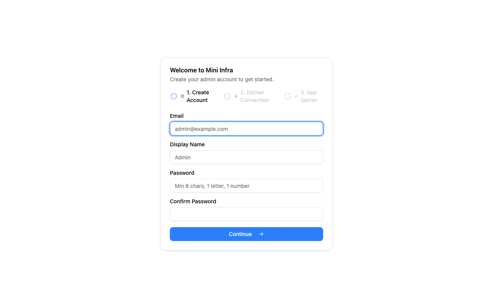
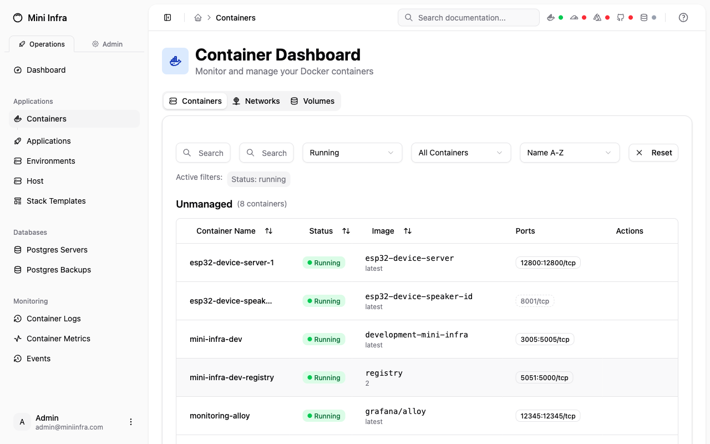
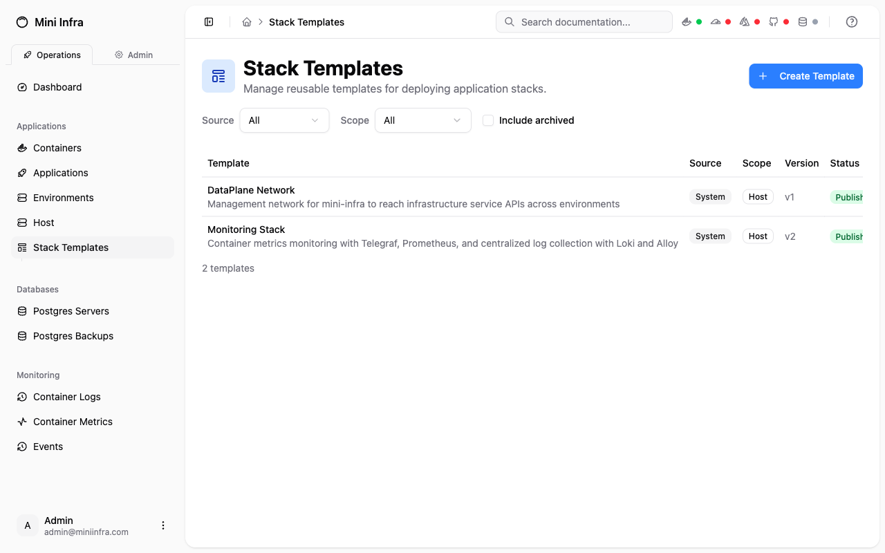
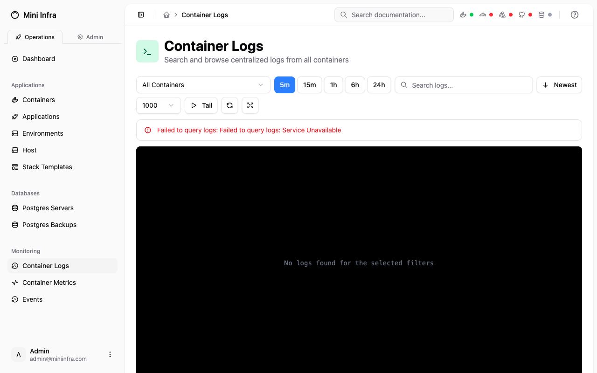

# Mini Infra

**One command to manage your entire Docker host.** Containers, backups, load balancing, monitoring, and an AI assistant — all in a clean, simple UI.

```bash
docker run -d \
  --name mini-infra \
  -p 5000:5000 \
  -v /var/run/docker.sock:/var/run/docker.sock \
  -v mini-infra-data:/app/data \
  ghcr.io/mrgeoffrich/mini-infra:latest
```

Then open [http://localhost:5000](http://localhost:5000) and you're done. A 3-step setup wizard creates your admin account, detects Docker, and generates your app secret. No config files, no environment variables, no prerequisites beyond Docker itself.



---

## Why Mini Infra?

Most self-hosting tools either do one thing well or try to do everything and become complex to manage. Mini Infra hits the sweet spot: **a single container that covers the concerns most self-hosters actually have**, with a UI that stays out of your way.

### Container Management

Full visibility into every container on your Docker host. Start, stop, restart, inspect, view logs — all from a clean dashboard with real-time status updates.



### Zero-Downtime Deployments

Blue-green deployments powered by HAProxy. Deploy new versions of your services with automatic health checks, traffic switching, and rollback on failure. No dropped requests.

### Encrypted Database Backups

Schedule automated PostgreSQL backups to Azure Blob Storage. Encrypted, compressed, with configurable retention policies. Restore with a click.

### Infrastructure as Stacks

Define your infrastructure as composable stacks with plan/apply semantics. Built-in templates for common patterns like monitoring and networking get you started fast. Drift detection tells you when reality doesn't match your definitions.



### Real-Time Monitoring & Logs

Container metrics (CPU, memory, network) and a centralized log viewer with filtering, search, and live tailing across all your containers.



### AI Assistant

An optional AI operations assistant (powered by Claude) that can answer questions about your infrastructure, help diagnose issues, and perform actions through natural language. It understands your Docker host, your containers, and the Mini Infra API.

### Environments & Networking

Organize services into environments (production, staging, etc.) with isolated Docker networks. Connect environments to the internet via Cloudflare Tunnels — no firewall ports to open.

### TLS Certificates

Automated SSL/TLS via Let's Encrypt with DNS-01 challenges through Cloudflare. Auto-renewed 30 days before expiry.

---

## Quick Start

### Docker Run

```bash
docker run -d \
  --name mini-infra \
  -p 5000:5000 \
  -v /var/run/docker.sock:/var/run/docker.sock \
  -v mini-infra-data:/app/data \
  -v mini-infra-logs:/app/server/logs \
  ghcr.io/mrgeoffrich/mini-infra:latest
```

### Docker Compose

```yaml
services:
  mini-infra:
    image: ghcr.io/mrgeoffrich/mini-infra:latest
    container_name: mini-infra
    restart: unless-stopped
    ports:
      - "5000:5000"
    volumes:
      - /var/run/docker.sock:/var/run/docker.sock
      - mini-infra-data:/app/data
      - mini-infra-logs:/app/server/logs

volumes:
  mini-infra-data:
  mini-infra-logs:
```

### What Happens Next

1. Open `http://your-server:5000`
2. Create your admin account (email + password)
3. Mini Infra auto-detects your Docker connection
4. Start managing your infrastructure

No OAuth setup required. No external databases. No config files. Everything runs from a single container with an embedded SQLite database.

---

## Optional Configuration

| Variable | Default | Description |
|---|---|---|
| `APP_SECRET` | Auto-generated | Secret for auth tokens and encryption. Set this to persist across container recreations |
| `ALLOWED_ADMIN_EMAILS` | — | Comma-separated emails allowed to create accounts |
| `PUBLIC_URL` | `http://localhost:5000` | Public URL (set this when behind a reverse proxy) |
| `LOG_LEVEL` | `info` | Logging verbosity: `trace`, `debug`, `info`, `warn`, `error` |

---

## Tech Stack

- **Frontend:** React 19, Vite, Tailwind CSS, shadcn/ui
- **Backend:** Express.js 5, Prisma ORM, SQLite
- **Infrastructure:** Docker API, HAProxy Data Plane API, Cloudflare API, Azure Blob Storage
- **AI Assistant:** Claude Agent SDK (optional, requires Anthropic API key)
- **Language:** TypeScript throughout

## Development

See [CLAUDE.md](CLAUDE.md) for development setup, project structure, and coding patterns.

```bash
git clone https://github.com/mrgeoffrich/mini-infra.git
cd mini-infra
npm install
npm run dev
```

## License

This project is licensed under the MIT License. See the [LICENSE](LICENSE) file for details.
