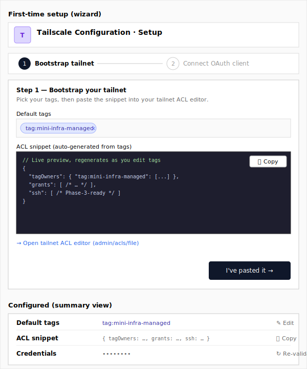

# Design: Phase 2 Tailscale settings form (ALT-68) — v2

> **Test re-run** of `/design-task ALT-68` against the updated skill template that adds Wireframe + UI components-to-use sections per Option, and bakes the frontend convention reads (`client/CLAUDE.md`, `client/ARCHITECTURE.md`, `claude-guidance/ICONOGRAPHY.md`) into Phase 4.3. Sits side-by-side with `alt-68-tailscale-settings-form.md` (the originally-shipped design) for comparison; not intended as a replacement. The substantive analysis of the ticket and prior art is the same — the skill changes are purely additive.

**Linear:** https://linear.app/altitude-devops/issue/ALT-68/design-phase-2-tailscale-connected-service
**Goal (from ticket):** lay out the new "Tailscale" admin form on the connected-services Settings page — OAuth `client_id` / `client_secret`, default tags, and a click-to-copy ACL bootstrap snippet block.
**Done when (from ticket):** Figma frames signed off and any new design tokens merged into the design system.

## Context

Phase 2 wires Tailscale up as a fifth connected service. The connected-services *card* on `/connectivity` is no-design — it slots into the established card pattern. The thing that needs design is the deeper **Settings → Tailscale** form, because it has two pieces no other settings form has today: a **default-tag list editor** (no existing tag-input component anywhere in `client/src/components/ui/`) and a **multi-line click-to-copy ACL bootstrap snippet** (today's only inline copy-block — `client/src/components/postgres-server/connection-string-modal.tsx:62-77` — is a one-line connection string in a dialog, far chunkier than what we need here).

Everything else maps cleanly onto the existing single-card "Validate & Save" pattern in [`client/src/app/connectivity/cloudflare/page.tsx`](client/src/app/connectivity/cloudflare/page.tsx).

The vendor doc `docs/vendors/tailscale-auth.md` inverts the obvious form ordering. The operator's real-world setup is: **(1)** pick a tag → **(2)** paste an ACL snippet that declares `tagOwners` for it → **(3)** create an OAuth client and *assign that tag* (rejected by Tailscale unless `tagOwners` exists) → **(4)** paste credentials and validate. The implication: **the ACL snippet must appear before the credentials section**, not after, because the operator can't validate until they've already pasted the snippet into their tailnet ACL. The snippet is also a function of `tags` only — not the validated tailnet domain — so it can render purely client-side.

Two design alternatives below differ along two reinforcing axes:
- **Form shape** — flat one-card linear scroll (sections in dependency order: tags → ACL snippet → credentials) vs. a two-step wizard that gates step 2 on the operator confirming "ACL pasted into tailnet" in step 1.
- **Reuse vs. greenfield** — extend the existing single-card settings pattern with one-off additions vs. introduce a wizard pattern (reusable for future multi-step connected-service setups) plus pull a `CodeSnippetBlock` and `TagListInput` into `components/ui/`.

### Frontend conventions in play (from Phase 4.3)

Read into the design before drafting:

- **Page shell** — every settings page in `client/src/app/connectivity/*` and `client/src/app/settings/*` uses the same skeleton: outer `<div className="flex flex-col gap-4 py-4 md:gap-6 md:py-6">`, then a `px-4 lg:px-6` header strip with a tinted rounded brand-icon tile (`<div className="p-3 rounded-md bg-<colour>-100 text-<colour>-800 dark:bg-<colour>-900 dark:text-<colour>-300">`) + `<h1 className="text-3xl font-bold">` + a one-line muted description, and a `max-w-4xl` body holding one or two stacked `<Card>`s. **Both options below adopt this shell verbatim** — Tailscale doesn't get to invent a new page chrome.
- **Iconography** — Tabler Icons only (`@tabler/icons-react`), per `claude-guidance/ICONOGRAPHY.md`. No `IconBrandTailscale` exists; brand options below pick from `IconAffiliate` / `IconNetwork` / `IconCloudNetwork`. Action icons are settled: `IconCircleCheck` for Validate & Save, `IconLoader2 className="animate-spin"` while saving, `IconCopy` ↔ `IconCheck` (with 2s timeout) for copy, `IconEye` ↔ `IconEyeOff` for show/hide secret, `IconX` for the chip-remove click target.
- **Form library** — `react-hook-form` + zod via `@/components/ui/form` (`Form`, `FormField`, `FormItem`, `FormLabel`, `FormControl`, `FormDescription`, `FormMessage`). Validation runs on `mode: "onChange"`. This is invariant across the codebase; both options inherit it.
- **Validation hook** — `useValidateService` from `@/hooks/use-settings-validation` is the existing entry point for "validate then save" flows. Cloudflare uses it; Tailscale will too.

The plan doc explicitly defers operator-feedback polish ("no copy-to-clipboard affordances, no Test connection button per addon") — both options have to ship in Phase 2, not Phase 5.

---

## Option A — One card, sections in dependency order

**Differs from Option B on:** form shape (single scroll, no gating) and reuse posture (extend the cloudflare/github pattern in-place, no new shared abstractions).

### Idea in one paragraph

Mirror the Cloudflare settings page, but stack the sections in execution order. A single `<Card>` titled "Tailscale OAuth" holds three sections top-to-bottom: **(1) Default tags** (chip-list input, default `tag:mini-infra-managed`), **(2) ACL bootstrap** (a pre-rendered HuJSON snippet that interpolates the tags from §1, with a copy button + a deep-link to `https://login.tailscale.com/admin/acls/file`), **(3) Credentials** (`client_id`, `client_secret` with show/hide, plus a one-line note about scopes + tag assignment). One "Validate & Save" button at the bottom runs the prober and writes credentials + tags atomically. The snippet block updates live as the operator edits tags — pure client-side derivation. A second card below ("How to set up Tailscale") repeats the existing help-card pattern with four numbered steps.

### Wireframe


### UI components to use

Primitives (`client/src/components/ui/*`):
- **Page shell:** standard outer flex column + `px-4 lg:px-6 max-w-4xl` body wrapper (no component — convention from `cloudflare/page.tsx:241-256`).
- **Header brand-icon tile:** `IconAffiliate` from `@tabler/icons-react` inside the standard `<div className="p-3 rounded-md bg-violet-100 ...">` tile (no `IconBrandTailscale` exists — flag in Open questions).
- **Form scaffold:** `Form`, `FormField`, `FormItem`, `FormLabel`, `FormControl`, `FormDescription`, `FormMessage` from [`client/src/components/ui/form.tsx`](client/src/components/ui/form.tsx). Same usage as Cloudflare.
- **Card:** `Card`, `CardHeader`, `CardTitle`, `CardDescription`, `CardContent` from [`client/src/components/ui/card.tsx`](client/src/components/ui/card.tsx).
- **Inputs:** `Input` from [`client/src/components/ui/input.tsx`](client/src/components/ui/input.tsx) for `client_id`; same `Input` with `type={showSecret ? "text" : "password"}` + an absolutely-positioned `Button variant="ghost" size="sm"` toggling `IconEye` / `IconEyeOff` for `client_secret` — copied verbatim from `cloudflare/page.tsx:283-329`.
- **Submit:** `Button` (default variant) from [`client/src/components/ui/button.tsx`](client/src/components/ui/button.tsx) with `IconLoader2 className="animate-spin"` ↔ `IconCircleCheck` swap while saving.
- **Validation feedback:** `Alert`, `AlertDescription` from [`client/src/components/ui/alert.tsx`](client/src/components/ui/alert.tsx) with `variant="destructive"` for errors; positive feedback via `sonner` toast (`toast.success(...)`).
- **Loading skeleton:** `Skeleton` from [`client/src/components/ui/skeleton.tsx`](client/src/components/ui/skeleton.tsx) — same triple-skeleton pattern as `cloudflare/page.tsx:269-274`.

Feature-level helpers (inline in the page file, **not** extracted):
- **`TagListInput`** *(new — sibling file `tag-list-input.tsx`)* — controlled chip-list. Renders existing tags as `Badge` from [`client/src/components/ui/badge.tsx`](client/src/components/ui/badge.tsx) with an `IconX` click-target; below them a free-text `Input` that adds on Enter or comma, removes the last on backspace-when-empty. Pattern-validates `tag:foo` via the parent zod schema.
- **`AclSnippetBlock`** *(new — inline)* — `<div className="rounded-md bg-muted font-mono p-4 max-h-96 overflow-auto">` wrapping `<pre>{snippet}</pre>`, with an absolutely-positioned `Button variant="outline" size="icon"` in the top-right toggling `IconCopy` ↔ `IconCheck` (2-second timeout, copied from [`connection-string-modal.tsx:65-76`](client/src/components/postgres-server/connection-string-modal.tsx)). Side-link rendered below as a plain `<a>` with `text-blue-600 hover:underline` matching `cloudflare/page.tsx:317-324`.
- **`buildAclSnippet(tags: string[])`** *(new — `acl-snippet.ts`)* — pure function that emits the canonical HuJSON template. No component, no React.

Icons (Tabler):
- Brand tile: `IconAffiliate` (proposed — see Open question).
- Submit / loading: `IconCircleCheck`, `IconLoader2`.
- Show/hide secret: `IconEye`, `IconEyeOff`.
- Copy: `IconCopy`, `IconCheck`.
- Chip remove: `IconX`.
- Help card numbering: `IconNumber1`, `IconNumber2`, etc. (or a plain `<span>` ordinal — match the GitHub help card's choice).

### Key abstractions

- **`TailscaleSettingsPage`** — single-route page, parallel to `CloudflareSettingsPage`. Owns the form, validation, save, and the live-snippet derivation.
- **`TagListInput`** — sibling file, not in `components/ui/`. Phase 2 has one consumer.
- **`buildAclSnippet`** — pure helper.

### File / component sketch

```
client/src/app/settings/tailscale/page.tsx            (new)        — TailscaleSettingsPage
client/src/app/settings/tailscale/tag-list-input.tsx  (new)        — chip-list input
client/src/app/settings/tailscale/acl-snippet.ts      (new)        — buildAclSnippet(tags) → string
client/src/hooks/use-tailscale-settings.ts            (new)        — TanStack Query hooks: load + save + validate
client/src/app/sidebar/sidebar-data.ts                (changed)    — add Settings → Tailscale entry
lib/types/tailscale.ts                                (new)        — TailscaleOAuthSettings + ValidationResult
```

### Implementation outline

1. Stand up `useTailscaleSettings` (load), `useUpdateTailscaleSettings` (save), `useValidateTailscaleConnection` (Validate & Save). Copy the Cloudflare hook pair line-for-line, swapping routes to `/api/settings/tailscale` and `/api/connectivity/tailscale`.
2. Build `TailscaleSettingsPage` skeleton from the Cloudflare page: header strip with brand-icon tile, single `<Card>`, `<Form>` + zod schema, "Validate & Save" button.
3. Drop `TagListInput` into the form as the **first** field. Default `["tag:mini-infra-managed"]` so the snippet preview is meaningful on initial render.
4. Implement `buildAclSnippet(tags)` — emits `tagOwners` keyed by each tag, the catch-all `grants` block, and the Phase-3-ready `ssh` stanza (per the vendor doc). Wire to `form.watch("tags")`.
5. Render the snippet block beneath the tag input. Header row inside the block: title "Tailscale ACL bootstrap", `IconCopy` ↔ `IconCheck` toggle, side-link to `https://login.tailscale.com/admin/acls/file`. `max-h-96 overflow-auto`.
6. Render the credentials section beneath the snippet. Description explicitly notes the prerequisite. Show/hide toggle on `client_secret` mirroring Cloudflare's `apiToken` field.
7. Add the "How to set up Tailscale" help card below — four numbered steps, links to `https://login.tailscale.com/admin/acls/file` and `https://login.tailscale.com/admin/settings/oauth`.
8. Register `data-tour` IDs (`tailscale-tags-input`, `tailscale-acl-copy-button`, `tailscale-client-id-input`, `tailscale-validate-button`) per the convention in `cloudflare/page.tsx`.

### Pros

- Slots into the existing settings-form mental model. Operators who configured Cloudflare or GitHub already know what to do.
- Smallest blast radius: one page file, one hook file, two sibling files.
- Live snippet preview is cheap (pure function of `tags`, no server round-trip).
- Re-edit case is trivial: every section is always visible and editable.
- Section ordering (tags → ACL → credentials) matches the real-world setup flow.

### Cons

- All three sections compete for attention; a first-time user might paste credentials before noticing the snippet they need to copy.
- Single linear card gets long: credentials + tag chips + ~30-line snippet + buttons + help card is a lot of vertical real estate.
- The tag-input and snippet-block are duplicated work-in-waiting if Phase 4 (`tailscale-web` Connect panel) wants the same building blocks.

### Prior art it leans on

- [`client/src/app/connectivity/cloudflare/page.tsx`](client/src/app/connectivity/cloudflare/page.tsx) — single-card "Validate & Save" with show/hide secret. Closest existing analogue.
- [`client/src/app/settings/github/page.tsx`](client/src/app/settings/github/page.tsx) — `isConfigured` Alert pattern (lines 205-217); we'll use the same shape for the post-save success indicator.
- [`client/src/components/postgres-server/connection-string-modal.tsx:62-77`](client/src/components/postgres-server/connection-string-modal.tsx) — the only existing copy-to-clipboard implementation. Reuse the `IconCopy` ↔ `IconCheck` + 2s timeout pattern.

---

## Option B — Two-step setup wizard, with shared `CodeSnippetBlock` + `TagListInput`

**Differs from Option A on:** form shape (gated wizard with a separate "configured" summary view) and reuse posture (extracts two reusable components into `components/ui/`).

### Idea in one paragraph

First-time setup is a guided two-step flow that mirrors the vendor doc's prerequisite chain. **Step 1 — Bootstrap your tailnet:** tag chip-list + live ACL snippet + "Copy snippet" + deep-link + "I've pasted the snippet, continue →" button (purely client-side advance; no save yet). **Step 2 — Connect your OAuth client:** instructions + `client_id` + `client_secret` + "Validate & finish" — calls the validate hook with step-1 tags + step-2 credentials; persists atomically on success. Once configured, the page renders a **summary view** instead of the wizard: three labelled rows (Default tags / ACL snippet / Credentials), each with an inline "Edit" pencil. The summary's snippet row is always visible (operators frequently come back to re-copy after editing tags); credentials hide behind a `••••••••` mask. A "Re-validate credentials" button in the summary header re-enters the wizard at Step 2 (Step 1 is skipped on re-edit since the ACL is presumed in place). Both novel building blocks ship as shared `client/src/components/ui/` components.

### Wireframe

Two states — wizard (first-time) on the left, summary (configured) on the right.



### UI components to use

Primitives (`client/src/components/ui/*`):
- **Page shell:** same as Option A.
- **Header brand-icon tile:** same.
- **Form scaffold:** same (`Form`, `FormField`, …).
- **Card:** same.
- **Stepper (new):** **no existing component**. Hand-roll inline with `Separator` from [`client/src/components/ui/separator.tsx`](client/src/components/ui/separator.tsx) + a numbered circle pattern. Flag as a one-off if Phase 4 doesn't reuse it. (Listing this here — per Phase 4.3 — so the executor can't miss that nothing in `ui/` covers it.)
- **Inputs / submit / alerts / skeleton:** same as Option A.

New shared primitives (extract into `client/src/components/ui/`):
- **`<CodeSnippetBlock />`** *(new)* — props `{ code: string; language?: string; title?: string; href?: string; maxHeight?: string }`. Multi-line variant of the postgres-server inline copy-block, generalised to accept a header row (title + side-link slot + copy button). Land it first, refactor `connection-string-modal.tsx` to use it as a small drive-by.
- **`<TagListInput />`** *(new)* — controlled `{ value: string[]; onChange; pattern?: RegExp; placeholder?: string }`. Renders chips as `Badge` + free-text `Input`. Validation deferred to the consumer's zod schema.

Feature-level helpers:
- **`TailscaleWizardView`** — owns step state (`"bootstrap" | "credentials"`).
- **`TailscaleSummaryView`** — owns per-section edit toggles. Three rows, each switching between read-only (`<div className="flex justify-between">`) and an in-line `<Form>` for that one field group.
- **`buildAclSnippet({ tags })`** — same pure helper as Option A.

Icons (Tabler):
- Brand tile + submit + show/hide + copy: same as Option A.
- Wizard stepper: `IconCheck` for completed step, plain numeral for current.
- Summary edit affordances: `IconPencil` for "Edit", `IconRefresh` for "Re-validate credentials".

### Key abstractions

- **`TailscaleSettingsPage`** — orchestrator. Picks `WizardView` vs `SummaryView` by reading `isConfigured`.
- **`TailscaleWizardView`** — step state machine.
- **`TailscaleSummaryView`** — read-mostly, per-section edit.
- **`CodeSnippetBlock`** — shared multi-line copy block.
- **`TagListInput`** — shared chip-list input.

### File / component sketch

```
client/src/app/settings/tailscale/page.tsx                (new)     — orchestrator, picks wizard vs summary
client/src/app/settings/tailscale/wizard-view.tsx         (new)     — step-1/step-2 state machine
client/src/app/settings/tailscale/summary-view.tsx        (new)     — read-mostly view + per-section edit
client/src/app/settings/tailscale/acl-snippet.ts          (new)     — buildAclSnippet({ tags })
client/src/components/ui/code-snippet-block.tsx           (new)     — shared multi-line copy block
client/src/components/ui/tag-list-input.tsx               (new)     — shared chip-list input
client/src/components/postgres-server/connection-string-modal.tsx   (changed) — refactor to use CodeSnippetBlock
client/src/hooks/use-tailscale-settings.ts                (new)     — load + save + validate hooks
client/src/app/sidebar/sidebar-data.ts                    (changed) — add Settings → Tailscale entry
lib/types/tailscale.ts                                    (new)     — TailscaleOAuthSettings + ValidationResult
```

### Implementation outline

1. Extract `CodeSnippetBlock` from `connection-string-modal.tsx`, generalised to multi-line + optional header row. Land it first; refactor the postgres modal to use it.
2. Build `TagListInput` as a presentation-only component.
3. Stand up the three `useTailscaleSettings*` hooks. The validate hook posts credentials *and* tags together so the server can persist atomically.
4. Implement `WizardView` with step state in `useState`. Step 1 advances purely client-side; Step 2 calls validate-and-finish.
5. Implement `SummaryView`: three rows, save-on-blur for `TagListInput`, read-only credentials with a "Re-validate" affordance that re-enters the wizard at Step 2.
6. `TailscaleSettingsPage` reads `isConfigured` to pick which view to render. First-load flicker hidden behind a `Skeleton` (same pattern as Cloudflare).
7. Wire `data-tour` IDs on wizard primary controls and summary affordances.

### Pros

- Sequencing matches the vendor doc's prerequisite chain *enforcement-style* — the wizard surfaces "paste ACL before you create the OAuth client" as a step, instead of leaving it to the operator to read the help card.
- Post-setup summary view is the right state for the page 99% of the time it's visited — small, scannable.
- `CodeSnippetBlock` and `TagListInput` are obvious wins for Phase 4's Connect panel and any future connected-service settings page.
- "Validate & finish" is the only place credentials touch the server, and it always validates before persisting.

### Cons

- More moving parts: wizard state machine + summary view + two shared components is several times the LoC of Option A.
- Per-section edit pattern in `SummaryView` is a small UX innovation that doesn't exist elsewhere in `settings/*` and adds a state machine of its own.
- Step 1's "I've pasted, continue" is operator-honour-system — Step 2's validate call will fail informatively if the ACL isn't in place, so the wizard's gating is more *guidance* than *enforcement*.
- Heavier than the plan doc's posture ("no copy-to-clipboard affordances" was scoped *out* of v1 polish — extracting reusable components leans the other way).
- Stepper is a one-off UI primitive (no `client/src/components/ui/stepper.tsx` exists). Either hand-rolled inline or new addition to `ui/` — neither is free.

### Prior art it leans on

- [`client/src/components/postgres-server/quick-setup-wizard.tsx`](client/src/components/postgres-server/quick-setup-wizard.tsx) — the only existing wizard pattern in the codebase. Borrow its step-state shape and Back/Next affordances; do not borrow its dialog shell (settings is page-level, not modal).
- [`client/src/components/postgres-server/connection-string-modal.tsx:62-77`](client/src/components/postgres-server/connection-string-modal.tsx) — the inline copy-block to generalise into `CodeSnippetBlock`.
- [`client/src/app/connectivity/cloudflare/page.tsx`](client/src/app/connectivity/cloudflare/page.tsx) — validate-first-then-save flow (lines 135-209).
- [`client/src/app/settings/github/page.tsx`](client/src/app/settings/github/page.tsx) — `isConfigured` branching pattern (lines 185, 205-217).

---

## Recommendation

**Lean Option A.** The vendor doc clarified the ACL snippet is purely tag-driven (no validated tailnet domain needed), which removes the strongest reason Option B existed in the first design pass — a wizard that gates the snippet on validation. With sections sequenced top-to-bottom in dependency order (tags → ACL snippet → credentials) and a help card reinforcing the four-step setup flow, Option A walks the operator through the same sequence Option B's wizard does, in roughly half the code, without the wizard/summary state-machine duality. The "Step 1 confirmation" in Option B is also more honour-system than enforcement, so the safety win is smaller than it first looks.

The plan doc's scope-out of "copy-to-clipboard affordances" as v1 polish is also a tell: the team's posture is "ship the simplest thing that does the job, then iterate." Option A is the simplest thing.

That said, **flip to Option B if** the team commits to building the Phase 4 Connect panel close behind Phase 2 and wants the `CodeSnippetBlock` extraction as a deliberate down-payment on it.

## Open questions

- **No `IconBrandTailscale` exists in Tabler.** Picking from the available set: `IconAffiliate` (network-mesh feel — closest to Tailscale's brand), `IconCloudNetwork`, or `IconNetwork` (used elsewhere for `/connectivity`, so reusing it would conflate). Recommendation: `IconAffiliate` with a violet tile, matching the GitHub page's purple convention. Designer call to confirm.
- **Phase 2 vs Phase 3 ACL snippet.** Should the snippet's `ssh` stanza ship in Phase 2 or be deferred to Phase 3? Including it makes the snippet a forward-compatible bootstrap (operators paste once); excluding keeps Phase 2 minimal but creates a "go re-paste this larger snippet" task in Phase 3. Recommendation: include it.
- **Will Phase 4's Connect panel reuse a tag input?** Connect panel is read-only per the plan doc — `TagListInput` may have only one consumer through Phase 5. `CodeSnippetBlock` is the more credible reuse target.

## Out of scope

- **Test-tailscale-connection button separate from "Validate & Save"** — match Cloudflare's single-button choice.
- **Auto-applying the ACL** — plan doc §3 defers calling the Tailscale ACL API.
- **Multi-tailnet support** — v1 is one tailnet per Mini Infra.
- **Per-environment default tags** — Phase 3 hard-codes `tag:env-<env>` separately.
- **"Sign in with Tailscale" / browser OAuth** — vendor doc confirms client-credentials paste is the supported pattern.
- **Auth-key-based setup** — plan doc commits to OAuth.
- **"Disconnect Tailscale" button** — covered by the connected-services delete flow on `/connectivity`.
