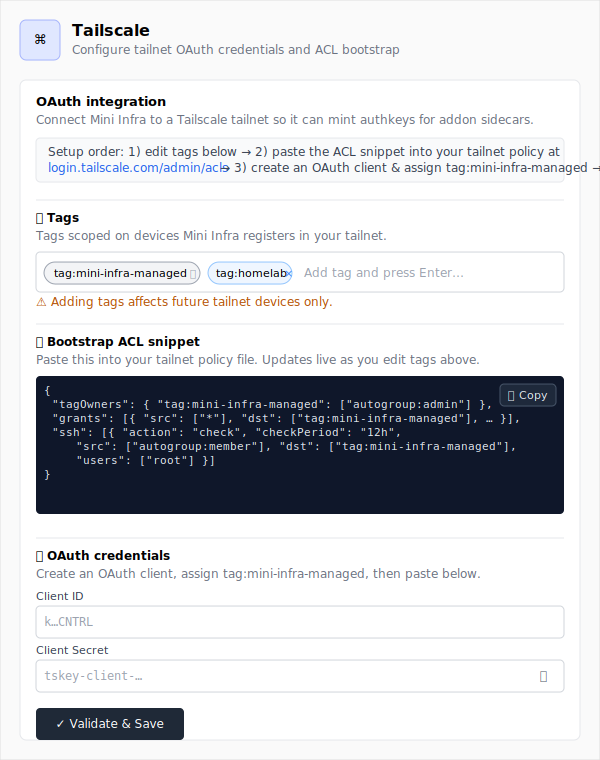
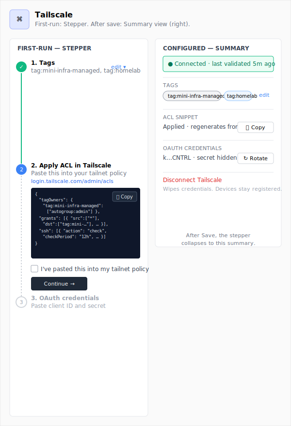

# Design: Tailscale settings form (ALT-68)

**Linear:** https://linear.app/altitude-devops/issue/ALT-68/design-phase-2-tailscale-connected-service
**Goal (from ticket):** Settings: new "Tailscale" admin form with OAuth client_id / client_secret, default tags, click-to-copy ACL bootstrap snippet block.
**Done when (from ticket):** Figma frames signed off (informational — this design doc + recommendation is the deliverable).

## Context

Phase 2 of the Service Addons plan adds Tailscale as a fifth connected-service alongside Docker / Cloudflare / GitHub / Azure. The plan calls for the settings form to expose three things: OAuth `client_id` + `client_secret`, the operator's default tag list, and a click-to-copy ACL bootstrap snippet that the operator pastes into their tailnet policy file. Connectivity-status, the connected-services list entry, and the docs page are tagged `[no design]` — they fit existing patterns. Only the settings form needs design work.

The form's awkward shape comes from a real-world prerequisite chain. Tailscale OAuth clients can only mint authkeys for tags they themselves *own*, so the operator has to (i) create the OAuth client, (ii) assign `tag:mini-infra-managed` to it inside Tailscale's admin console, (iii) paste a `tagOwners` + `grants` + `ssh` snippet into their tailnet's ACL policy, and only then (iv) come back and paste the `client_id` + `client_secret` into Mini Infra. If credentials land before the ACL is in place, the first `mintAuthkey()` call returns 403 and the connectivity prober flips red. So the page isn't really a credentials form with extras — it's a guided handoff between Mini Infra and Tailscale's admin UI, and the credentials are the *last* thing the operator does, not the first. Vendor reference: [docs/architecture/vendor/tailscale-auth.md](../architecture/vendor/tailscale-auth.md).

The two options below differ on **whether the form is a single-page reference (sections in operator-flow order, all visible at once) or a stepper that gates each step on the previous step's completion**. That axis matters because it changes (a) how visible the prerequisite chain is on first run, (b) how the page reads after configuration is done and the operator returns to rotate credentials or change tags, and (c) how much new pattern this introduces — Cloudflare / GitHub / Docker are all flat one-card forms today.

The prior-art reference for both options is [client/src/app/connectivity/cloudflare/page.tsx](../../client/src/app/connectivity/cloudflare/page.tsx) — same RHF + zod + `useSystemSettings` shape, same Validate & Save button, same encrypted-secret handling. Whichever option ships, the wiring underneath is the existing pattern.

---

## Option A — Single-page form, sections ordered for the operator's path

**Differs from Option B on:** layout (flat-with-sections vs. gated stepper), and consequently on first-run guidance density vs. re-edit ergonomics.

### Idea in one paragraph

A single Card matching the existing connectivity pages, with the form body broken into three labelled sections in operator-flow order: **(1) Tags**, **(2) Bootstrap ACL snippet** (auto-derived from the tags above and copyable), **(3) OAuth credentials**. A short "How to set this up" paragraph at the top of the card sets expectations and links to the vendor admin URLs (`https://login.tailscale.com/admin/settings/oauth` and `.../admin/acls`). Tags drive a live-rendered ACL preview as the operator edits them; the credentials section sits at the bottom because it's the only step that happens *after* the operator has done the Tailscale-side work. Validate & Save lives below the credentials. Re-edit is native: the page re-opens with values pre-filled, secret masked, and the snippet still rendering against the saved tags.

### Wireframe



### UI components to use

Primitives (all from `client/src/components/ui/`):
- **Page shell + header:** match [`client/src/app/connectivity/cloudflare/page.tsx:240-255`](../../client/src/app/connectivity/cloudflare/page.tsx) — `flex flex-col gap-4 py-4 md:gap-6 md:py-6`, brand-tinted icon block, h1 + muted description.
- **Card / CardHeader / CardContent:** [`card`](../../client/src/components/ui/card.tsx) — one card holds the whole form; section dividers are plain `<Separator />` + sub-headings, not nested cards.
- **Form / FormField / FormItem / FormLabel / FormDescription / FormMessage:** [`form`](../../client/src/components/ui/form.tsx) — RHF + zod, identical to Cloudflare.
- **Tags input:** *(new)* `TagListInput` — controlled chip-style input over an `Input` primitive. See **Key abstractions** below.
- **ACL snippet block:** *(new)* `CopyableCodeBlock` wrapping a styled `<pre>` with a `Button variant="ghost" size="sm"` carrying `IconCopy` / `IconCheck`. See **Key abstractions**.
- **Credential inputs:** [`input`](../../client/src/components/ui/input.tsx) with show/hide eye toggle — copy [`cloudflare/page.tsx:281-329`](../../client/src/app/connectivity/cloudflare/page.tsx) verbatim for the secret field.
- **Validate & Save button:** [`button`](../../client/src/components/ui/button.tsx) — `IconLoader2` while pending, `IconCircleCheck` otherwise, label sequence below.
- **Result feedback:** [`alert`](../../client/src/components/ui/alert.tsx) — green-tinted success / `variant="destructive"` failure, mirroring Cloudflare.

Icons (from [`claude-guidance/ICONOGRAPHY.md`](../../claude-guidance/ICONOGRAPHY.md)):
- **Page header:** `IconNetwork` (semantic match — Tailscale is a tailnet/networking integration; Tabler has no Tailscale brand glyph). Tinted block matches Cloudflare's orange treatment.
- **Section glyphs:** `IconTag` (tags), `IconShield` (ACL), `IconKey` (OAuth credentials).
- **Show/hide secret:** `IconEye` / `IconEyeOff`.
- **Copy:** `IconCopy` → flips to `IconCheck` for ~1.5s after click (matches the api-keys/new copy pattern at [`api-keys/new/page.tsx:144-156`](../../client/src/app/api-keys/new/page.tsx)).

Hooks: `useSystemSettings({ filters: { category: "tailscale" } })`, `useCreateSystemSetting`, `useUpdateSystemSetting`, `useValidateService({ service: "tailscale" })` — all already exist; no new hooks needed.

### States, failure modes & lifecycle

**Per-region states:**

- **Tags input:**
  - **Empty:** seeded with one read-only chip `tag:mini-infra-managed` (the constant default; matches the OAuth-client tag the operator must assign in Tailscale). The seed chip has no `×` affordance — it can't be removed, it carries a `Tooltip` explaining why.
  - **Live input:** add chip on `Enter` or `,`; client-side validation regex `^tag:[a-z0-9-]+$`; invalid input shows inline error under the input rather than landing as a chip. Each typed chip immediately re-renders the snippet block — debounce only the cosmetic shimmer, not the rendering.
  - **Failure:** none — pure local state.
- **ACL snippet block:**
  - **Empty:** never empty in practice (the seed chip guarantees at least one tag). If the user somehow reduces tags to zero (race + bug), render the block disabled with text "Add at least one tag to generate the ACL snippet" rather than emitting broken JSON.
  - **Live input:** snippet re-renders on every tags change. Copy-to-clipboard reads the latest rendered text; no need to debounce.
  - **Failure:** `navigator.clipboard.writeText()` rejection → toast "Couldn't copy — your browser blocked clipboard access. Select the snippet manually." (matches api-keys/new failure path).
- **OAuth credentials:**
  - **Empty:** standard placeholders. `client_secret` is a password input by default with eye-toggle.
  - **Live input:** `client_id` is a UUID-shaped string (`k...CNTRL`); zod `.min(8)` is enough for a sanity check — Tailscale doesn't publish a stable format, so don't over-tighten the regex. `client_secret` is `tskey-client-...` — also `.min(8)`. Validate-on-submit does the real work.
  - **Failure:** the Validate & Save call exercises the OAuth `client_credentials` grant (covered in [Implementation outline](#implementation-outline-a) step 4). Surface three categories specifically — `invalid_client` (paste error / wrong scopes) → "Tailscale rejected these credentials. Double-check the client ID and secret, and confirm the OAuth client has `auth_keys:write` and `devices:core:write` scopes."; `invalid_tag` after the dummy `mintAuthkey()` probe → "OAuth client doesn't own the tag. Assign `tag:mini-infra-managed` to the client at https://login.tailscale.com/admin/settings/oauth and paste the ACL snippet above into your tailnet policy."; everything else (network, 5xx) → generic "Couldn't reach Tailscale — check your network or try again." Tier-1 message in the alert; raw vendor body behind a `<details>` "Show details" disclosure.

**Page-level lifecycle:**

- **Configured state.** **Same form, pre-filled.** Tags + ACL snippet render with saved values. `client_id` is shown verbatim (it isn't secret); `client_secret` masked with a "Replace secret" button — clicking clears the field and unmasks it for typing, matching how GitHub's PAT field behaves at [`connectivity/github/page.tsx`](../../client/src/app/connectivity/github/page.tsx). Re-saving without re-entering the secret is allowed (server keeps existing encrypted value). Three states the page must look right in: **never-configured** (seed chip, snippet rendered, empty creds, "Validate & Save" disabled until creds are typed), **just-saved** (success Alert appears for ~5s, then auto-dismisses, leaving the page in re-edit shape), **re-edit-after-N-months** (form pre-filled with saved tags, snippet re-rendered, masked secret with "Replace secret" affordance).
- **Latency window.** Validate & Save is one OAuth-token mint + one tag-probe `mintAuthkey()` (with `expirySeconds: 60` and `ephemeral: true` so the test key auto-cleans). Wall-clock is typically 0.5–2s. Button label sequence: `Validate & Save` → `Validating…` (lock form) → `Saving…` → `Saved`. No cancellation — the call is short. If pending exceeds 10s, swap the button label to `Validating… (still trying)` so the operator knows nothing is wedged.
- **Reversibility.** Each editable field:
  - **`client_id` / `client_secret`** — *requires re-validation* on save (handled by Validate & Save). Rotating either is the supported credential-rotation path; show a `Tooltip` on the "Replace secret" button reading "Rotate by pasting a fresh secret. The old one becomes inactive after Save." No cascading effects on existing tailnet devices since authkeys are minted-on-demand, not long-lived.
  - **Tags** — *breaks-existing-resources* if `tag:mini-infra-managed` is removed. Phase 3+ sidecars are minted with that tag; removing it from this form *doesn't* unbind already-minted devices, but every future addon application will mint with the new tag set, leaving old devices orphaned in the admin console. Render an inline warning under the seed chip whenever `extraTags` is non-empty: "Adding tags affects future tailnet devices only. Existing devices keep their original tag set until reapplied."

### Key abstractions

- **`TagListInput`** *(new)* — a controlled chip-input component at `client/src/components/ui/tag-list-input.tsx`. Props: `{ value: string[]; onChange: (next: string[]) => void; pinnedHead?: string[]; validate?: (raw: string) => string | null; placeholder?: string }`. `pinnedHead` chips render with no remove affordance (used here for `tag:mini-infra-managed`). Single shared primitive — anticipating reuse for Phase 5's per-instance tag overrides and for `extraTags` in the addon spec UI later. Implementation is a `<div>` flex-wrap of `<Badge variant="secondary">` chips + an `<Input>` that consumes `Enter` / `,` / `Tab` to commit.
- **`CopyableCodeBlock`** *(new)* — small wrapper at `client/src/components/ui/copyable-code-block.tsx`. Props: `{ value: string; language?: "json" | "hujson" | "shell"; ariaLabel: string }`. Renders a `<pre>` with monospace styling + a top-right `Button variant="ghost" size="sm"` running the `navigator.clipboard.writeText` flow from `api-keys/new/page.tsx:144-156`. No syntax highlighting in v1 — plain `<pre>` with the existing `font-mono text-sm` token. Reused as-is by Phases 6–7's Caddyfile / Vault-path snippets.
- **`buildAclSnippet(tags: string[]): string`** — pure helper at `client/src/lib/tailscale/build-acl-snippet.ts`. Returns the canonical JSON ACL with `tagOwners`, `grants`, `ssh` stanzas the plan calls for, parameterised over the tag list. Pure-function so it's trivially unit-tested and the Phase 2 server can use the same source of truth for the docs page.
- **`tailscaleSettingsSchema`** — zod schema in `client/src/app/connectivity/tailscale/page.tsx`, mirroring `cloudflareSettingsSchema`. Three fields: `clientId` (`min(8)`), `clientSecret` (`min(8)`), `extraTags` (`z.array(z.string().regex(/^tag:[a-z0-9-]+$/)).default([])`). The mandatory `tag:mini-infra-managed` is *not* in the form payload — it's a constant the snippet generator and the server already know about.

### File / component sketch

```
client/src/app/connectivity/tailscale/page.tsx            (new)        — the settings page
client/src/components/ui/tag-list-input.tsx               (new)        — chip-style tag input primitive
client/src/components/ui/copyable-code-block.tsx          (new)        — copy-to-clipboard <pre> wrapper
client/src/lib/tailscale/build-acl-snippet.ts             (new)        — pure ACL-snippet generator
client/src/lib/tailscale/build-acl-snippet.test.ts        (new)        — unit tests for the snippet
client/src/components/connectivity-status.tsx             (changed)    — add "tailscale" entry to serviceLabels
client/src/components/app-sidebar.tsx (or routes)         (changed)    — register /connectivity/tailscale route
```

### Implementation outline {#implementation-outline-a}

1. Stand up `TagListInput` and `CopyableCodeBlock` as standalone primitives with their own unit tests. They have zero Tailscale-specific knowledge — get them green before wiring anything else.
2. Write `buildAclSnippet` + tests. Cover: default tag only; default + extras; injection-attempt input rejected by the schema, not the helper.
3. Scaffold `connectivity/tailscale/page.tsx` from the Cloudflare page; rip out Cloudflare-specific fields, leave the RHF/zod/useSystemSettings/useValidateService shape.
4. Wire the form: Tags → ACL snippet (live-derived via `form.watch("extraTags")` → `buildAclSnippet`) → OAuth credential inputs → Validate & Save. Snippet is read-only computed output, not a form field.
5. Wire Validate & Save against `useValidateService({ service: "tailscale" })` — error categories surfaced per the failure-mode table. Server side ships in the impl ticket; the client should accept the contract `{ category: "invalid_client" | "invalid_tag" | "network" | "ok"; detail?: string }`.
6. Plumb the route into `app-sidebar.tsx` / wherever connectivity routes live, and add `tailscale` to `serviceLabels` in `connectivity-status.tsx`. Smoke-test with the env: open the page cold, type tags, verify snippet updates, copy works, paste known-bad creds and confirm error wording.

### Pros

- **Lowest novelty.** Every existing connectivity page reads this way; an executor can copy `cloudflare/page.tsx` line-by-line and replace the field set. Reviewers find their bearings in the first 5 lines.
- **Re-edit is native.** No mode toggle, no "I'm done with the wizard, where do I edit my creds now" trap. Most operator visits to this page after week 1 are credential rotations or tag tweaks — both work without ceremony.
- **Snippet stays visible.** The ACL is a thing the operator might re-copy weeks later (e.g. if their tailnet policy is being refactored). Putting it in a stepper that collapses post-setup hides it from the case where they need it again.
- **Two new shared primitives** (`TagListInput`, `CopyableCodeBlock`) earn their keep across Phase 5 (per-instance tags), Phase 6 (Caddyfile snippets), Phase 7 (Vault path snippet). Both are small, isolated, and testable.

### Cons

- **First-run guidance is implicit.** The operator has to read the "How to set this up" paragraph at the top to understand that the credentials at the bottom depend on Tailscale-side work in the middle. A motivated operator will manage; a distracted one might paste creds first, hit the `invalid_tag` error, and then have to backtrack. The error message is good; it's still a 30-second detour.
- **Tag-edit warning is easy to miss.** A flat form has no natural moment to interrupt the operator with "this is a destabilising change" the way a stepper does. The inline warning is the best we can do; a confirmation dialog on Save would be heavier-handed than the rest of the page.
- **Dual-purpose page slightly muddled.** First-time setup and re-edit live in the same shape; the page is optimised for re-edit (because that's the long-term majority), so first-time setup feels like reading documentation interleaved with a form. Acceptable trade-off, but not free.

---

## Option B — Three-step stepper, collapses to summary on completion

**Differs from Option A on:** layout (gated stepper vs. flat-with-sections), and consequently on first-run guidance density vs. re-edit ergonomics.

### Idea in one paragraph

First-run is a three-step stepper with explicit gates: **Step 1 — Choose tags** (live ACL preview, tag list); **Step 2 — Apply ACL in Tailscale** (copy block, "I've pasted this" confirmation checkbox); **Step 3 — Paste OAuth credentials** (input fields, Validate & Save). Each step shows the next only after its forward action; a previously-completed step stays expandable for reference. Once Save succeeds the page collapses to a summary panel with three rows ("Tags: …", "ACL: copied", "OAuth: connected last validated 5 min ago") and a per-section "Edit" button that re-expands just that step. Re-edit is mode-switched: clicking "Edit tags" expands Step 1 inline, rest stays summary. The stepper carries the prerequisite chain in its UI rather than relying on the operator to read inline copy.

### Wireframe



### UI components to use

Primitives:
- **Stepper:** *(new)* `SetupStepper` — composed from existing pieces (numbered circles in a flex row with `<Separator />` between, panels rendered with `Collapsible` from [`collapsible.tsx`](../../client/src/components/ui/collapsible.tsx)). No dedicated stepper primitive exists today — same observation as the api-keys flow at [`api-keys/new/page.tsx`](../../client/src/app/api-keys/new/page.tsx) (stepless multi-section). Building it as one component avoids hand-rolling the same flex/circle/collapse trio in two places.
- **Tags input + snippet block + credential inputs:** identical to Option A — same `TagListInput`, `CopyableCodeBlock`, `Form` primitives. The chassis around them differs.
- **Summary view:** `Card` with `CardContent` rows, `Badge` variants for status (`outline` for tags, `secondary` "Copied 3 times" for ACL, `default` green-leaning for "Connected"), `Button variant="ghost" size="sm"` per-row Edit affordance.
- **"I've pasted this" checkbox in Step 2:** [`checkbox.tsx`](../../client/src/components/ui/checkbox.tsx) — the only thing gating the move from Step 2 to Step 3 (since there's no automated way to know the operator did the Tailscale-side work; the checkbox is an honour-system advance gate).

Icons: same set as Option A. Stepper circles use `IconCheck` for completed steps, plain numbers for pending.

Hooks: same as Option A. Plus a `[currentStep, setCurrentStep]` local state and a `[mode, setMode]` toggle (`"first-run" | "summary" | "edit-tags" | "edit-creds"`).

### States, failure modes & lifecycle

**Per-region states:**

- **Stepper steps (each):**
  - **Empty / pending** (not yet reached): rendered greyed-out, not expandable, no input affordances.
  - **Active** (current step): expanded panel with full inputs.
  - **Completed**: collapsed by default with a one-line summary ("Tags: 1 chip" / "ACL applied") and a chevron to re-expand.
- **Step 1 — Tags:** identical interaction to Option A's tags region. Live snippet preview rendered in Step 2's preview slot (Step 2 is also visible as the next pending step, just greyed). Advancing requires at least the seed chip — guaranteed by the pinned-head chip.
- **Step 2 — ACL snippet:** same `CopyableCodeBlock` as Option A. Empty state same as A (not reachable in practice). Advancing requires checking "I've pasted this into my tailnet policy at https://login.tailscale.com/admin/acls". Failure mode: none — pure honour-system gate.
- **Step 3 — Credentials:** identical interactions to Option A's credentials section. Same failure-categorisation rules (`invalid_client` / `invalid_tag` / `network`). One difference: the `invalid_tag` error in this layout reads "Step 2 wasn't applied — re-open the ACL step and confirm the snippet is in your policy" because the stepper makes it natural to point at a specific prior step.
- **Summary panel rows (post-Save):**
  - **Empty:** unreachable — summary only renders after at least one successful Save.
  - **Failure:** the connectivity prober may flip red later (independent of the form). When it does, surface a thin Alert at the top of the summary linking back to "Re-validate credentials" — re-running Validate & Save against existing values.

**Page-level lifecycle:**

- **Configured state.** **Read-only summary by default**, per-section edit. The summary shows tags as chips, the ACL with a "Copy again" button (no re-edit, since editing the ACL means editing tags), and credentials as "Connected — last validated 5 min ago" with a "Rotate" button that jumps straight to a one-field form. Three states: **never-configured** (stepper at Step 1, Steps 2–3 greyed); **just-saved** (success animation flips to summary view); **re-edit-after-N-months** (summary view with three Edit affordances; clicking one expands that section's inputs in place; Save re-collapses).
- **Latency window.** Same as Option A — Validate & Save is 0.5–2s. Button label sequence identical. The success path adds one extra animation: Step 3's panel collapses, summary panel fades in (~150ms cross-fade). Failure leaves the panel open with the alert below the inputs; no animation.
- **Reversibility.** Same per-field classifications as Option A. The stepper makes the "tags edit affects future devices only" warning more discoverable — it lives in the Tags step's inline copy and in the "Edit tags" confirmation flyout when re-editing. The credential-rotation path is more obvious because the summary shows a "Rotate" button rather than a "Replace secret" toggle inside a larger form.

### Key abstractions

- **`SetupStepper`** *(new)* — generic stepper at `client/src/components/ui/setup-stepper.tsx`. Props: `{ steps: Array<{ id: string; title: string; render: (api: { advance: () => void; canAdvance: boolean }) => ReactNode }>; currentStepId: string; completedStepIds: Set<string>; onAdvance: (id: string) => void }`. Pure layout component — knows nothing about Tailscale. Same primitive could serve a future first-run wizard for any other setup flow (the team hasn't asked for one yet, but the pattern is generic enough that it'd be reused).
- **`TagListInput`, `CopyableCodeBlock`, `buildAclSnippet`, `tailscaleSettingsSchema`** — same as Option A.
- **`TailscaleSettingsSummary`** *(new)* — page-local component for the post-save view. Consumes `useSystemSettings` + `useConnectivityStatus`, renders the three rows, dispatches edit-mode toggles. Lives next to the page in `client/src/app/connectivity/tailscale/`.

### File / component sketch

```
client/src/app/connectivity/tailscale/page.tsx                 (new)   — orchestrates stepper vs. summary modes
client/src/app/connectivity/tailscale/TailscaleStepper.tsx     (new)   — first-run stepper
client/src/app/connectivity/tailscale/TailscaleSummary.tsx     (new)   — configured-state summary
client/src/components/ui/setup-stepper.tsx                     (new)   — generic stepper primitive
client/src/components/ui/tag-list-input.tsx                    (new)   — same as Option A
client/src/components/ui/copyable-code-block.tsx               (new)   — same as Option A
client/src/lib/tailscale/build-acl-snippet.ts                  (new)   — same as Option A
client/src/lib/tailscale/build-acl-snippet.test.ts             (new)   — same as Option A
client/src/components/connectivity-status.tsx                  (changed) — add "tailscale" label
client/src/components/app-sidebar.tsx (or routes)              (changed) — register the route
```

### Implementation outline {#implementation-outline-b}

1. Build `TagListInput`, `CopyableCodeBlock`, `buildAclSnippet` + tests as standalone primitives — same step 1 as Option A.
2. Build `SetupStepper` as a standalone primitive with a Storybook-equivalent or unit-test harness; verify the gating logic in isolation.
3. Build `TailscaleStepper.tsx` consuming `SetupStepper` + the three step bodies; wire `form.watch("extraTags")` from Step 1 into Step 2's snippet block.
4. Build `TailscaleSummary.tsx` consuming `useSystemSettings` + `useConnectivityStatus`; per-row Edit affordances re-mount the corresponding stepper step in single-step edit mode.
5. Compose into `page.tsx` with the mode toggle (`first-run` / `summary` / `edit-<section>`), plumb Validate & Save with the same error-category contract as Option A.
6. Plumb the route + `serviceLabels` entry. Smoke-test the four lifecycle states deliberately: never-configured (cold page), just-saved (cross-fade landing), re-edit (open from summary), error path (paste bad creds at Step 3 to confirm the "Step 2 wasn't applied" wording).

### Pros

- **First-run feels learn-by-doing.** The prerequisite chain is in the UI, not in inline copy. An operator who's never touched Tailscale's admin console gets a guided handoff: "do this in Mini Infra → do this in Tailscale → come back and finish here." That's exactly the cognitive model the underlying flow needs.
- **Configured-state ergonomics are excellent.** A summary view with per-section Edit reads more like the rest of an admin product (DNS, Stack templates, etc.) than a re-opened form. Credential rotation in particular is a one-field affordance instead of "find the secret field, click Replace, paste."
- **Tag-edit warning gets its own moment.** Editing tags from the summary view goes through a "this affects future devices only" confirmation step that an inline warning in a flat form can't reliably enforce. Right-sizes attention.

### Cons

- **High novelty.** No existing connectivity page reads this way; reviewers and the executor have to hold a whole new pattern in their head while writing it. The risk of accidental drift from the Cloudflare/GitHub patterns is real — small inconsistencies in spacing, focus management, or form-state handling will compound.
- **Two new layout components** (`SetupStepper`, `TailscaleSummary`) plus the two primitives Option A introduces. Each new component is a maintenance surface; `SetupStepper` in particular is the kind of thing that ages badly when it ends up with one consumer for two years.
- **Honour-system gate is fragile.** The "I've pasted this" checkbox in Step 2 is the only way to advance to credentials; an operator who lies (deliberately, or because they pasted the wrong policy) ends up at the same `invalid_tag` error Option A would have given them, just one screen later. The stepper's value-add depends on that checkbox; if operators learn to tick it without reading, the gate stops paying for itself.
- **Re-edit cost.** The summary-with-edit pattern has more moving parts than "open the form again." It's nicer when it works, but it's more code, more tests, more states to keep aligned. For a settings page that's visited a few times a year, the ROI is marginal.

---

## Recommendation

**Pick Option A — single-page form, sections ordered for the operator's path.** The Cloudflare and GitHub pages already establish a recognisable pattern for this surface; copying it gets the executor most of the way there in a day's work, leaves no novelty for a reviewer to argue about, and keeps the ACL snippet visible in the case where the operator returns to copy it again. The two new primitives (`TagListInput`, `CopyableCodeBlock`) are genuinely reusable across later phases of the Service Addons plan, and the inline guidance + good error wording handle the prerequisite-chain UX well enough — a 30-second backtrack on first run is a fair price for not introducing a stepper pattern the rest of the product doesn't use.

The call would flip if either of these landed on the roadmap: (a) a second connected-service in the same plan also needed first-run guidance with a Tailscale-style prerequisite chain (e.g. a future OAuth-IdP setup in Phase 10) — at that point, a generic `SetupStepper` earns its keep; or (b) usability research surfaces operators consistently mis-sequencing the Tailscale setup and wanting their hand held more explicitly. Neither is true today.

## Open questions

- **Tag-input format on submit.** Default plan-doc language says "default tags" plural, but the OAuth-client tag-ownership constraint means only `tag:mini-infra-managed` actually drives addon behaviour. The form's `extraTags` payload — what *is* it for, post-save? Is the server expected to do anything with it, or is it purely a snippet-generation convenience? If the latter, the field could move into the ACL section's "advanced" disclosure rather than being a top-level form field. Recommend resolving with @geoff.rich before the impl ticket starts; my read of the plan doc is "snippet-generation convenience for now, addon-spec input later," but worth confirming.
- **Disconnect / revoke flow.** Vendor docs (`docs/architecture/vendor/tailscale-auth.md:113`) recommend a "Disconnect Tailscale" action that revokes locally-stored credentials and links to the Tailscale admin console. The ticket doesn't call for one in v1, but the absence will look odd next to a working credential-rotation flow. Out-of-scope for ALT-68; flag for the impl ticket.

## Out of scope

- **HuJSON-formatted snippet.** Plan doc explicitly defers HuJSON to a follow-up ("JSON by default; HuJSON is a follow-up"). `CopyableCodeBlock` is structured to accept a `language` prop so the upgrade is non-breaking.
- **Inline ACL validator.** Pasting the snippet into the operator's tailnet policy could in principle be fronted by a "Test my ACL" affordance that uses the OAuth client to read the current policy and compare. Useful, but a much bigger feature than this ticket — different design exercise.
- **Tailscale admin-console deep-links beyond the two core URLs.** v1 links to `…/admin/settings/oauth` and `…/admin/acls`. Linking to a per-tag or per-device deep-link surface would require knowing the tailnet name, which we don't ask for in v1 (the `-` placeholder in the API URL covers it).
