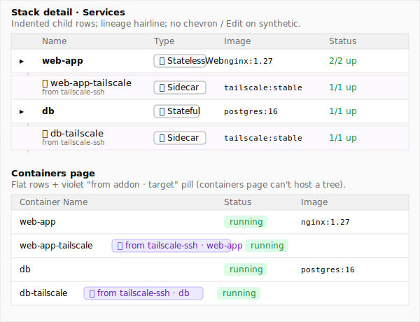
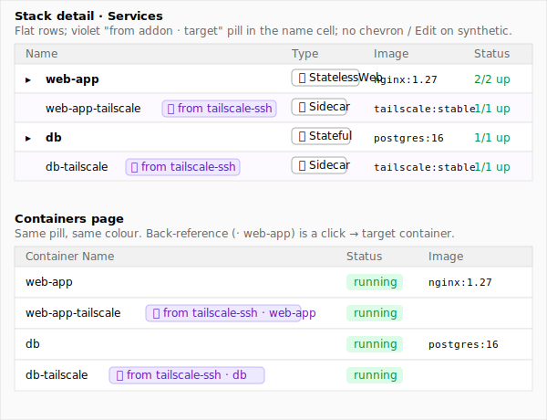

# Design: Synthetic addon-derived row styling (MINI-23)

**Issue:** MINI-23 (run `mk issue show MINI-23` for the full ticket)
**Goal (from ticket):** decide how addon-derived sidecars render in the existing service / container lists — badge style, visual lineage to the target row, disabled edit affordances.
**Done when (from ticket):** design recommendation merged so MINI-2 (Phase 3 `tailscale-ssh` addon impl) can wire it up.

## Context

Phase 3 of the Service Addons Framework lands the first addon — `tailscale-ssh` — which materialises a synthetic sidecar service alongside its user-authored target. The sidecar is a real Docker container, joins the same stack, runs in the target's network namespace, and shows up in two existing list surfaces: the **Stack detail / Services table** ([client/src/app/applications/\[id\]/_components/service-row.tsx](client/src/app/applications/[id]/_components/service-row.tsx)) and the **Containers page table** ([client/src/app/containers/ContainerTable.tsx](client/src/app/containers/ContainerTable.tsx)). Phase 4 adds `tailscale-web`; Phase 7 adds `caddy-auth`. Whatever shape we pick has to scale to a stack where two or three synthetic sidecars sit alongside three or four user-authored services.

Three constraints frame the design space. **First**, edit affordances must be disabled — the synthetic service is owned by the addon's `buildServiceDefinition()` output, not by the user, so any edit UI on the row is a lie. **Second**, the operator must be able to tell at a glance that a row is synthetic and which addon produced it; with three addons on the roadmap, "from addon" without naming the addon is ambiguous. **Third**, the Containers page is sort-driven and virtual-row-friendly — its table model doesn't accommodate parent/child nesting the way a flat services table can.

There's already prior art for synthetic-derived rows in the Mini Infra UI: pool instances render with an amber `Pool` pill on the Containers page ([ContainerTable.tsx:67-71](client/src/app/containers/ContainerTable.tsx)) and `selfRole` containers (the Mini Infra control plane itself) get a blue role pill ([ContainerTable.tsx:62-66](client/src/app/containers/ContainerTable.tsx)). The stack-detail services table uses shadcn `Badge variant="outline"` with a Tabler icon for service-type indicators ([service-row.tsx:27-42](client/src/app/applications/[id]/_components/service-row.tsx)). Both are precedents the addon badge can lean on.

The two options below differ along the **layout axis** (nested-child-row vs. flat-sibling-row) and the **surface-uniformity axis** (split treatment per page vs. one treatment everywhere). Pick the layout shape and you've effectively picked the surface-uniformity story too — they're tied because the Containers page can't host a tree without a structural change to its table model.

---

## Option A — Indented child row with lineage connector (stack-detail tree; flat-with-pill on containers)

**Differs from Option B on:** layout (nested tree vs. flat row) — and consequently on surface uniformity (different treatment per page vs. one treatment).

### Idea in one paragraph
On the **Stack detail** services table, a synthetic sidecar renders as a child row physically indented under its target service, with a hairline left-border drawn from the parent row's name cell down through the children to make the lineage visible. The synthetic row has its own status / image cells but no chevron (its container is shown via the parent's expand state, or via a flat `Containers` sub-section), no Edit affordances, and a small `IconPuzzle` glyph at the leading edge plus a muted `from <addon-name>` caption under the name. On the **Containers page** — which is sort-driven and can't cleanly host a tree — synthetic containers render as flat rows with the same `IconPuzzle` pill (`from tailscale-ssh · web-app`) that names both the addon and the target service.

### Wireframe



### UI components to use
**Stack detail (Services table):**
- **Indented synthetic row:** new `SyntheticServiceRow` component sibling to `ServiceRow` ([service-row.tsx](client/src/app/applications/[id]/_components/service-row.tsx)) — same `<TableRow>` / cell structure, but with a leading `pl-8` indent on the name cell and a hairline `border-l border-muted` rendered via a small spacer column to draw the lineage connector. Reuses `ServiceTypeBadge` ([service-row.tsx:27-42](client/src/app/applications/[id]/_components/service-row.tsx)) so the type column reads consistently.
- **Addon glyph:** `IconPuzzle` from `@tabler/icons-react`, sized `h-4 w-4`, in the name cell's leading position.
- **From-addon caption:** plain `<span class="text-xs text-muted-foreground">from tailscale-ssh</span>` rendered as a subtitle under the service name.
- **Disabled edit:** simply omit the Edit button / chevron from the synthetic row's cells. No `disabled` state needed because the affordance isn't rendered.
- **Grouping logic:** new `groupServicesByAddonTarget()` helper on the page component (or an inline `useMemo`) that produces a `[parent, ...children]` ordering keyed off the synthetic service's `addonTarget` field on `StackServiceDefinition`. Rendered by walking the grouped list and emitting a `ServiceRow` then any `SyntheticServiceRow`s.

**Containers page (flat row + pill):**
- **Synthetic pill:** new `AddonBadge` component at `client/src/components/stacks/addon-badge.tsx` (the path MINI-2 already commits to). Built on shadcn `Badge` ([badge.tsx](client/src/components/ui/badge.tsx)) with a `violet` color override (`bg-violet-100 text-violet-800 dark:bg-violet-900 dark:text-violet-300`) to sit cleanly alongside the existing blue self-role pill and amber `Pool` pill. Carries `IconPuzzle` + `from <addon-name>` text.
- **Back-reference:** the addon badge is followed by `· <target-service-name>` rendered as a `<button>` styled like a link that navigates to the target container's detail route. Reuses the click-vs-button-target gating pattern at [ContainerTable.tsx:142-156](client/src/app/containers/ContainerTable.tsx).
- **Wire-up site:** [ContainerTable.tsx:317-326](client/src/app/containers/ContainerTable.tsx) — the same place `isPoolInstance` is derived from `mini-infra.pool-instance`. Read `mini-infra.addon` (the addon name) and `mini-infra.addon-target` (the target service name) from the container's labels and pass them through `ContainerNameCell` like the existing `isPoolInstance` flag.

### States, failure modes & lifecycle

**Per-region states (Stack detail synthetic row):**
- **Empty:** N/A — synthetic rows only render when an addon was applied. If the addon's `provision` failed, the synthetic service is omitted from the rendered stack and the failure surfaces in the apply task tracker (`STACK_ADDON_FAILED`), not in this list.
- **Failure:** synthetic sidecar container in `exited` / `restarting` state — the Status cell shows the existing color-coded `n/m up` indicator ([service-row.tsx:57-62](client/src/app/applications/[id]/_components/service-row.tsx)), no addon-specific failure UX needed. Container-level failures route through the existing services / containers logs UI.
- **Live input:** N/A — read-only.

**Per-region states (Containers page synthetic row):**
- **Empty:** N/A.
- **Failure:** identical to other container rows; the synthetic pill is purely a marker and doesn't change the failure rendering.
- **Live input:** N/A.

**Page-level lifecycle:**
- **Configured state.** N/A — read-only list of materialised state.
- **Latency window.** N/A — list rendering, no slow calls.
- **Reversibility.** N/A for the row itself; the operator removes the addon by editing the parent service definition, which is a separate flow already designed for stack templates.

**Differs from Option B on:** the indented tree exposes lineage spatially, so the `from <addon-name>` caption can stay short; in B, the badge has to do all the lineage work because there's no spatial cue.

### Key abstractions
- **`SyntheticServiceRow`** (new) — read-only sibling to `ServiceRow`. Knows it's a child; renders without chevron / edit affordances; renders the lineage connector.
- **`AddonBadge`** (new, `client/src/components/stacks/addon-badge.tsx`) — shadcn `Badge` wrapper with `IconPuzzle`, addon name, and optional target back-reference.
- **`groupServicesByAddonTarget()`** (new helper) — turns a flat `StackServiceDefinition[]` into `[parent, ...children][]` ordered groups for table rendering.
- **`addonTarget` field** on `StackServiceDefinition` (or a label-derived equivalent) — the contract that lets the UI know which row is the parent of which sidecar. (Adjacent to MINI-2's existing `mini-infra.addon-target` container label.)

### File / component sketch
```
client/src/components/stacks/addon-badge.tsx                                  (new)        — IconPuzzle + addon name + optional target back-reference
client/src/components/stacks/synthetic-service-row.tsx                        (new)        — read-only indented sibling of ServiceRow
client/src/app/applications/[id]/_components/service-row.tsx                  (changed)    — accept addon target metadata, expose a no-chevron read-only mode (or split into Service vs. SyntheticService renderers via a parent grouping component)
client/src/app/applications/[id]/_components/services-table.tsx               (changed)    — group synthetic services under their target; render parent + child rows in order
client/src/app/containers/ContainerTable.tsx                                  (changed)    — read mini-infra.addon + mini-infra.addon-target labels; render AddonBadge in ContainerNameCell
lib/types/stacks.ts                                                           (changed)    — add addonTarget?: string and addonName?: string to StackServiceDefinition (mirroring the labels server-side)
```

### Implementation outline
1. Add `addonTarget?: string` and `addonName?: string` to `StackServiceDefinition` in `lib/types/stacks.ts`. The server already stamps the matching container labels in MINI-2's plan — extend the type so the client sees them.
2. Build the `AddonBadge` component: `IconPuzzle` + violet shadcn `Badge` + `from {addonName}` text, optional `onTargetClick` prop for the back-reference variant.
3. Wire `AddonBadge` into `ContainerTable.tsx`'s `ContainerNameCell` next to the existing `Pool` pill — read `mini-infra.addon` / `mini-infra.addon-target` labels and pass them through the memo's prop equality check.
4. Build `SyntheticServiceRow` — a thin wrapper around `<TableRow>` cells that mirrors `ServiceRow`'s shape but drops the chevron / edit affordances, indents the leading cell, and renders the lineage hairline.
5. Refactor the Services table page to call `groupServicesByAddonTarget()` and emit either a `ServiceRow` or `SyntheticServiceRow` per row, in grouped order.
6. Decide `SyntheticServiceRow`'s expand behaviour — either no chevron at all (preferred), or a chevron that expands to the same Containers / Runtime sub-grid as the parent row, with the Addon-config block read-only.
7. Smoke-test with a stack carrying `addons: { tailscale-ssh: {} }` on a Stateful service: verify the parent row shows above the indented synthetic row with a connector, the badge reads `from tailscale-ssh`, no Edit affordances, and the same container shows up on the Containers page with the addon pill + back-reference link.

### Pros
- **Spatial lineage** — operator can see at a glance which sidecar belongs to which target; doesn't have to read text on every row.
- **Reads like a tree** — when a stack grows to multiple services each with addons, the indentation gives quick scan-ability.
- **Stack detail page is the deliberately-curated view of the stack** — a tree shape rewards the page that already has spatial structure.

### Cons
- **Two visual languages.** Stack detail is nested; Containers page is flat — the "from addon" relationship has to be re-read on each surface, which is what the consistent-treatment approach explicitly avoids.
- **More components, more grouping logic** — `groupServicesByAddonTarget`, `SyntheticServiceRow`, the lineage connector rendering all need to be built and tested.
- **Sort/filter friction.** If the Services table ever grows column-sortable headers, nested rows will need special-case handling (children stay attached to parent regardless of sort).
- **Doesn't help the Containers page** — the Containers page is where most operators look at containers day-to-day, and Option A still solves that surface with the same flat pill Option B uses.

---

## Option B — Flat row with `from addon` pill, consistent across both surfaces (recommended)

**Differs from Option A on:** layout (flat row vs. nested tree) — consistent visual language across Stack detail and Containers, no row-grouping logic, mirrors the existing `Pool` synthetic-derived pill pattern.

### Idea in one paragraph
A synthetic sidecar renders as a normal flat row in both the Stack detail services table and the Containers page table. In the name cell, alongside the service name, an `AddonBadge` renders a violet shadcn `Badge` carrying `IconPuzzle` + `from tailscale-ssh` (the addon name) + ` · web-app` (the target service name as a clickable back-reference). Edit affordances are omitted from the row — no Edit button, no chevron-expand into a runtime panel that would imply mutability — leaving only the read-only Containers / Runtime block accessible (or no expansion at all on the Stack detail synthetic row). The same `AddonBadge` is reused on the Containers page in the existing `ContainerNameCell` slot next to where the `Pool` pill lives today, so an operator reading either page recognises addon-derived rows by the same colour + glyph.

### Wireframe



### UI components to use
- **Synthetic pill:** new `AddonBadge` at `client/src/components/stacks/addon-badge.tsx`. Built on shadcn `Badge` ([badge.tsx](client/src/components/ui/badge.tsx)) with a violet variant (`bg-violet-100 text-violet-800 dark:bg-violet-900 dark:text-violet-300`) — picked to land cleanly between the blue self-role pill and amber `Pool` pill ([ContainerTable.tsx:62-71](client/src/app/containers/ContainerTable.tsx)) without colliding with status colours (emerald / amber / red are already in use). Carries `IconPuzzle` from `@tabler/icons-react` + `from <addonName>` text + optional ` · <targetName>` back-reference rendered as a `<button>` styled like a link.
- **Stack detail wire-up:** [service-row.tsx](client/src/app/applications/[id]/_components/service-row.tsx) — read `service.addonName` / `service.addonTarget` from the new fields on `StackServiceDefinition`, render `<AddonBadge>` next to `service.serviceName` in the name cell, and gate the chevron + Edit affordances on `!service.addonName`. The chevron disappears entirely on synthetic rows (no expansion needed because the runtime configuration is owned by the addon — exposing it would invite the operator to think they can edit it).
- **Containers page wire-up:** [ContainerTable.tsx:317-326](client/src/app/containers/ContainerTable.tsx) — derive `addonName` / `addonTarget` from the `mini-infra.addon` / `mini-infra.addon-target` labels exactly like `isPoolInstance` is derived today, pass them into `ContainerNameCell`, and render `<AddonBadge>` after the existing self-role / pool pills. The back-reference click navigates to `/containers/<target-container-id>`.
- **Disabled edit on stack detail:** no `disabled` attribute needed — affordances are simply not rendered when `service.addonName` is set. The truthy check is one boolean; reasoning about "is this row editable" stays a one-liner.

### States, failure modes & lifecycle

**Per-region states (synthetic row, both pages):**
- **Empty:** N/A — rows only render when the addon materialised.
- **Failure:** the row's status cell follows the same color-coded path as user-authored services (Stack detail's `n/m up` indicator at [service-row.tsx:57-62](client/src/app/applications/[id]/_components/service-row.tsx); Containers page's `ContainerStatusBadge`). Addon-provision failures (`STACK_ADDON_FAILED`) surface in the apply task tracker, not in this list.
- **Live input:** N/A — read-only.

**Page-level lifecycle:**
- **Configured state.** N/A — list view of materialised state.
- **Latency window.** N/A.
- **Reversibility.** N/A for the row itself.

**Differs from Option A on:** the badge does all the lineage-communication work — there's no spatial cue, so the badge is the only signal an operator gets. That puts more weight on the badge being recognisable; the violet colour + puzzle glyph + named addon are the three signals carrying that weight.

### Key abstractions
- **`AddonBadge`** (new, `client/src/components/stacks/addon-badge.tsx`) — shadcn `Badge`-based component. Props: `addonName: string`, `targetName?: string`, `onTargetClick?: () => void`. Renders `IconPuzzle` + `from {addonName}` and (when `targetName` provided) ` · {targetName}` as a clickable back-reference.
- **`addonName` / `addonTarget` fields** on `StackServiceDefinition` ([lib/types/stacks.ts](lib/types/stacks.ts)) — surface the same metadata the server already stamps onto container labels in MINI-2 (`mini-infra.addon`, `mini-infra.addon-target`) so the client doesn't have to grep labels to know it's looking at a synthetic service.
- **`isAddonSynthetic(service)`** — trivial boolean predicate on `StackServiceDefinition` used to gate Edit affordance rendering. One-liner, lives next to `StackServiceDefinition`.

### File / component sketch
```
client/src/components/stacks/addon-badge.tsx                                  (new)        — violet shadcn Badge + IconPuzzle + addon name + optional target back-reference
client/src/app/applications/[id]/_components/service-row.tsx                  (changed)    — render AddonBadge in name cell when service.addonName set; gate chevron + Edit on !addonName
client/src/app/containers/ContainerTable.tsx                                  (changed)    — read mini-infra.addon / mini-infra.addon-target labels; render AddonBadge in ContainerNameCell
lib/types/stacks.ts                                                           (changed)    — add addonName?: string and addonTarget?: string to StackServiceDefinition
```

### Implementation outline
1. Add `addonName?: string` and `addonTarget?: string` to `StackServiceDefinition` in `lib/types/stacks.ts`. Run `pnpm build:lib`.
2. Build `AddonBadge` — wraps shadcn `Badge` with the violet variant, `IconPuzzle`, and the `from {addonName} · {targetName}` content. Cover the no-target variant (rare — used if the target hasn't materialised yet) so the component handles both cases.
3. Update `service-row.tsx`: render `<AddonBadge>` next to `service.serviceName` in the name `<TableCell>` when `service.addonName` is set; gate the chevron + Edit affordances on `!service.addonName`. Keep the rest of the row identical.
4. Update `ContainerTable.tsx`: derive `addonName` / `addonTarget` from container labels in the cell-renderer at line 317; pass them into `ContainerNameCell`; render `<AddonBadge>` after the existing self-role / pool pills. Wire the back-reference click to `navigate(/containers/<target-container-id>)` — look up the target container ID from the same `containers` list passed into `ContainerTable`.
5. Smoke-test with a stack carrying `addons: { tailscale-ssh: {} }` on a Stateful service: stack detail shows the synthetic row with the violet `from tailscale-ssh · web-app` pill, no chevron, no Edit; Containers page shows the same row with the same pill; clicking the target name jumps to the target container's detail page.

### Pros
- **One visual language across both surfaces.** An operator who sees a violet `IconPuzzle` pill on the Containers page recognises it instantly when it appears on the Stack detail page, and vice-versa.
- **Mirrors the existing Pool pill pattern** — the `mini-infra.pool-instance` container label already produces an amber pill in `ContainerNameCell`; the addon pill is structurally identical and uses the same wire-up site.
- **Cheap to ship.** One new component (`AddonBadge`), two changed call sites, two new fields on `StackServiceDefinition`. No row-grouping logic, no nesting, no special-case sort handling.
- **Sort/filter clean.** Synthetic rows participate in the same sort and filter behaviour as user-authored ones; no special-cases for the data table model.
- **Phase 5 lands the Connect panel** ([service-addons-plan.md §Phase 5](docs/planning/not-shipped/service-addons-plan.md)) which explicitly surfaces the addon-attached endpoints as a curated list with status badges. The lists in stack detail / containers pages don't need to do that job — they just need to mark synthetic rows recognisably.

### Cons
- **No spatial lineage.** On a stack with many services, the synthetic row could appear far from its target in alphabetic order; the operator has to read the badge to discover the relationship. The back-reference link makes this a one-click navigation rather than a search, but it's still less immediate than a tree.
- **The badge has to carry all the meaning.** If the addon name is unfamiliar to the operator, the row reads as "some synthetic thing" until they hover or click. Mitigation: tooltip on the badge expands to a full sentence ("Provisioned by the tailscale-ssh addon attached to web-app") — cheap to add via shadcn `Tooltip`.
- **Three pills in the same cell on the Containers page** is possible (e.g. an addon-attached pool instance — though this combination doesn't actually exist until Phase 9). The cell already has flex-wrap fallback, so layout-wise it's fine; visually it's busy. Acceptable for the Phase 3 / 4 / 7 landings; revisit if a fourth pill class enters the mix.

---

## Recommendation

**Option B — flat row + violet `IconPuzzle from <addon>` pill, consistent across both pages.** It's the cheaper change, mirrors the existing Pool synthetic-derived row pattern verbatim, gives operators one visual language across the two surfaces they'll encounter addon rows on, and avoids the sort/filter friction that nested rows would create on the Services table. The "no spatial lineage" cost is real but small — most stacks have ≤10 services, the violet pill is distinctive against the existing blue / amber / status colours, and the back-reference link makes the parent service one click away. Phase 5's Connect panel is the surface that actually needs to make addon endpoints scannable; the Stack detail / Containers tables just need to mark synthetic rows clearly and disable the wrong edit affordances, which is exactly what a pill + omitted-chevron does.

The fact that would flip the call: if the eventual operator-facing UI ends up with stacks routinely carrying 20+ services with multiple addons on each (a scale we haven't seen on this product), the spatial-lineage argument for Option A's tree gets stronger. Phase 5's Connect panel is the cheaper place to solve that problem if it appears — keep an eye on operator feedback after Phases 3–5 land before re-opening the tree question.

## Open questions

- **Pill colour: violet vs. an alternative?** Default is violet (`bg-violet-100`/`bg-violet-900`) — picked because the existing self-role pill is blue, the Pool pill is amber, and status colours are emerald / amber / red. Violet sits cleanly outside that palette. If the design system prefers a different accent for derived/synthetic concepts, swap accordingly — the colour is a one-liner in `AddonBadge`.
- **Back-reference click target on the Stack detail page.** On the Containers page the back-reference navigates to a different container's detail route, which is unambiguous. On the Stack detail page, both rows are already on the same page — should the back-reference scroll to and highlight the target row, or do nothing? Default: the back-reference renders as plain text (not a button) on Stack detail, since the spatial distance is bounded; render it as a button on Containers where cross-page navigation matters.
- **Does `StackServiceDefinition` carry `addonName` directly, or do we derive it client-side from a generic `addonInfo` field?** Default: two flat fields (`addonName`, `addonTarget`) — simplest, mirrors the container labels MINI-2 already commits to. If a future addon needs richer per-row metadata (config summary, version, status), the design owes a follow-up before that lands.

## Out of scope

- **A separate "Addon-derived" sub-section in the Services table** (a third option that groups synthetic rows under a labelled section instead of mixing them in or nesting them). Considered briefly; rejected because it splits the operator's mental model of the stack into two halves and the Containers page can't mirror the grouping. If operators report difficulty finding addon-derived rows after launch, this is the natural next experiment.
- **Status rollup, addon filter chips on the Containers page, copy-to-clipboard for the synthetic container name.** Out of scope for Phase 3 ([service-addons-plan.md §11](docs/planning/not-shipped/service-addons-plan.md) deferred-decisions explicitly excludes these); revisit after operator feedback.
- **Visual treatment of merged Tailscale sidecars** (Phase 4 — when `tailscale-ssh` and `tailscale-web` collapse into one synthetic service). The `from <addon>` text becomes ambiguous with two addons attached. Phase 4's UI changes block flags this as `[no design]` because the merged sidecar is a single materialised row — but the badge text needs a follow-up call (`from tailscale` vs. `from tailscale-ssh + tailscale-web`). Not this ticket's job.
- **Connect panel design** (Phase 5). Separate design ticket, separate surface — addressed there.
