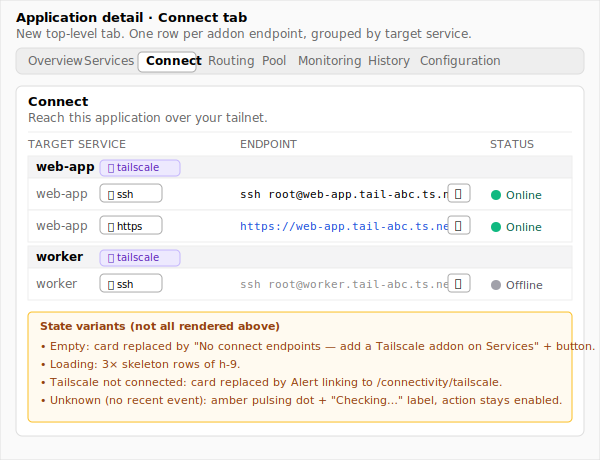
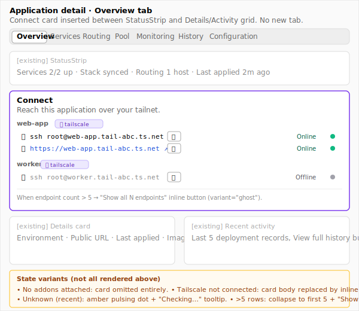

# Design: Connect panel + Tailscale device-status poller (MINI-24)

**Issue:** MINI-24 (run `mk issue show MINI-24` for the full ticket)
**Goal (from ticket):** operators see every addon-attached endpoint with one-click `ssh`/HTTPS actions and live online/offline status.
**Done when (from ticket):** Connect panel rows render within ~1s and badges flip within ~5s of a deliberate device-down test.

## Context

Phase 5 of the Service Addons Framework lights up the user-facing payoff for the prior four phases. After `tailscale-ssh` (Phase 3) and `tailscale-web` (Phase 4) ship, every addon-attached service has at least one tailnet endpoint — an `ssh root@<host>.<tailnet>.ts.net` for SSH, and an `https://<host>.<tailnet>.ts.net` for HTTPS — plus a tailscaled sidecar running with an ephemeral identity. Today the application detail page exposes addon attachments only as violet `from tailscale-…` pills on the Services tab ([service-row.tsx:108-114](client/src/app/applications/[id]/_components/service-row.tsx)) — the operator can see *that* an addon was applied but cannot reach the endpoint without copy-pasting the hostname out of nowhere. The Connect panel is the surface that closes that gap.

The deliverables also include a server-side device-status poller and a new `tailscale` Socket.IO channel emitting `TAILSCALE_DEVICE_ONLINE` / `TAILSCALE_DEVICE_OFFLINE` events. Those events drive the live status badges on the panel; they also flow into the existing connection-status indicator at [client/src/components/connectivity-status.tsx](client/src/components/connectivity-status.tsx) (Phase 5's third deliverable, marked `[no design]`). The poller's wire shape is fully specified in the impl ticket — this design only commits to *which payload fields the panel consumes* and how the panel reacts when a device-status event arrives.

The two options below differ along the **surface-placement axis** — does the panel get its own tab in the application detail layout, or sit as a card on the Overview tab? Both present the same row content (target service, addon kind, action affordance, copy button, status badge, last-seen) and lean on the same status-badge component; they differ on **discoverability** (Overview is the default landing tab; a separate tab is one click away), **information density** (a tab page accommodates a wider layout; a card stays compact), and **scaling** (a tab can hold 50+ rows without breaking; a card needs a "View all" overflow path past ~5 endpoints). The pool-instance expansion path (Phase 9) is explicitly out of scope for v1 — both options leave a hook for it but neither implements it.

## Design tokens & shared building blocks

Both options use the same row content and status component. Calling them out here so each Option section can stay tight:

- **`<DeviceStatusBadge>`** — new component at `client/src/components/stacks/device-status-badge.tsx`. Takes `status: 'online' | 'offline' | 'unknown'` plus an optional `lastSeenAt: string | null`. Renders a 12px filled circle (`bg-emerald-500` / `bg-zinc-400` / `bg-amber-500`) followed by a label (`Online` / `Offline` / `Checking…`); uses `animate-pulse` only on `unknown`. On hover, shows `Last seen <relative>` via shadcn `<Tooltip>` ([tooltip.tsx](client/src/components/ui/tooltip.tsx)). Same dot-and-label vocabulary as [connectivity-status.tsx:128-165](client/src/components/connectivity-status.tsx) so the two indicators read consistently. Transition is a 200ms colour fade — no badge swap, no DOM reflow.
- **`<EndpointRow>`** — new component, file location depends on the option (`Connect` tab subfolder vs. inline under `_components/`). Same content in both options: target service name, addon-kind chip (`tailscale-ssh` / `tailscale-web` — re-uses the violet [`AddonBadge`](client/src/components/stacks/addon-badge.tsx) from MINI-2), the `ssh root@…` or `https://…` action as the row's primary affordance, a copy button reusing the [`CopyableCodeBlock`](client/src/components/ui/copyable-code-block.tsx) `IconCopy` → `IconCheck` flip pattern, and the `<DeviceStatusBadge>`. HTTPS rows render the URL as a real anchor (target=_blank, `IconExternalLink`); SSH rows render as `<code>ssh root@<host></code>` plus a copy button (no anchor — there's no `ssh:` URL convention worth adopting). Disabled state: when `status === 'offline'`, the action is rendered but its `aria-disabled` is `true` and a tooltip explains "Device offline — connection will time out".
- **`useTailscaleDevices(stackId)`** — new hook at `client/src/hooks/use-tailscale-devices.ts`. Wraps `useQuery(['tailscale', 'devices', stackId])` plus `useSocketChannel('tailscale')` + `useSocketEvent('tailscale:device:online' | 'tailscale:device:offline', invalidate)`. Emission is on the new top-level `tailscale` channel (per Phase 5 deliverable). Per [client/CLAUDE.md](client/CLAUDE.md), socket events drive cache invalidation; polling is `false` while connected and `30000` only as a reconnect fallback (`refetchOnReconnect: true` covers any missed events). Returned shape: `{ devices: Map<syntheticServiceName, DeviceStatus>, lastUpdatedAt }`.
- **Endpoint derivation** is server-side, surfaced as a new `addonEndpoints` array on `StackInfo` (or on a new `useStackAddonEndpoints(stackId)` hook — implementation-ticket choice). Each entry: `{ targetService, addonId, kind: 'ssh' | 'https', host, syntheticServiceName }`. The panel does **not** synthesise URLs client-side — that would mean re-deriving `<host>.<tailnet>.ts.net` formatting in two places. The synthetic service name is the join key against `useTailscaleDevices`.

---

## Option A — Dedicated Connect tab

**Differs from Option B on:** surface placement (new top-level tab vs. card on Overview), and consequently on information density and scaling — a tab page is wide and handles arbitrary row counts; a card is compact and bounded.

### Idea in one paragraph
A new `Connect` tab joins the Application detail tab strip ([layout.tsx:42-50](client/src/app/applications/[id]/layout.tsx)) between Services and Routing — visually positioned to mean "reach into your service" alongside Services ("what's running") and Routing ("how the world reaches it"). The tab body is a single shadcn `<Card>` with a `<Table>` of one row per addon endpoint, grouped by target service via a non-sticky group header row (same pattern as [PoolServiceRow.tsx:78-180](client/src/components/stacks/PoolServiceRow.tsx) for instance grouping). Empty state when no addons are attached steers the operator to the Services tab; an inline "Tailscale isn't connected — configure it in [Connectivity settings](/connectivity/tailscale)" banner replaces the table when the connected service is in `failed` / `unreachable`. Latency, response time, and last-seen all show in a single Status column to keep horizontal density manageable.

### Wireframe



### UI components to use
- **Page shell:** new route at `client/src/app/applications/[id]/connect/page.tsx`, registered alongside the existing `/services`, `/routing`, `/pool` routes. Reads `ApplicationDetailContext` via `useOutletContext` (same as [services/page.tsx:62-68](client/src/app/applications/[id]/services/page.tsx)) — no new context, no new layout wrapper.
- **Tab strip entry:** add `{ value: "connect", label: "Connect" }` to the `TABS` array in [layout.tsx:42-50](client/src/app/applications/[id]/layout.tsx). No further layout changes — the existing `NavLink` rendering picks it up.
- **Card + table:** [`Card`](client/src/components/ui/card.tsx) + [`Table`](client/src/components/ui/table.tsx) — same shape as the Services tab. Columns: *Target service* / *Endpoint* / *Status*. Action column collapsed into the *Endpoint* column (the row content *is* the action).
- **Group header row:** a shaded `<TableRow>` with a single `colSpan={3}` cell carrying the target service name + violet `<AddonBadge addonName="tailscale" />` ([addon-badge.tsx](client/src/components/stacks/addon-badge.tsx)) — visually distinct so a service with both `tailscale-ssh` and `tailscale-web` reads as one stanza.
- **Empty state:** when `addonEndpoints.length === 0`, a [`Card`](client/src/components/ui/card.tsx) with `<CardTitle>` "No connect endpoints" and body text "Add a Tailscale addon on the Services tab to attach an SSH or HTTPS endpoint." plus a `<Button asChild>` linking to `/applications/{id}/services`. Same pattern as [services/page.tsx:70-81](client/src/app/applications/[id]/services/page.tsx).
- **Tailscale-not-connected banner:** [`Alert`](client/src/components/ui/alert.tsx) with `IconAlertTriangle`, replacing the table contents when the Tailscale connected service is `failed` / `timeout` / `unreachable`. Uses the existing `useServiceConnectivity('tailscale')` hook.
- **Loading skeleton:** [`Skeleton`](client/src/components/ui/skeleton.tsx) — three rows of `h-9 w-full`, mirroring the Services tab's loading shape.
- **Route registration:** add the new entry to [`client/src/lib/routes.tsx`](client/src/lib/routes.tsx) and [`client/src/lib/route-config.ts`](client/src/lib/route-config.ts). The route-config file already names every public route — Connect needs a `description` and an `icon: IconLink`.
- **Navigation icon:** `IconLink` (Tabler) for the tab strip and route metadata — semantic match for "connect to" and not yet in use elsewhere ([ICONOGRAPHY.md](claude-guidance/ICONOGRAPHY.md)).

### States, failure modes & lifecycle

**Per-region states (Endpoint table):**
- **Empty:** application has no addons attached → render the empty-state card with the link to `/services`. Application *has* addons but the apply has not yet stamped endpoints (mid-deploy / very rare race) → render the loading skeleton until `useStackAddonEndpoints` has data; if endpoints don't materialise within 10s, fall through to the empty-state card with a footnote "Last apply may not have completed — check the History tab".
- **Failure (Tailscale connected service down):** swap the table for the not-connected `<Alert>`. Failure UX is one tier — generic message, link to `/connectivity/tailscale`. We deliberately do not branch per Tailscale API error category here because the Tailscale settings page already does that ([connectivity/tailscale/page.tsx](client/src/app/connectivity/tailscale/page.tsx)) — the panel's job is to nudge the operator to that page, not re-litigate the failure UX.
- **Failure (per-device, status=offline):** row stays rendered, status badge flips to grey `Offline`, action affordance gets `aria-disabled` + tooltip ("Device offline — connection will time out"). Click is not blocked — operators sometimes want to copy the URL anyway for sharing — but the visual cue is unambiguous.
- **Failure (per-device, status=unknown — poller hasn't reported in N intervals):** amber `Checking…` badge with `animate-pulse`. Action stays enabled.
- **Live input:** N/A — the panel is read-only. The only "input" is the operator clicking copy / open-in-new-tab.

**Per-region states (Tab strip entry):**
- The tab is always present once the page is loaded — empty state is handled inside the tab, not by hiding the tab. Hiding-when-empty produces a tab that appears and disappears as the operator adds the first addon, which is jarring; "the tab is here, here's how to populate it" is friendlier.

**Page-level lifecycle:**
- **Configured state.** N/A in the settings sense — read-only list. The "first time vs. re-visit" distinction collapses to "the table is populated or it isn't". Bookmark-friendly: the route is `/applications/{id}/connect`, deep-linkable from a Slack message or terminal alias.
- **Latency window.** First load: TanStack Query + REST fetch, ~50-150ms. Per-device status flips: socket event-driven, target ≤5s end-to-end per the ticket. If the Tailscale API call inside the poller exceeds expected duration the operator sees badges stuck on `Online`/`Offline` until the next emission — explicitly accepted; the alternative (a "stale" indicator on every row) adds visual noise for an edge case.
- **Reversibility.** N/A — read-only.

**Differs from Option B on:** because the page is wider (a full tab body, not a card), the row layout has room for a dedicated *Status* column and per-row last-seen text. The compact card in Option B has to push last-seen into a tooltip and rely on the badge alone; the operator scanning Option A sees device freshness without hovering.

### Key abstractions
- **`<DeviceStatusBadge>`** (new, shared) — see *Design tokens* above.
- **`<EndpointRow>`** (new) — at `client/src/app/applications/[id]/connect/_components/endpoint-row.tsx`, scoped to this page. Renders the target service name, addon-kind chip, action affordance, copy button, and `<DeviceStatusBadge>` inside a `<TableRow>`.
- **`<EndpointGroupHeader>`** (new) — `<TableRow>` with `colSpan={3}`, shaded `bg-muted/30`, naming the target service. Lightweight enough to live inline in `page.tsx` rather than its own file unless the group set grows complex.
- **`useTailscaleDevices(stackId)`** (new, shared) — see *Design tokens* above.
- **`useStackAddonEndpoints(stackId)`** (new, shared) — fetches the server-derived endpoint list. Implementation ticket decides between adding `addonEndpoints` to `StackInfo` vs. a separate route; the panel only depends on the hook signature.

### File / component sketch
```
client/src/app/applications/[id]/layout.tsx                    (changed)    — add Connect tab to TABS
client/src/app/applications/[id]/connect/page.tsx              (new)        — tab body, table grouped by target service
client/src/app/applications/[id]/connect/_components/endpoint-row.tsx (new) — one row per endpoint
client/src/components/stacks/device-status-badge.tsx           (new)        — green/grey/amber dot + label, shared
client/src/hooks/use-tailscale-devices.ts                      (new)        — query + socket subscription
client/src/hooks/use-stack-addon-endpoints.ts                  (new)        — server-derived endpoint list
client/src/lib/routes.tsx                                      (changed)    — register /applications/:id/connect
client/src/lib/route-config.ts                                 (changed)    — Connect route metadata + icon
lib/types/socket-events.ts                                     (changed)    — add 'tailscale' channel + TAILSCALE_DEVICE_ONLINE/OFFLINE events
```

### Implementation outline
1. Land the `tailscale` Socket.IO channel + `TAILSCALE_DEVICE_ONLINE` / `TAILSCALE_DEVICE_OFFLINE` event constants in `lib/types/socket-events.ts`. Extend the connection-status indicator to surface the channel ([connectivity-status.tsx](client/src/components/connectivity-status.tsx)) — that's the `[no design]` part of the Phase 5 deliverable and rides along here.
2. Build `<DeviceStatusBadge>` and the `useTailscaleDevices(stackId)` hook against the new channel. Cover the three states (online / offline / unknown) and the reconnect fallback.
3. Build `useStackAddonEndpoints(stackId)` against the server's endpoint-derivation endpoint (the impl ticket decides REST shape). Wire the join with `useTailscaleDevices` so each endpoint row has its current status.
4. Add the Connect tab — route, tab strip entry, and `connect/page.tsx` rendering empty / loading / failure / populated. Group by target service via `useMemo`.
5. Pull `<EndpointRow>` and the group header into the page; add the not-connected `<Alert>` branch and the empty-state card.
6. Smoke-test the device-flip latency: deliberately stop a tailnet device in the admin console and confirm the badge flips within ~5s. Smoke-test the empty state by deploying an app with no addons. Smoke-test the not-connected banner by clearing the Tailscale OAuth credential.

### Pros
- **Scales freely** — a stack with 8 services and 16 endpoints reads naturally; the card form in Option B has to overflow.
- **Bookmark-friendly URL** — `/applications/{id}/connect` is shareable in Slack, terminal aliases, or runbooks.
- **Clean column model** — three columns (Target / Endpoint / Status) means the operator scans Status without hovering.
- **Future-proof for Phase 9** — pool-instance expansion fits as a per-row chevron expanding nested instance rows; the card is too narrow to host the same expansion gracefully.
- **Hides nothing on the Overview tab** — the existing Overview stays focused on deploy/stop/edit affordances; new operators don't have to learn a new card pattern.

### Cons
- **One click away from the default landing tab** — Overview is the default; the operator who deploys an app has to find the Connect tab to actually use it. The first-time discovery cost is real.
- **More wiring** — new route, new route-config entry, new manifest update for `data-tour`, new help-doc category if user-docs follow.
- **Tab-strip clutter** — eight tabs is already a lot. Adding a ninth pushes the strip toward overflow on narrow viewports.
- **Empty state cost is per-application** — operators landing on Connect for an app with no addons get the empty card every time, not just once.

---

## Option B — Connect card on the Overview tab

**Differs from Option A on:** surface placement (card on Overview vs. dedicated tab), and consequently on discoverability (always-visible) and density (compact rows, not full table).

### Idea in one paragraph
A new `<ConnectCard>` is inserted on the Overview tab between [`<StatusStrip>`](client/src/app/applications/[id]/_components/status-strip.tsx) and the existing two-column `Details` / `Recent activity` grid ([overview/page.tsx:150-286](client/src/app/applications/[id]/overview/page.tsx)). The card renders one compact row per addon endpoint, grouped by target service with a small section header. Each row is a single line: addon-kind chip on the left (`tailscale-ssh` violet pill), the action affordance in the middle (`ssh root@host` or `https://host` with the copy button), and a 12px status dot + tiny label on the right. No separate Status column — the dot does the work, with last-seen in a tooltip on hover. When more than 5 endpoints exist the card collapses to "Showing 5 of N — view all" with an inline expand to the full set; pool-instance fanout (Phase 9) would use the same expand pattern. When no addons are attached the card is omitted entirely from the Overview, so the page stays clean for non-Tailscale workloads.

### Wireframe



### UI components to use
- **Card placement:** new `<ConnectCard>` rendered conditionally inside [overview/page.tsx](client/src/app/applications/[id]/overview/page.tsx) at line ~163, between the optional `lastFailure` `<Alert>` and the `Details` / `Recent activity` two-column grid. Conditional on `addonEndpoints.length > 0`.
- **Card shell:** [`Card`](client/src/components/ui/card.tsx) with `<CardHeader>` "Connect" + `<CardDescription>` "Reach this application over your tailnet." Body uses a flat `<ul>` of rows — no `<Table>`, no group-header `<TableRow>`s — to stay visually quieter than the tab page in Option A.
- **Section header per target service:** small `<div className="text-xs font-medium text-muted-foreground">` showing `{serviceName}` plus the violet [`AddonBadge`](client/src/components/stacks/addon-badge.tsx). Pure presentational, no border / shading — the whitespace between sections does the grouping.
- **Endpoint row:** flex row with `IconBrandSsh` (or `IconTerminal2` for SSH; `IconWorld` for HTTPS) leading, `<code>ssh root@host</code>` / `<a href={url}>` middle, copy button + `<DeviceStatusBadge size="sm">` trailing. Reuses the icon vocabulary from [service-row.tsx:28-43](client/src/app/applications/[id]/_components/service-row.tsx).
- **Overflow path:** if `addonEndpoints.length > 5`, render the first 5 plus a `<Button variant="ghost">Show all N endpoints</Button>` that toggles `expanded` local state. Same pattern as [overview/page.tsx:271-282](client/src/app/applications/[id]/overview/page.tsx) "View full history".
- **Tailscale-not-connected affordance:** when the card *would* render but Tailscale connectivity is `failed` / `unreachable`, the card body is replaced with an inline `<Alert>` ([alert.tsx](client/src/components/ui/alert.tsx)) — same shape as the existing "Last apply failed" alert at [overview/page.tsx:154-162](client/src/app/applications/[id]/overview/page.tsx). The card itself stays present so the operator sees *why* the panel is empty.
- **Loading state:** the card renders three [`Skeleton`](client/src/components/ui/skeleton.tsx) `h-7` rows. Same loading texture as the existing Overview cards.
- **No route registration / route-config / data-tour-manifest changes** — the card is rendered inside an already-registered route.

### States, failure modes & lifecycle

**Per-region states (Connect card):**
- **Empty (no addons):** card is omitted entirely from the Overview render — the operator sees no Connect surface, the existing Overview reads as it does today. The Services tab's `<AddonBadge>` row is still the entry point if they want to add one.
- **Empty (addons, but no devices reported yet):** card renders the row(s) with `unknown` (`Checking…`) status. After ~10s of no socket events, fall through to a one-line `<CardDescription>` footnote "Devices have not reported yet — last apply may still be in flight."
- **Failure (Tailscale connected service down):** card renders, body replaced with the inline `<Alert>` — same wording as Option A, link to `/connectivity/tailscale`.
- **Failure (per-device, status=offline):** the row stays, the dot flips to grey, the action affordance gets `aria-disabled` + tooltip. Same behaviour as Option A.
- **Failure (per-device, status=unknown):** amber pulsing dot + "Checking…" tooltip. Same as Option A.
- **Live input:** N/A — read-only.

**Per-region states (overflow path):**
- **>5 endpoints:** show first 5, "Show all N" button below. Click expands to all rows in-place; no scroll lock, no modal. Sticky `expanded: false` on each Overview visit (we don't persist expand state — most stacks have ≤3 endpoints).
- **Pool-instance fanout (Phase 9):** the same expand mechanism would carry per-instance rows. v1 ignores this; the design leaves the hook.

**Page-level lifecycle:**
- **Configured state.** N/A — read-only; same "populated or empty" split as Option A.
- **Latency window.** Same as Option A — REST fetch on first load (~50-150ms), socket-driven flips ≤5s.
- **Reversibility.** N/A — read-only.

**Differs from Option A on:** the card disappears entirely when no addons are attached, where the tab in A always shows. That's a deliberate "non-Tailscale apps stay clean" choice; the trade-off is operators with addons get a *new* card on Overview that wasn't there yesterday — surprising at first, but discoverable on the page they already land on.

### Key abstractions
- **`<DeviceStatusBadge>`** (new, shared) — same component as Option A. The only difference is the size variant — Option B's version uses `size="sm"` to fit the compact row.
- **`<ConnectCard>`** (new) — at `client/src/app/applications/[id]/_components/connect-card.tsx`, scoped to the application detail. Owns the conditional empty branch, the not-connected branch, and the overflow expand state.
- **`<EndpointRow>`** (new) — at `client/src/app/applications/[id]/_components/endpoint-row.tsx`. Compact flex row, not a `<TableRow>`. Same content as Option A's row but no table cells.
- **`useTailscaleDevices(stackId)`** (new, shared) — same as Option A.
- **`useStackAddonEndpoints(stackId)`** (new, shared) — same as Option A.

### File / component sketch
```
client/src/app/applications/[id]/overview/page.tsx              (changed)    — render <ConnectCard> between lastFailure alert and Details grid
client/src/app/applications/[id]/_components/connect-card.tsx   (new)        — Connect card, owns empty/loading/failure/overflow branches
client/src/app/applications/[id]/_components/endpoint-row.tsx   (new)        — compact flex row, one per endpoint
client/src/components/stacks/device-status-badge.tsx            (new)        — shared, identical to Option A
client/src/hooks/use-tailscale-devices.ts                       (new)        — shared, identical to Option A
client/src/hooks/use-stack-addon-endpoints.ts                   (new)        — shared, identical to Option A
lib/types/socket-events.ts                                      (changed)    — add 'tailscale' channel + TAILSCALE_DEVICE_ONLINE/OFFLINE events
```

### Implementation outline
1. Land the `tailscale` Socket.IO channel + event constants in `lib/types/socket-events.ts`. Extend the connection-status indicator. (Same as Option A, step 1.)
2. Build `<DeviceStatusBadge>`, `useTailscaleDevices`, `useStackAddonEndpoints`. (Same as Option A, steps 2-3.)
3. Build `<EndpointRow>` as a compact flex row (no `<TableRow>` shell) — different file but same content as Option A.
4. Build `<ConnectCard>`: conditional render against `addonEndpoints.length > 0`, the not-connected `<Alert>` branch, the >5 overflow expand.
5. Wire `<ConnectCard>` into [overview/page.tsx](client/src/app/applications/[id]/overview/page.tsx) at line ~163.
6. Smoke-test: device-flip latency same as A, plus verify the card vanishes for non-addon apps and that the >5 overflow expands cleanly.

### Pros
- **Default-tab visibility** — operators land on Overview and immediately see the connect surface; no extra click.
- **Zero-cost for non-Tailscale apps** — the card omits itself, so the Overview stays clean.
- **Less wiring** — no route registration, no tab-strip change, no `data-tour` manifest update, no new help-article category.
- **Compact** — most stacks have ≤3 endpoints, which fits in a single screen above the fold next to the Status strip.
- **Page that already loads the data** — Overview already pulls `containerStatus` and the stack snapshot; folding the addon endpoints into the same render is one extra query, not a route hop.

### Cons
- **Doesn't scale past ~5 endpoints without an overflow click** — a stack with 8 addon-attached pool services lands on "Show all 16 endpoints" inside a card that's competing with Status / Details / Activity for vertical space.
- **No bookmark-friendly URL** — `/applications/{id}/overview#connect` is a soft anchor at best; you can't link "the connect panel" without dragging the whole Overview page along.
- **Pool-instance fanout (Phase 9) is awkward** — expanding 50 pool instances inside a card on Overview competes with the rest of the page; Option A's tab swallows them naturally.
- **Surprise factor** — operators who used the app yesterday see a *new card* today. Mitigated by clear copy and the existing `from tailscale-…` pill on the Services tab telegraphing that an addon is attached, but still a behavioural change.
- **Status legibility** — the small dot is harder to scan than Option A's full Status column; operators with motion sensitivity may miss the `animate-pulse` on `unknown`. Mitigated by the tooltip but not erased.

---

## Recommendation

**Pick Option B — Connect card on the Overview tab.** The Overview tab is the default landing page for an application detail, and the Connect panel is the primary post-deploy interaction — the operator who just deployed `web-app` wants to SSH into it *now*, not after a tab click. Putting the panel one click away makes it feel like a setting; putting it on Overview makes it feel like the natural "you have deployed this thing, here's how to reach it" surface. The compact card form is also a better match for current scale — most Mini Infra services will have 1-3 addon endpoints in v1, which is well below the overflow threshold; the >5 overflow path is a known escape hatch, not a load-bearing UX.

The case to flip to Option A is **endpoint count** — if pool integration (Phase 9) lands and the typical pool-attached stack has 10+ active instance endpoints, the card stops fitting and the dedicated tab becomes the right home. That decision should be deferred to the Phase 9 design ticket, not pre-emptively made now. A second flip trigger would be **operator usage telemetry** — if the team starts wanting deep-link URLs to specific endpoints, the tab in Option A is the natural anchor; v1 has no such requirement.

## Open questions

- **Endpoint derivation lives where on the server?** The panel needs `{ targetService, addonId, kind, host, syntheticServiceName }` per endpoint. The two reasonable shapes are: (a) extend `StackInfo.lastAppliedSnapshot` with an `addonEndpoints` array stamped at apply time; (b) a new GET route that derives endpoints from the snapshot + the addon registry on demand. (a) is cheaper to render but requires every applied snapshot to carry the array even if the consumer doesn't read it; (b) keeps the snapshot lean but adds a fetch per panel mount. Implementation-ticket call.
- **Last-seen freshness threshold for the `unknown` state.** v1 proposes "no event in 60s". If the poller cadence ends up being 30s, that's fine; if it's 5min, the threshold should rise. Pin it after the impl ticket settles the poller cadence.
- **Tooltip wording for `aria-disabled` action when offline.** Proposed: "Device offline — connection will time out". Alternative: "Device offline — last seen <relative>". The latter is more informative but requires the tooltip to render two pieces of info; v1 picks the shorter form unless reviewers prefer the richer one.

## Out of scope

- **Pool-instance fanout** — Phase 9 territory. Both options leave a hook (Option A: per-row chevron; Option B: extends the >5 overflow path) but v1 only renders one row per `(targetService, kind)`, no per-instance breakdown.
- **`caddy-auth` endpoints** — Phase 7 adds the third addon. The endpoint shape is the same (`https://...`), so the panel will pick it up for free, but the design intentionally focuses on the two Tailscale endpoint kinds since that's what Phase 5's poller covers.
- **In-page "Open SSH session" terminal** — copying `ssh root@host` to the operator's clipboard is the v1 contract; an embedded terminal (xterm.js, etc.) is a different feature.
- **Per-endpoint custom hostname** — endpoints render the host derived by the addon. Custom hostnames (e.g. `web-app-prod.<tailnet>.ts.net`) are a Tailscale-side configuration, not surfaced in this panel.
- **Tunnel-routed (Cloudflare) endpoints** — the existing public-URL chip on the layout header ([layout.tsx:181-191](client/src/app/applications/[id]/layout.tsx)) already handles that. The Connect panel is tailnet-only on purpose.
