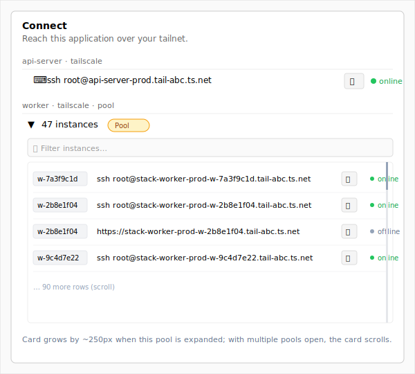
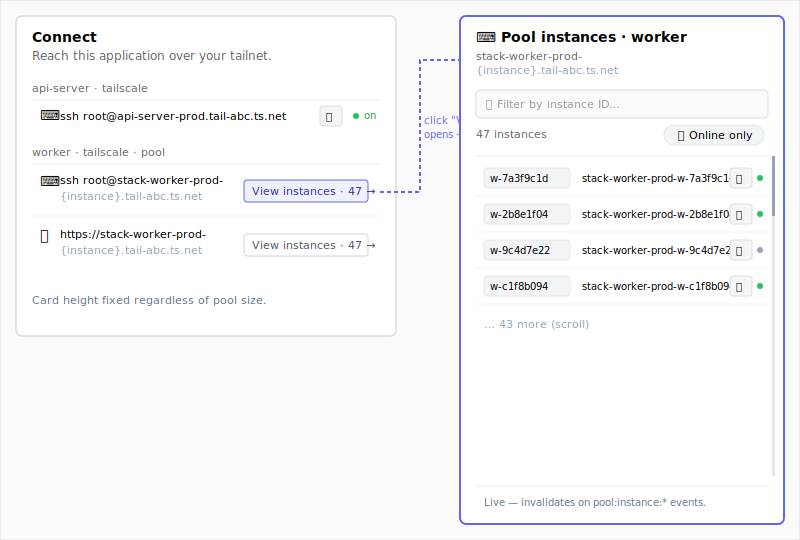

# Design: Phase 6: Pool integration — Connect-panel disclosure (MINI-49)

**Issue:** MINI-49 (run `mk issue show MINI-49` for the full ticket)
**Goal (from ticket):** disclosure pattern for the Application Connect card so a pool with N instances exposes per-instance `ssh` / HTTPS actions without flooding the panel.
**Done when (from ticket):** design doc attached + recommendation merged on `main`; impl ticket MINI-48 picks it up from the linked mk doc.

## Context

Phases 1–5 of the addons plan shipped per-application Tailscale sidecars for `Stateful` and `StatelessWeb` services. The Application Overview's [`ConnectCard`](../../client/src/app/applications/[id]/_components/connect-card.tsx) renders one [`EndpointRow`](../../client/src/app/applications/[id]/_components/endpoint-row.tsx) per `(targetService, kind)` derived from the stack's last-applied snapshot ([`stacks-addon-endpoints-route.ts:70-130`](../../server/src/routes/stacks/stacks-addon-endpoints-route.ts)). At most ~2 rows per target service today (ssh + https), grouped by target, with a "Show all N endpoints" reveal once the flat list crosses 5.

Phase 6 (MINI-48) extends the addon framework to pool services. Each pool instance becomes its own tailnet device with hostname `{stack}-{service}-{env}-{instance-id}` (sanitised, ≤63 chars; FNV-1a-32 fallback when oversized). For a pool service with `tailscale-ssh` + `tailscale-web` and N runtime instances, a naïve extension produces `2 × N` rows under one target group. The plan calls out 50-instance pools as the design challenge; even 10 instances dwarf the rest of the card.

Two structural facts shape the design. **First**, today's addon endpoints route is a *snapshot read* — derived purely from `lastAppliedSnapshot`, with no live-pool plumbing. Pool instance state lives on a separate live pipeline ([`usePoolInstances`](../../client/src/hooks/use-pool-instances.ts), `Channel.POOLS` socket events). Designs that fold per-instance rows into the addon endpoints API drag pool runtime state into a snapshot route; designs that keep them separate let each pipeline stay focused. **Second**, per-instance hostnames are *deterministic from the (stack, service, env, instanceId) tuple* via the same `sanitizeTailscaleHostname` helper — so the client can compute them locally as long as it has the live instance list.

The two options below differ along the **data-flow + UI surface axis**: where the per-instance list lives. Option A folds it inline into the existing flat-list card and extends the snapshot route to enumerate per-instance endpoints. Option B keeps the card as a per-pool *summary* row and drills the per-instance list into a Sheet that pulls from the existing live pool pipeline. The cleanliness of pipeline separation is what tilts the recommendation.

---

## Option A — Inline expandable disclosure (mirror PoolServiceRow)

**Differs from Option B on:** data-flow shape (snapshot route enumerates per-instance rows; inline UI) vs. composition (summary card + drill-in Sheet using live pool API).

### Idea in one paragraph

The `ConnectCard` keeps its current shape: per-target-service group with flat `EndpointRow`s. For pool targets, the group now renders a chevron-disclosure header — `{count} instances` — that, when expanded, reveals one `EndpointRow` per `(instanceId, kind)` inline. Above ~10 instances the expanded list gets a search input and a `max-h-72 overflow-y-auto` cap so it doesn't dominate the card. The server-side addon endpoints route is extended: for each pool target, it queries the live `PoolInstance` table and emits one `TailscaleAddonEndpoint` per (instance × addon kind), with `instanceId` and a fully-resolved per-instance hostname/URL on each row. The client is dumb — it groups what the server hands back. This mirrors the pattern already in [`PoolServiceRow.tsx:122-225`](../../client/src/components/stacks/PoolServiceRow.tsx) on the Stack detail page (chevron + nested table for instances).

### Wireframe



### UI components to use

- **Card shell:** unchanged — [`ConnectCard`](../../client/src/app/applications/[id]/_components/connect-card.tsx) itself, including the current `groupByTargetService` + `clampGroupedRows` "Show all N" pattern.
- **Per-target group header (pool variant):** `<button>` with `IconChevronRight` / `IconChevronDown` (matches the existing `PoolServiceRow.tsx` disclosure idiom) plus a count `Badge` — no new primitive, just a structural lift of the disclosure UX one level up from the pool detail page.
- **Search input (only on expanded pools >10 instances):** `Input` from [`client/src/components/ui/input.tsx`](../../client/src/components/ui/input.tsx) with an `IconSearch` prefix; debounced client-side filter on `instanceId` substring match.
- **Per-instance row:** existing `EndpointRow` from [`endpoint-row.tsx`](../../client/src/app/applications/[id]/_components/endpoint-row.tsx) — extended only to render the instance ID prefix (`<code>{instanceId}</code>`) before the action affordance when the endpoint carries one. Same copy button, same `DeviceStatusBadge`.
- **Empty pool (zero running instances):** small muted line "No active instances. Pool instances are created on demand by the caller service." — copy lifted verbatim from `PoolServiceRow.tsx:169-172` so the operator sees the same message in both places.

### States, failure modes & lifecycle

- **Pool group header:**
  - **Empty** (zero instances): renders `0 instances` greyed; click still expands but shows the empty-pool muted line.
  - **Failure:** `usePoolInstances` errors fold into the per-target group — surface a small inline `Alert` ("Couldn't load pool instances — retry"). Snapshot-derived ssh/https endpoint rows for *static* services in the same card stay visible; only the pool's section degrades.
  - **Live input:** none; clicking the chevron is the only interaction.
- **Search input (when present):**
  - **Empty:** placeholder `Filter instances…`; submit-button equivalent N/A (filter is reactive, not a submit).
  - **Failure:** N/A — pure client-side filter.
  - **Live input:** debounced 150ms; renders "No instances match" when the filter empties the list.
- **Page-level lifecycle:**
  - **Configured state.** The card renders identically across "never-configured" / "just-saved" / "re-edit" — the addon endpoints route returns `[]` until the stack is applied with addons, at which point the card surfaces. There is no "edit" mode; the card is a read-only overview.
  - **Latency window.** Initial fetch shows the existing skeleton rows. Per-instance enumeration on the server side is bounded by the pool size — for 50 instances, expect a small ms-scale bump in route response time (single DB query). No multi-second waits.
  - **Reversibility.** None per-row — this is a read-only surface. Pool instances spawn/reap via the existing pipeline; the card observes.

### Key abstractions

- **`TailscaleAddonEndpoint.instanceId?: string`** — optional new field on the existing type ([`lib/types/tailscale.ts:131-151`](../../lib/types/tailscale.ts)). When set, the row is per-instance; when absent, it's per-service (today's shape). Single discriminator avoids a second type.
- **`deriveEndpoints` extended** ([`server/src/routes/stacks/stacks-addon-endpoints-route.ts:70-130`](../../server/src/routes/stacks/stacks-addon-endpoints-route.ts)) — for each addon-bearing service whose `serviceType === 'Pool'`, query `prisma.poolInstance.findMany({ where: { stackId, serviceName, status: { in: ['running', 'starting'] } } })` and emit one endpoint per (instance × kind). Reuses `sanitizeTailscaleHostname` with a fourth `instanceId` segment.
- **`PoolEndpointGroup` (new client component)** — renders the chevron header, count badge, search-input-when-large, and the inline list. Lives next to `connect-card.tsx`. Reads grouped endpoints from the existing route response.

### File / component sketch

```
lib/types/tailscale.ts                                                          (changed)    — TailscaleAddonEndpoint.instanceId?: string + sanitizeTailscaleHostname overload accepting an instance segment
server/src/routes/stacks/stacks-addon-endpoints-route.ts                        (changed)    — deriveEndpoints branches on serviceType === 'Pool', queries PoolInstance, emits per-instance rows
server/src/__tests__/stacks-addon-endpoints-route.test.ts                       (changed)    — add Pool fixture; assert per-instance row shape + sort order
client/src/app/applications/[id]/_components/connect-card.tsx                    (changed)    — groupByTargetService gains a 'pool' tag; renders <PoolEndpointGroup> when a target is a pool
client/src/app/applications/[id]/_components/pool-endpoint-group.tsx             (new)        — chevron-disclosure + inline filtered list of EndpointRows
client/src/app/applications/[id]/_components/endpoint-row.tsx                    (changed)    — render instanceId prefix when endpoint.instanceId is set
```

### Implementation outline

1. **Plumb the type.** Add `instanceId?: string` to `TailscaleAddonEndpoint` in `lib/types/tailscale.ts`. Build lib so client/server both pick it up.
2. **Extend the snapshot route.** In `deriveEndpoints`, branch on `service.serviceType === 'Pool'` (looked up via the snapshot's `services[]` for `synthetic.targetService`). For pool targets, query active `PoolInstance` rows and emit one endpoint per (instance × addon kind). Sort: target alphabetical → instanceId alphabetical → ssh-before-https.
3. **Wire the row.** Update `EndpointRow` to render the instance ID as a leading mono-font chip when `endpoint.instanceId` is set; keep the existing layout otherwise.
4. **Build `PoolEndpointGroup`.** Chevron header with count Badge; on expand, render the per-instance rows; for `>= POOL_SEARCH_THRESHOLD` (10) instances, render the search input + `max-h-72 overflow-y-auto` wrapper.
5. **Switch grouping.** In `ConnectCard`, the `groupByTargetService` helper distinguishes pool vs static groups (via the presence of any `instanceId` in the group); render `<PoolEndpointGroup>` for pool groups, today's flat `<ServiceGroup>` for static.
6. **Tests + smoke.** Server-side fixture covering 0 / 1 / N instance pools; client smoke via `playwright-cli` confirming chevron disclosure, search filter, copy-button propagation, and that the static-service rows in the same card stay unaffected.

### Pros

- **Minimal new pattern.** The Connect card already does flat-list disclosure; the chevron-into-table idiom already lives on `PoolServiceRow`. Operators recognise it instantly.
- **Single round-trip.** The card has every endpoint in one response — no deferred fetch when expanding.
- **Per-instance status badges everywhere.** Each row carries its own `DeviceStatusBadge` directly; "online" vs "offline" is visible without drilling.

### Cons

- **The snapshot route now reads live pool state.** `stacks-addon-endpoints-route.ts` becomes a hybrid (snapshot + live DB join), which couples two pipelines that are otherwise cleanly separated. The route is also no longer cacheable on snapshot-version alone.
- **50 instances inline is still a lot.** Even with `max-h-72` + scroll, a 50-instance expand creates a tall scrolling region inside an Overview card — operators will scroll-trap in it. The search box helps but the geometry is still cramped.
- **Stale-on-mutation risk.** The route fetches once and sends one response; pool instances spawn/reap on socket events. The card has to re-fetch on `pool:instance:*` events to stay live, which means the route picks up *another* invalidation channel. Or the card stays stale until a manual refresh — a regression vs. how live the static-service rows feel.
- **Per-pool addon-kind interleaving.** Each instance produces 2 rows (ssh + https). 50 instances × 2 = 100 rows in one group. Even with grouping by instance ID first, the visual density is high.

---

## Option B — Pool summary row + drill-in Sheet (recommended)

**Differs from Option A on:** the addon endpoints API stays a pure snapshot read; per-instance enumeration happens *only* when the operator opens the picker, sourced from the existing live pool pipeline. The card surface stays compact regardless of pool size.

### Idea in one paragraph

For pool targets, the `ConnectCard` shows a single *summary row* per `(targetService, addonKind)` — one ssh row, one https row — with a count badge ("47 instances"), a hostname *template* string (`{stack}-{service}-{env}-{instance}.<tailnet>` with `{instance}` styled as a placeholder), and a "View instances →" affordance. Clicking opens a right-side **Sheet** that lists the live per-instance rows (driven by the existing `usePoolInstances` hook + client-side hostname computation) with a search input, online-first sort, and per-row copy/open + status badge. The addon endpoints API stays a snapshot read — it gains an `isPool: true` discriminator on existing rows; per-instance enumeration is the Sheet's job. One new client component (`PoolEndpointsSheet`); zero changes to the snapshot pipeline beyond the discriminator.

### Wireframe



### UI components to use

- **Card shell:** unchanged — [`ConnectCard`](../../client/src/app/applications/[id]/_components/connect-card.tsx).
- **Pool summary row:** structural variant of [`endpoint-row.tsx`](../../client/src/app/applications/[id]/_components/endpoint-row.tsx) — same kind icon (`IconTerminal2` for ssh, `IconWorld` for https), same target-service caption, but the action area renders the hostname *template* (with `{instance}` in muted styling) and a `Button variant="ghost" size="sm"` "View instances · {count}" instead of a copy button. No `DeviceStatusBadge` on the summary row (the Sheet shows per-instance badges).
- **Sheet:** [`Sheet`](../../client/src/components/ui/sheet.tsx) opened to `side="right"` — pattern already used by [`service-edit-drawer.tsx:162`](../../client/src/components/stack-templates/service-drawer/service-edit-drawer.tsx) and [`config-file-drawer.tsx:120`](../../client/src/components/stack-templates/config-files/config-file-drawer.tsx).
- **Sheet header:** `SheetTitle` "Pool instances · {targetService}" with the addon-kind icon; `SheetDescription` shows the hostname template once.
- **Sheet search:** `Input` with `IconSearch` prefix; debounced filter on `instanceId` substring.
- **Sheet sort/filter row:** small toggle for "Online only" using `Toggle` from [`client/src/components/ui/toggle.tsx`](../../client/src/components/ui/toggle.tsx); default sort = online → offline → unknown, then by `instanceId`.
- **Sheet per-instance row:** new compact row (mono `instanceId`, full per-instance URL, `DeviceStatusBadge`, `IconCopy` button) — semantically similar to `EndpointRow` but with the instance ID promoted to the leading column. Reuse `CopyButton` from `endpoint-row.tsx`; reuse `DeviceStatusBadge` from [`device-status-badge.tsx`](../../client/src/components/stacks/device-status-badge.tsx).
- **Loading state inside Sheet:** existing `Skeleton` rows (3 placeholder rows) until `usePoolInstances` resolves.
- **Empty pool inside Sheet:** muted "No active instances. Pool instances are created on demand by the caller service." (lifted verbatim from `PoolServiceRow.tsx:169-172`).

### States, failure modes & lifecycle

- **Pool summary row:**
  - **Empty** (zero instances): summary row still renders with count `0 instances`; clicking opens the Sheet which shows the empty-pool message. The summary's hostname template is informational either way.
  - **Failure:** none on the summary side — it's derived from the snapshot, same path as static rows.
  - **Live input:** none.
- **Sheet content:**
  - **Empty:** the verbatim pool-empty muted line; search/sort UI hides when the underlying list is empty.
  - **Failure:** `usePoolInstances` errors render a small inline `Alert` inside the Sheet ("Couldn't load pool instances — retry"); static-card rows in the underlying `ConnectCard` stay healthy regardless.
  - **Live input:** debounced 150ms search; "Online only" toggle re-renders the list. The list invalidates on `pool:instance:*` socket events (already wired by `usePoolInstances`).
- **Page-level lifecycle:**
  - **Configured state.** Same three states as Option A — the summary card has no edit mode. The first time an operator opens the Sheet for a pool there's a fresh fetch + 2-3s warm period; subsequent opens are instant via TanStack Query cache.
  - **Latency window.** Sheet open is non-blocking — Sheet animates in immediately, content shows skeleton rows until `usePoolInstances` resolves (typically <300ms; the hook also has 2s `staleTime` so re-opens are instant). No "Validate" button, no save lifecycle, no cancellation surface.
  - **Reversibility.** None — read-only surface end-to-end.
- **Differs from Option A:** because per-instance state lives behind a click, the card itself is *immutable in shape* — a 50-instance pool and a 1-instance pool produce the same card geometry. Option A's expanded card warps based on pool size. The "live-ness" of per-instance status is identical (both rely on `usePoolInstances`'s socket events) but Option B contains the live re-render to the Sheet; in Option A every pool:instance:* event invalidates the addon endpoints query, redrawing the card itself.

### Key abstractions

- **`TailscaleAddonEndpoint.isPool?: boolean` + `templateHostname?: string`** — additive fields on the existing type. `isPool` discriminates the row variant; `templateHostname` (e.g. `{stack}-{service}-{env}-{instance}.<tailnet>`) is the literal string the summary row renders.
- **`PoolEndpointsSheet` (new client component)** — the right-side sheet. Props: `stackId`, `targetService`, `addonKind`, `templateHostname`, `tailnet`. Calls `usePoolInstances(stackId, targetService)` and computes per-instance hostnames locally via a shared sanitisation helper from `lib/types/tailscale.ts`.
- **`buildPoolInstanceHostname(stack, service, env, instanceId)`** — new helper in [`lib/types/tailscale.ts`](../../lib/types/tailscale.ts) that wraps `sanitizeTailscaleHostname` with the fourth instance segment. Single source of truth shared between the Sheet and the impl-ticket's per-instance addon synthesis on the server.

### File / component sketch

```
lib/types/tailscale.ts                                                           (changed)    — TailscaleAddonEndpoint gains isPool? + templateHostname?; export buildPoolInstanceHostname helper
server/src/routes/stacks/stacks-addon-endpoints-route.ts                         (changed)    — deriveEndpoints sets isPool/templateHostname when target service is a Pool; no PoolInstance query
server/src/__tests__/stacks-addon-endpoints-route.test.ts                        (changed)    — add Pool fixture; assert summary row shape + isPool + templateHostname
client/src/app/applications/[id]/_components/connect-card.tsx                     (changed)    — render <PoolSummaryRow> when endpoint.isPool, else today's <EndpointRow>
client/src/app/applications/[id]/_components/pool-summary-row.tsx                 (new)        — single-row summary; "View instances" opens the Sheet
client/src/app/applications/[id]/_components/pool-endpoints-sheet.tsx             (new)        — right Sheet with search, sort toggle, per-instance rows
client/src/app/applications/[id]/_components/pool-instance-row.tsx                (new)        — one row inside the Sheet (instanceId, full URL, status, copy)
```

### Implementation outline

1. **Add the discriminator + helper.** `isPool?: boolean` + `templateHostname?: string` on `TailscaleAddonEndpoint`; `buildPoolInstanceHostname` exported from `lib/types/tailscale.ts`. This helper is shared with the impl-ticket's server-side per-instance hostname rule, so it lands once.
2. **Wire the snapshot route.** In `deriveEndpoints`, when the target service is a Pool, set `isPool: true` and `templateHostname: \`${sanitised(stack-service-env)}-{instance}.${tailnet}\``. No new DB query — keep the route a pure snapshot read.
3. **Build `PoolSummaryRow`.** One per (target, kind). Renders kind icon, target caption, the template hostname (with `{instance}` styled as `<span class="text-muted-foreground">`), and a "View instances · {count}" button. Pulls the count from `usePoolInstances(stackId, targetService).data?.length` (the hook is already cheap; reused under the hood by the Sheet so the second open is instant).
4. **Build `PoolEndpointsSheet`.** Sheet shell + header + search + sort toggle + scrollable list of `PoolInstanceRow`s. Computes each row's hostname via `buildPoolInstanceHostname`. Sort default: online → offline → unknown, then `instanceId` alphabetical.
5. **Build `PoolInstanceRow`.** Mono `instanceId` chip, the resolved per-instance URL (ssh-as-code or https-as-anchor), `DeviceStatusBadge`, copy button. Reuse `CopyButton` from `endpoint-row.tsx`.
6. **Switch the card.** `ConnectCard` checks `endpoint.isPool` per row; renders the summary variant or the existing `EndpointRow`. `groupByTargetService` keeps working unchanged.
7. **Tests + smoke.** Server-side fixture for the discriminator. Client smoke via `playwright-cli`: open Sheet on a 0-instance pool / 3-instance / 47-instance pool; confirm search filters; confirm `pool:instance:starting` event invalidates the Sheet's list while it's open.

### Pros

- **Card geometry is independent of pool size.** A 1-instance pool and a 47-instance pool produce the same card height and the same number of summary rows. Option A can't promise that.
- **Snapshot route stays a snapshot read.** No live `PoolInstance` query in `deriveEndpoints`; the live pipeline (`usePoolInstances` + `Channel.POOLS`) stays the single source for pool runtime state. Pipeline separation = simpler caching, simpler invalidation.
- **The Sheet handles 50 instances natively.** Search + online-first sort + scrollable list is the right shape for the listing problem. Inline disclosure can't match it.
- **Reuses an existing hook unchanged.** `usePoolInstances` already exists with full socket invalidation. Per-instance hostname computation is a pure function. No new server-side aggregation.
- **Composes cleanly with future addons.** A second addon kind (say, OIDC scopes) attached to a pool would just add another summary row + Sheet variant — no per-pool inline-list density to worry about.

### Cons

- **Extra click for tiny pools.** A 1-instance pool still hides its single endpoint behind a Sheet open. Mitigation: show the per-instance URL directly on the summary row when count === 1 (small special-case in `PoolSummaryRow` — drop the "View instances" button, render the resolved URL + copy). Otherwise the consistency win argument applies.
- **Two new components.** `PoolEndpointsSheet` + `PoolInstanceRow` (plus `PoolSummaryRow`) is more surface area than Option A's single `PoolEndpointGroup`. Mitigation: each component is small (~80 LOC); the Sheet primitive is well-trodden in the codebase.
- **No per-instance status visible at a glance.** Operators have to open the Sheet to see "is instance X-7 online". Mitigation: the count badge could optionally split (`23 online · 24 offline`) — minor refinement; flagged as a follow-up rather than baseline scope.

---

## Recommendation

**Option B.** Three reasons in priority order:

1. **The spec calls out 50-instance pools as the design challenge.** A right-side Sheet with search + sort is the textbook shape for "list of N where N might be large". Inline disclosure works for small N and degrades visibly past ~15-20 — and the worst case isn't 15, it's 50.
2. **Pipeline separation matters more than one extra click.** Keeping `stacks-addon-endpoints-route.ts` a pure snapshot read is the difference between a route that's cacheable on snapshot-version and a route that has to invalidate on every `pool:instance:*` event. The cost — one extra click on the small-pool case — is offset by the count===1 special-case in the summary row.
3. **Connect card geometry stays predictable.** The Application Overview is a glance-level surface; an operator scanning for "what can I reach" benefits more from a card whose shape doesn't warp with pool size than from saving a click on small pools.

Facts that would flip the call to Option A: if production pools are typically 1-3 instances and 50-instance pools are hypothetical (then ergonomics for the common case dominates), or if a future requirement bakes per-instance status badges directly into the card-level view (then the inline list earns its size). Both are answerable with one piece of data — average pool size in production today — that the Open question below names.

## Open questions

- **Average production pool size.** The recommendation hinges on the *common* case. If pools are typically 1-3 instances, Option B's small-pool count===1 special-case absorbs the friction; if pools are typically 20+, Option A loses geometry control entirely. Would help to pin this with one query against the production `PoolInstance` table before MINI-48 starts.
- **Should the Sheet be modal or non-modal?** Default Sheet behaviour traps focus and dims the page; non-modal ("popover-like") lets the operator keep the card visible. Recommended default: modal (matches `service-edit-drawer.tsx`'s convention) — operators are looking up *one* instance at a time.

## Out of scope

- **Per-instance stop/start actions in the Sheet.** The pool detail page (`/applications/[id]/pool`) already exposes the manual stop action via `PoolServiceRow`; duplicating it on the Connect Sheet conflates "where do I reach this" with "how do I manage this". Different ticket if the team wants it.
- **Cross-pool aggregation.** A future "all pools across all stacks" surface might want a different list shape; that's a different feature, not this card.
- **Mobile/narrow-viewport tuning.** The right Sheet defaults to bottom-up on narrow viewports per the existing primitive. No special-casing here.
- **Bulk copy ("copy hostname template for use in scripts").** Useful but not in scope for the Connect surface — the template hostname on the summary row is already copyable via the existing `CopyButton` if we wire it; flagged for a follow-up rather than baseline.
