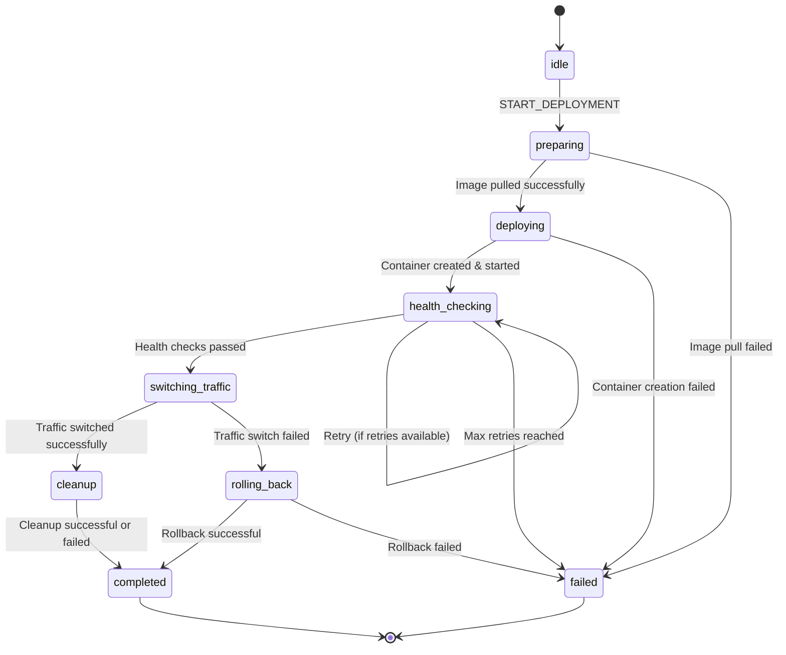
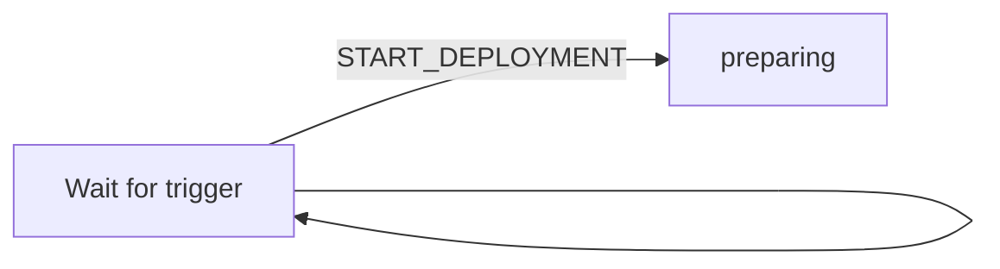
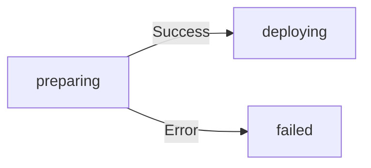
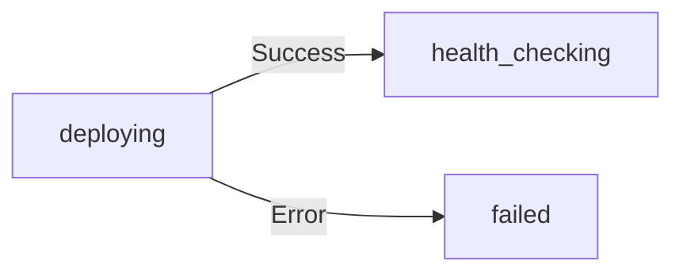
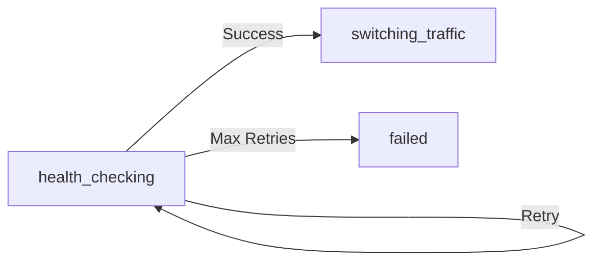
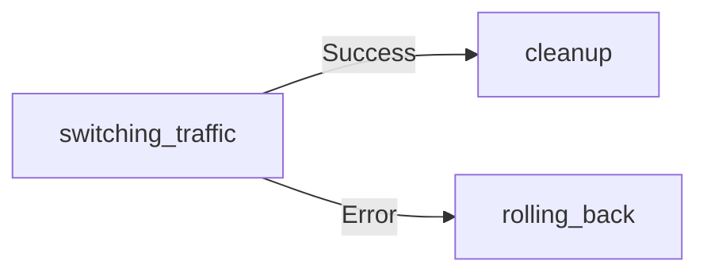
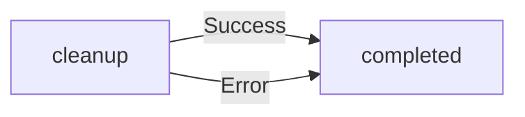
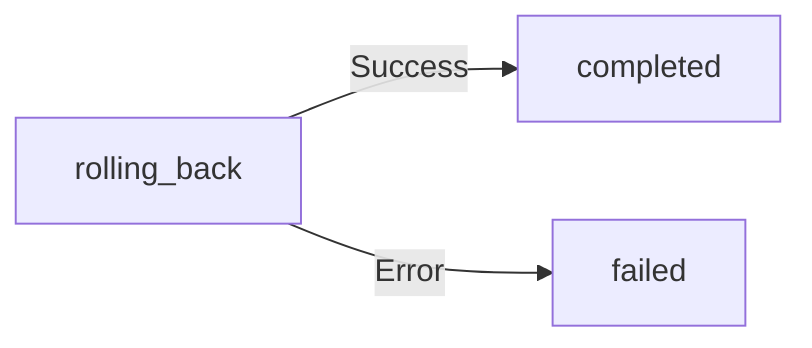
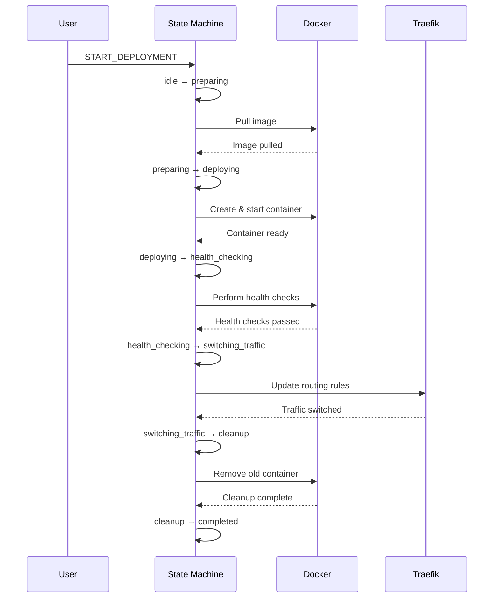
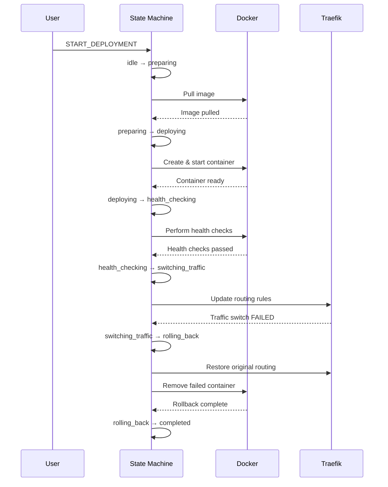

# Deployment State Machine Documentation

## Overview

The deployment state machine orchestrates zero-downtime deployments using XState v5. It manages the complete lifecycle of a deployment from initialization through container creation, health checking, traffic switching, and cleanup or rollback scenarios.

## State Machine Structure

### Core States

The machine consists of 8 primary states:

1. **idle** - Initial state, waiting for deployment trigger
2. **preparing** - Pulling Docker image
3. **deploying** - Creating and starting new container
4. **health_checking** - Verifying new container health
5. **switching_traffic** - Redirecting traffic to new container
6. **cleanup** - Removing old container
7. **rolling_back** - Reverting to previous container on failure
8. **completed** (final) - Successful deployment completion
9. **failed** (final) - Deployment failure

## State Transition Diagram



## Deployment Context

The deployment context maintains all state information throughout the deployment process:

### Core Properties
- `deploymentId`: Unique deployment identifier
- `configurationId`: Reference to deployment configuration
- `config`: Complete deployment configuration object
- `triggerType`: How deployment was triggered (manual/automatic)
- `triggeredBy`: User or system that initiated deployment
- `dockerImage`: Docker image being deployed

### Container Tracking
- `oldContainerId`: ID of currently running container
- `newContainerId`: ID of newly created container
- `targetColor`: Blue/green deployment target color

### Progress Tracking
- `currentStep`: Current state name for progress reporting
- `steps`: Array of deployment steps with status
- `startTime`: Deployment start timestamp
- `deploymentTime`: Total deployment duration in seconds
- `downtime`: Measured downtime during deployment

### Health Check Management
- `healthCheckPassed`: Boolean flag for health check status
- `healthCheckLogs`: Array of health check results

### Error Handling
- `errorMessage`: Human-readable error description
- `errorDetails`: Detailed error information
- `retryCount`: Current retry attempt number
- `maxRetries`: Maximum allowed retries (default: 3)

## State Behaviors

### 1. Idle State

- **Entry**: Clear current step
- **Transitions**: Waits for START_DEPLOYMENT event
- **Actions**: Log deployment start, set start time

### 2. Preparing State

- **Entry**: Set current step to "preparing"
- **Service**: Invokes `pullDockerImage` service
- **Success**: Transition to deploying
- **Failure**: Transition to failed with error handling

### 3. Deploying State

- **Entry**: Set current step to "deploying"
- **Service**: Invokes `createAndStartContainer` service
- **Success**: Sets new container ID, transitions to health_checking
- **Failure**: Transition to failed with container error

### 4. Health Checking State

- **Entry**: Set current step to "health_checking"
- **Service**: Invokes `performHealthChecks` service
- **Success**: Mark health check passed, transition to switching_traffic
- **Failure with retries**: Increment retry count, retry health check
- **Failure without retries**: Transition to failed

### 5. Traffic Switching State

- **Entry**: Set current step to "switching_traffic"
- **Service**: Invokes `switchTrafficToNewContainer` service
- **Success**: Transition to cleanup
- **Failure**: Transition to rolling_back for recovery

### 6. Cleanup State

- **Entry**: Set current step to "cleanup"
- **Service**: Invokes `cleanupOldContainer` service
- **Both paths**: Calculate deployment time, transition to completed
- **Note**: Cleanup failures don't fail the deployment

### 7. Rolling Back State

- **Entry**: Set current step to "rolling_back"
- **Service**: Invokes `performRollback` service
- **Success**: Log rollback completion, transition to completed
- **Failure**: Transition to failed with critical error

## Action Handlers

### Assignment Actions
- `setNewContainerId`: Stores the newly created container ID
- `setHealthCheckPassed`: Marks health checks as successful
- `incrementRetryCount`: Increases retry counter for health checks
- `resetForRetry`: Clears error state for retry attempts
- `calculateDeploymentTime`: Computes total deployment duration

### Error Handling Actions
- `handleImagePullError`: Processes Docker image pull failures
- `handleContainerError`: Manages container creation/start failures
- `handleHealthCheckError`: Handles health check failures with retry logic
- `handleTrafficSwitchError`: Processes traffic switching failures
- `handleRollbackError`: Manages critical rollback failures

### Logging Actions
The state machine includes comprehensive logging at multiple levels:

#### Info Level Logging
- `logDeploymentStart`: Initial deployment trigger
- `logImagePulled`: Successful image pull
- `logContainerCreated`: Container creation success
- `logHealthCheckPassed`: Health check success
- `logTrafficSwitched`: Traffic switch completion
- `logDeploymentCompleted`: Final success
- `logRollbackCompleted`: Successful rollback

#### Warning Level Logging
- `logHealthCheckRetry`: Health check retry attempts
- `logCleanupError`: Non-critical cleanup failures

#### Debug Level Logging
- `logStateEntry`: Entry to each state with full context
- `logStateExit`: Exit from each state
- `logTransition`: State transition events with event data
- `logContextAfterAssign`: Context updates after assignments

## Guards (Conditions)

### maxRetriesReached
```javascript
({ context }) => context.retryCount >= context.maxRetries
```
Determines if maximum retry attempts have been exhausted for health checks.

### canRetry
```javascript
({ context }) => context.retryCount < context.maxRetries
```
Checks if additional retry attempts are available.

## Event Types

The state machine responds to these events:

- `START_DEPLOYMENT` - Initiates deployment process
- `IMAGE_PULLED` - Image pull completed
- `IMAGE_PULL_FAILED` - Image pull error
- `CONTAINER_CREATED` - Container creation success
- `CONTAINER_CREATION_FAILED` - Container creation error
- `CONTAINER_STARTED` - Container start success
- `CONTAINER_START_FAILED` - Container start error
- `HEALTH_CHECK_PASSED` - Health checks successful
- `HEALTH_CHECK_FAILED` - Health check failure
- `TRAFFIC_SWITCHED` - Traffic routing updated
- `TRAFFIC_SWITCH_FAILED` - Traffic switch error
- `CLEANUP_COMPLETED` - Old container removed
- `CLEANUP_FAILED` - Cleanup error
- `RETRY` - Retry current operation
- `FORCE_ROLLBACK` - Manual rollback trigger
- `ROLLBACK_COMPLETED` - Rollback success
- `ROLLBACK_FAILED` - Rollback error

## Deployment Flow Examples

### Successful Deployment


### Deployment with Rollback


## Integration with Services

The state machine integrates with several external services through invoked promises:

1. **pullDockerImage**: Docker registry interaction for image retrieval
2. **createAndStartContainer**: Docker API for container lifecycle
3. **performHealthChecks**: Application health endpoint monitoring
4. **switchTrafficToNewContainer**: Traefik API for routing updates
5. **cleanupOldContainer**: Docker API for container removal
6. **performRollback**: Orchestrated rollback operations

## Error Recovery Strategies

### Retry Logic
- Health checks automatically retry up to `maxRetries` times
- Exponential backoff can be implemented in the service layer
- Each retry increments the retry counter

### Rollback Mechanism
- Triggered automatically on traffic switch failures
- Restores previous container as active
- Removes failed new container
- Updates routing to original configuration

### Graceful Degradation
- Cleanup failures don't fail the deployment
- Partial success states are logged for manual intervention
- Critical failures trigger immediate rollback

## Monitoring and Observability

### Progress Tracking
- Real-time state updates via `currentStep`
- Detailed step array with individual statuses
- Deployment time metrics

### Logging Strategy
- Structured logging with Pino
- Separate log file: `app-deployments.log`
- Debug, info, warning, and error levels
- Full context snapshots at state transitions

### Metrics Collection
- Deployment duration (`deploymentTime`)
- Downtime measurement (`downtime`)
- Retry attempt tracking
- Success/failure rates

## Best Practices

1. **Idempotency**: All service invocations should be idempotent
2. **Timeout Management**: Services should implement appropriate timeouts
3. **Resource Cleanup**: Always clean up resources, even on failure
4. **Health Check Design**: Implement comprehensive health checks
5. **Rollback Safety**: Ensure rollback operations are always safe
6. **Logging Completeness**: Log all state transitions and context changes
7. **Error Context**: Preserve error details for debugging

## Configuration

Default configuration values:
- `maxRetries`: 3 attempts for health checks
- `targetColor`: Alternates between "blue" and "green"
- Initial state: `idle`

## Usage Example

```typescript
import { createActor } from 'xstate';
import { deploymentStateMachine } from './deployment-state-machine';

// Create actor with initial context
const deploymentActor = createActor(deploymentStateMachine, {
  input: {
    deploymentId: 'deploy-123',
    configurationId: 'config-456',
    config: deploymentConfig,
    triggerType: 'manual',
    triggeredBy: 'user@example.com',
    dockerImage: 'myapp:latest',
    oldContainerId: 'container-old',
    newContainerId: null,
    targetColor: 'blue',
    currentStep: '',
    steps: [],
    startTime: Date.now(),
    healthCheckPassed: false,
    healthCheckLogs: [],
    errorMessage: null,
    errorDetails: null,
    retryCount: 0,
    maxRetries: 3,
    deploymentTime: null,
    downtime: 0
  }
});

// Subscribe to state changes
deploymentActor.subscribe((state) => {
  console.log('Current state:', state.value);
  console.log('Context:', state.context);
});

// Start the actor
deploymentActor.start();

// Trigger deployment
deploymentActor.send({ type: 'START_DEPLOYMENT' });
```

## Conclusion

This deployment state machine provides a robust, observable, and recoverable deployment orchestration system. Its clear state transitions, comprehensive error handling, and detailed logging make it suitable for production zero-downtime deployments with automatic rollback capabilities.