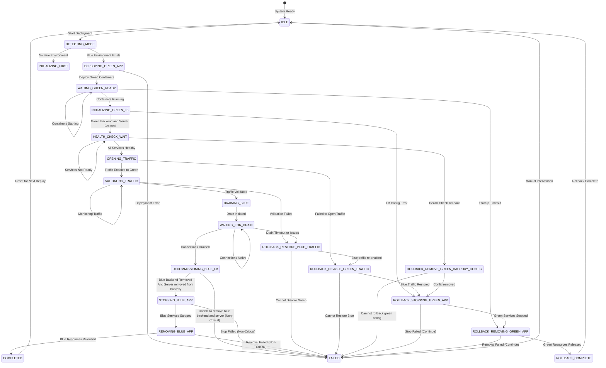
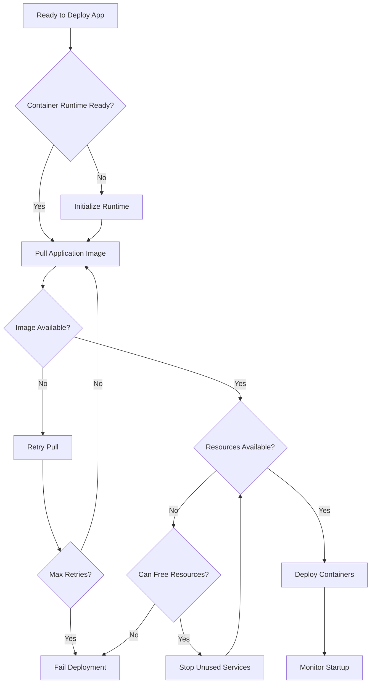
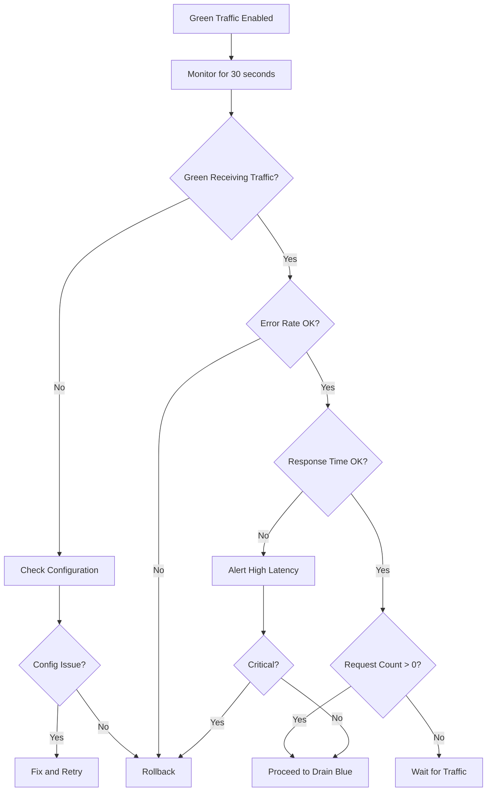
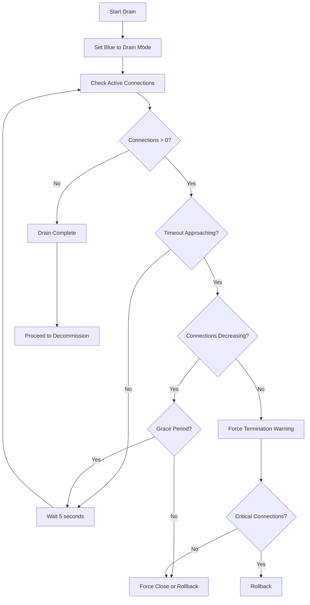
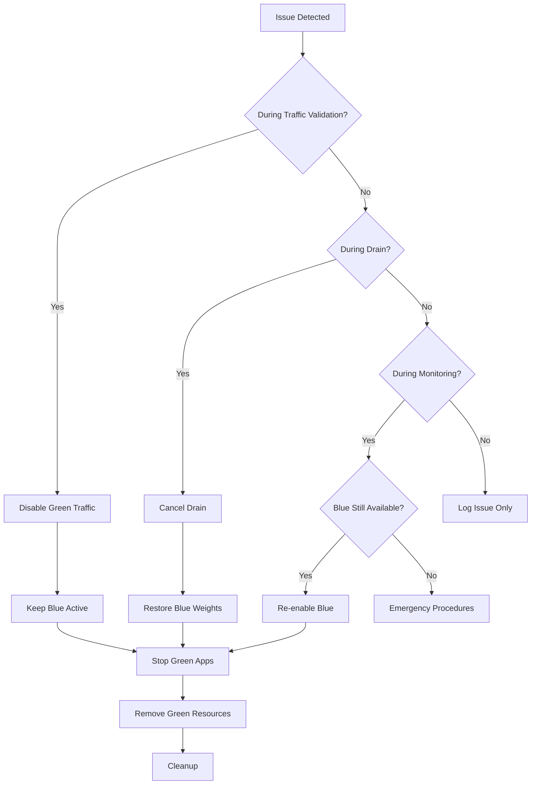
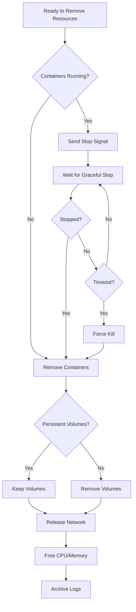

# HAProxy Blue-Green Deployment State Machine

## Overview

This document describes the state machine architecture for managing zero-downtime deployments using HAProxy as a load balancer with a blue-green deployment strategy. The system orchestrates traffic enablement, validation, connection draining, and rollback capabilities to ensure continuous service availability during application updates.

## Core Concepts

### Blue-Green Deployment Strategy

The blue-green deployment pattern maintains two production environments:
- **Blue Environment**: The current live production environment serving traffic
- **Green Environment**: The new version being deployed

For updates, traffic is opened to green alongside blue, validated, then blue is drained. For initial deployments, only the green environment is configured and activated.

### Key Components

1. **HAProxy Load Balancer**: Manages traffic distribution between blue and green backends
2. **Health Monitor**: Continuously validates server health and application readiness
3. **Traffic Controller**: Manages traffic enablement and connection draining
4. **Transaction Manager**: Ensures atomic configuration changes with rollback capability
5. **State Coordinator**: Manages the overall deployment state machine
6. **Deployment Mode Detector**: Determines if this is an initial or update deployment
7. **Application Orchestrator**: Manages deployment and removal of application containers/services
8. **Resource Manager**: Handles allocation and deallocation of compute resources

## State Machine Diagrams

### Update Deployment Flow (Blue Environment Exists)



### Initial Deployment Flow (First Time)

```mermaid
stateDiagram-v2
    [*] --> IDLE: System Ready
    
    IDLE --> DETECTING_MODE: Start Deployment
    
    DETECTING_MODE --> DEPLOYING_INITIAL_APP: No Blue Environment
    
    DEPLOYING_INITIAL_APP --> WAITING_APP_READY: Deploy Application Containers
    DEPLOYING_INITIAL_APP --> FAILED: Deployment Error
    
    WAITING_APP_READY --> WAITING_APP_READY: Containers Starting
    WAITING_APP_READY --> INITIALIZING_FIRST_LB: Containers Running
    WAITING_APP_READY --> FAILED: Startup Timeout
    
    INITIALIZING_FIRST_LB --> INITIAL_HEALTH_CHECK: Initialize HAProxy and create backend
    INITIALIZING_FIRST_LB --> FAILED: Initialization Error
    
    INITIAL_HEALTH_CHECK --> INITIAL_HEALTH_CHECK: Servers Not Ready
    INITIAL_HEALTH_CHECK --> ENABLING_TRAFFIC: All Servers Healthy
    INITIAL_HEALTH_CHECK --> FAILED: Health Check Timeout
    
    ENABLING_TRAFFIC --> VALIDATING_INITIAL: Traffic Enabled
    ENABLING_TRAFFIC --> FAILED: Traffic Enable Failed
    
    VALIDATING_INITIAL --> VALIDATING_INITIAL: Monitoring
    VALIDATING_INITIAL --> INITIAL_MONITORING: Traffic Stable
    VALIDATING_INITIAL --> FAILED: Critical Issues
    
    INITIAL_MONITORING --> COMPLETED: Deployment Successful
    INITIAL_MONITORING --> FAILED: Issues Detected
    
    COMPLETED --> IDLE: Reset State
    
    FAILED --> IDLE: Manual Intervention

## State Descriptions

### Common States

#### IDLE
- **Description**: System is ready for deployment, no active deployment in progress
- **Entry Conditions**: System initialized or previous deployment completed/failed
- **Exit Triggers**: New deployment request received
- **Actions**: Monitor system health, await deployment trigger

#### DETECTING_MODE
- **Description**: Determining if this is an initial or update deployment
- **Entry Conditions**: Deployment triggered from IDLE state
- **Exit Triggers**: Deployment mode determined
- **Actions**: 
  - Check for existing blue backend
  - Query current HAProxy configuration
  - Determine deployment path

#### FAILED
- **Description**: Deployment or rollback failed, manual intervention required
- **Entry Conditions**: Unrecoverable error in any state
- **Exit Triggers**: Manual resolution and reset to IDLE
- **Actions**:
  - Alert operations team
  - Preserve error context
  - Log detailed failure information
  - Await manual intervention

#### COMPLETED
- **Description**: Deployment successfully completed
- **Entry Conditions**: Monitoring period passed without issues
- **Exit Triggers**: State reset to IDLE
- **Actions**:
  - Log deployment success
  - Update deployment history
  - Clean up temporary resources
  - Reset state machine

### Update Deployment States

#### DEPLOYING_GREEN_APP
- **Description**: Deploying green application containers/services
- **Entry Conditions**: Blue environment exists and deployment initiated
- **Exit Triggers**: Containers deployed or deployment failure
- **Actions**: 
  - Ask Docker Executor to deploy container

#### WAITING_GREEN_READY
- **Description**: Waiting for green application containers to be ready
- **Entry Conditions**: Green containers deployed
- **Exit Triggers**: Containers running or timeout
- **Actions**:
  - Monitor container startup status using docker executor response

#### INITIALIZING_GREEN_LB
- **Description**: Preparing HAProxy configuration for green backend and registering the green servers
- **Entry Conditions**: Green application containers running
- **Exit Triggers**: Green backend ready and server ready or initialization failure
- **Actions**: 
  - Create green backend in HAProxy
  - Configure load balancing algorithm
  - Set up health check endpoints
  - Prepare server registration
  - Discover green container IP addresses
  - Register each container as a server
  - Configure server-specific parameters
  - Set initial weights

#### HEALTH_CHECK_WAIT
- **Description**: Waiting for green servers to become healthy
- **Entry Conditions**: Servers successfully added to green backend
- **Exit Triggers**: All servers healthy, timeout, or critical failure
- **Actions**:
  - Poll server health status
  - Monitor application readiness probes

#### OPENING_TRAFFIC
- **Description**: Enabling traffic to green environment alongside blue
- **Entry Conditions**: All green servers healthy
- **Exit Triggers**: Traffic successfully opened or failure
- **Actions**:
  - Enable green backend in HAProxy
  - Set taraffic weights to prefer GREEN
  - Both blue and green now receive traffic but GREEN is the preference

#### VALIDATING_TRAFFIC
- **Description**: Monitoring green environment with live traffic
- **Entry Conditions**: Traffic successfully opened to green
- **Exit Triggers**: Validation passed, failed, or timeout
- **Actions**:
  - Monitor green error rates
  - Track request distribution
  - Validate green is receiving and processing traffic

#### DRAINING_BLUE
- **Description**: Initiating connection drain from blue environment
- **Entry Conditions**: Green traffic validated successfully
- **Exit Triggers**: Drain mode activated
- **Actions**:
  - Set blue servers to drain mode
  - Stop new connections to blue
  - Allow existing connections to complete

#### WAITING_FOR_DRAIN
- **Description**: Waiting for all blue connections to close
- **Entry Conditions**: Blue servers in drain mode
- **Exit Triggers**: All connections closed or timeout
- **Actions**:
  - Monitor active connection count
  - Track connection closure rate
  - Log long-running connections
  - Maintain green health monitoring

#### DECOMMISSIONING_BLUE_LB
- **Description**: Removing blue backend from HAProxy configuration
- **Entry Conditions**: Blue connections fully drained
- **Exit Triggers**: Blue backend removed from load balancer
- **Actions**:
  - Disable blue backend in HAProxy
  - Remove blue server registrations
  - Archive blue configuration
  - Update routing tables

#### STOPPING_BLUE_APP
- **Description**: Stopping blue application containers
- **Entry Conditions**: Blue backend removed from HAProxy
- **Exit Triggers**: Blue containers stopped or timeout
- **Actions**:
  - Send graceful shutdown signal to containers via docker executor

#### REMOVING_BLUE_APP
- **Description**: Removing blue application resources
- **Entry Conditions**: Blue containers stopped
- **Exit Triggers**: Resources released
- **Actions**:
  - Remove blue containers via docker executor

#### ROLLBACK_RESTORE_BLUE_TRAFFIC
- **Description**: Restoring traffic to the blue application in the event of a rollback
- **Entry Conditions**: Issues detected during draining of traffic or validating green traffic
- **Exit Triggers**: Traffic to blue is re-enabled
- **Actions**:
  - All traffic back to blue

#### ROLLBACK_DISABLE_GREEN_TRAFFIC
- **Description**: Disabling traffic to green environment
- **Entry Conditions**: Rollback initiated
- **Exit Triggers**: Green traffic disabled
- **Actions**:
  - Stop routing to green servers
  
#### ROLLBACK_REMOVE_GREEN_HAPROXY_CONFIG
- **Description**: Remove green haproxy server and backends
- **Entry Conditions**: Green traffic has been disabled on a rollback
- **Exit Triggers**: Server and backend removed for Green 
- **Actions**:
  - Remove green backend from haproxy
  - Remove green server from haproxy

#### ROLLBACK_STOPPING_GREEN_APP
- **Description**: Stopping failed green application containers
- **Entry Conditions**: Blue restored or rollback in progress
- **Exit Triggers**: Green containers stopped
- **Actions**:
  - Send stop signal to green containers
  - Wait for graceful shutdown
  - Force termination if needed
  - Capture final logs

#### ROLLBACK_REMOVING_GREEN_APP
- **Description**: Cleaning up green application resources
- **Entry Conditions**: Green containers stopped
- **Exit Triggers**: Green resources released
- **Actions**:
  - Remove green containers
  - Release allocated resources
  - Clean up network configurations
  - Archive deployment artifacts

#### CLEANUP
- **Description**: Cleaning up after rollback
- **Entry Conditions**: Blue traffic restored
- **Exit Triggers**: Cleanup complete
- **Actions**:
  - Remove green backend configuration
  - Clear temporary resources
  - Generate rollback report

### Initial Deployment States

#### DEPLOYING_INITIAL_APP
- **Description**: Deploying application containers for first time
- **Entry Conditions**: No existing environment detected
- **Exit Triggers**: Containers deployed or deployment failure
- **Actions**:
  - Pull application image
  - Create initial container configuration
  - Allocate resources
  - Start application containers
  - Configure networking

#### WAITING_APP_READY
- **Description**: Waiting for initial application containers to be ready
- **Entry Conditions**: Initial containers deployed
- **Exit Triggers**: Containers running or timeout
- **Actions**:
  - Monitor container startup
  - Check initialization progress
  - Verify resource allocation
  - Wait for application readiness

#### INITIALIZING_FIRST_LB
- **Description**: Setting up HAProxy for first deployment
- **Entry Conditions**: Application containers running
- **Exit Triggers**: HAProxy configured or error
- **Actions**:
  - Initialize HAProxy base configuration
  - Create frontend configuration
  - Prepare backend template
  - Set up monitoring hooks

#### CREATING_BACKEND
- **Description**: Creating the first backend in HAProxy
- **Entry Conditions**: HAProxy initialized
- **Exit Triggers**: Backend created or error
- **Actions**:
  - Create backend configuration
  - Set up load balancing rules
  - Configure default parameters
  - Enable backend

#### REGISTERING_SERVERS
- **Description**: Registering initial servers with HAProxy
- **Entry Conditions**: Backend successfully created
- **Exit Triggers**: Servers registered or error
- **Actions**:
  - Discover container IP addresses
  - Register application servers
  - Configure server parameters
  - Set server weights

#### CONFIGURING_HEALTH
- **Description**: Setting up health checks for initial deployment
- **Entry Conditions**: Servers successfully added
- **Exit Triggers**: Health checks configured
- **Actions**:
  - Configure health check endpoints
  - Set check intervals and timeouts
  - Define failure thresholds

#### INITIAL_HEALTH_CHECK
- **Description**: Waiting for initial servers to become healthy
- **Entry Conditions**: Health checks configured
- **Exit Triggers**: Servers healthy or timeout
- **Actions**:
  - Monitor server startup
  - Track health check results
  - Validate application readiness

#### ENABLING_TRAFFIC
- **Description**: Enabling traffic for the first time
- **Entry Conditions**: All servers healthy
- **Exit Triggers**: Traffic enabled or failure
- **Actions**:
  - Enable backend in HAProxy
  - Configure frontend rules
  - Open traffic flow

#### VALIDATING_INITIAL
- **Description**: Validating the initial deployment
- **Entry Conditions**: Traffic enabled
- **Exit Triggers**: Validation complete or issues found
- **Actions**:
  - Monitor initial traffic
  - Check error rates
  - Validate response times
  - Ensure proper request handling

#### INITIAL_MONITORING
- **Description**: Extended monitoring for first deployment
- **Entry Conditions**: Initial validation passed
- **Exit Triggers**: Monitoring complete or issues detected
- **Actions**:
  - Extended stability monitoring
  - Performance baseline establishment
  - Capacity validation

## State Transition Conditions

### Deployment Mode Detection

| Condition | Result | Next State |
|-----------|--------|------------|
| Blue backend exists | Update deployment | INITIALIZING_UPDATE |
| No blue backend | Initial deployment | INITIALIZING_FIRST |
| Detection error | Abort deployment | FAILED |

### Health-Based Transitions

| Metric | Threshold | Action |
|--------|-----------|--------|
| Server Health | < 100% healthy | Remain in HEALTH_CHECK_WAIT |
| Server Health | 100% healthy | Proceed to traffic enablement |
| Green Traffic Validation | Error rate < 1% | Proceed to drain blue |
| Green Traffic Validation | Error rate > 5% | Trigger ROLLBACK |
| Response Time | > 2x blue baseline | Evaluate for ROLLBACK |
| Connection Count | 0 active connections | Complete drain phase |

### Time-Based Transitions

| State | Timeout | Action |
|-------|---------|--------|
| HEALTH_CHECK_WAIT | 60 seconds | Transition to FAILED |
| VALIDATING_TRAFFIC | 30 seconds minimum | Must see traffic before proceeding |
| WAITING_FOR_DRAIN | 120 seconds | Force transition or ROLLBACK |
| MONITORING | 5 minutes | Transition to COMPLETED |
| INITIAL_HEALTH_CHECK | 90 seconds | Transition to FAILED |

## Decision Points

### Deployment Mode Detection
```mermaid
flowchart TD
    A[Start Deployment] --> B{Check HAProxy Config}
    B --> C{Blue Backend Exists?}
    C -->|Yes| D[Update Deployment Path]
    C -->|No| E[Initial Deployment Path]
    D --> F[Verify Blue Health]
    E --> G[Initialize HAProxy]
    F --> H{Blue Healthy?}
    H -->|Yes| I[Proceed with Green Setup]
    H -->|No| J[Abort - Fix Blue First]
```

### Application Deployment Decision


### Traffic Validation Decision Tree


### Connection Drain Decision Matrix


### Rollback Decision Points


### Resource Cleanup Decision


## Error Handling States

### Recoverable Errors

| Error Type | Recovery Action | Next State |
|------------|-----------------|------------|
| Temporary Health Failure | Retry with backoff | Same state with retry counter |
| Network Timeout | Retry operation | Same state or ROLLBACK |
| Partial Server Failure | Continue with healthy servers | Next state if threshold met |
| Configuration Conflict | Resolve and retry | INITIALIZING |

### Non-Recoverable Errors

| Error Type | Action | Next State |
|------------|--------|------------|
| Authentication Failure | Alert and halt | FAILED |
| Critical System Error | Preserve current state | FAILED |
| Rollback Failure | Emergency procedures | FAILED |
| Data Corruption | Manual intervention | FAILED |

## Monitoring and Observability

### Key Metrics Tracked

#### Traffic Metrics
- Request rate per backend
- Active connection count
- Connection distribution percentage
- Request success rate
- Response time percentiles (p50, p95, p99)

#### Health Metrics
- Server operational state
- Health check success rate
- Application readiness status
- Backend availability percentage

#### Deployment Metrics
- State transition duration
- Total deployment time
- Rollback frequency
- Success/failure rate

### Event Logging

| Event Type | Information Captured |
|------------|---------------------|
| State Transition | From state, to state, trigger, timestamp |
| Health Change | Server, previous state, new state, reason |
| Traffic Shift | Blue percentage, green percentage, timestamp |
| Application Deployment | Container ID, image version, start time, resources allocated |
| Application Stop | Container ID, stop reason, runtime duration, exit code |
| Resource Allocation | Type, amount, container ID, timestamp |
| Resource Release | Type, amount, container ID, cleanup duration |
| Error Occurrence | Error type, context, stack trace, recovery attempted |
| Rollback Initiated | Trigger reason, current state, metrics snapshot |
| Container Health | Container ID, health check result, response time |
| Image Pull | Image name, version, pull duration, size |

## Configuration Parameters

### Tunable Parameters

| Parameter | Default | Description |
|-----------|---------|-------------|
| health_check_timeout | 60s | Maximum time to wait for servers to become healthy |
| initial_health_check_timeout | 90s | Maximum time for initial deployment health checks |
| app_startup_timeout | 120s | Maximum time for application containers to start |
| app_ready_check_interval | 5s | Interval between application readiness checks |
| traffic_validation_min_duration | 30s | Minimum time to validate green traffic |
| traffic_validation_timeout | 60s | Maximum time to validate green traffic |
| drain_timeout | 120s | Maximum time to drain connections |
| drain_check_interval | 5s | Interval between drain status checks |
| app_shutdown_timeout | 30s | Maximum time for graceful application shutdown |
| monitoring_duration | 300s | Post-deployment monitoring period |
| rollback_threshold_error_rate | 5% | Error rate triggering automatic rollback |
| rollback_threshold_latency_multiplier | 2x | Latency increase triggering rollback |
| min_requests_for_validation | 10 | Minimum requests green must handle before validation |
| max_retry_attempts | 3 | Maximum retries for recoverable errors |
| retry_backoff_base | 1s | Base delay for exponential backoff |
| force_drain_grace_period | 30s | Grace period before forcing connection termination |
| resource_cleanup_timeout | 60s | Maximum time for resource cleanup |
| image_pull_timeout | 300s | Maximum time to pull container images |
| container_cpu_limit | 2000m | CPU limit for application containers |
| container_memory_limit | 2Gi | Memory limit for application containers |

## Success Criteria

### Update Deployment Success Indicators
1. All green servers report healthy status
2. Green backend successfully receives traffic alongside blue
3. Green traffic validation shows acceptable error rates and latency
4. Minimum request threshold met for green validation
5. Blue connections successfully drained within timeout
6. No active connections remain on blue after drain
7. Green maintains stability during monitoring period
8. No critical alerts during entire deployment

### Initial Deployment Success Indicators
1. Backend successfully created in HAProxy
2. All servers report healthy status
3. Traffic successfully enabled
4. Application handles initial requests without errors
5. Response times within acceptable range
6. No critical alerts during monitoring period
7. System stable for entire monitoring duration

### Rollback Success Indicators
1. Green traffic successfully disabled
2. Blue backend reactivated (if available)
3. Error rates return to normal
4. System stability restored
5. All rollback actions logged

## Best Practices

### Pre-Deployment
- Check if this is an initial or update deployment
- For updates, verify blue backend and application health before starting
- Ensure sufficient resources to run both blue and green applications simultaneously
- Validate container images are available and accessible
- Review recent deployment history and resource utilization
- Plan for connection drain time and application shutdown in maintenance windows
- Verify container runtime health and available disk space

### During Deployment
- Monitor application startup logs for errors
- Ensure green containers are fully initialized before enabling traffic
- Verify green receives actual traffic before draining blue
- Watch connection count carefully during drain phase
- Monitor resource utilization during parallel running
- Track container health checks throughout deployment
- Be prepared for immediate rollback if validation fails
- Consider long-running connections in drain timeout planning

### Application Lifecycle Management
- Always attempt graceful shutdown before force termination
- Archive application logs before removing containers
- Preserve persistent volumes when required
- Clean up unused images periodically
- Monitor for orphaned resources after failed deployments
- Implement proper health check endpoints in applications
- Use readiness probes separate from liveness probes

### Post-Deployment
- Keep blue configuration and images archived for emergency restore
- Clean up stopped containers after successful validation
- Release unused resources promptly
- Conduct deployment retrospective including resource usage
- Review application startup and drain times
- Update runbooks based on learnings
- Monitor for any delayed issues or memory leaks
- Schedule cleanup of old container images

### Initial Deployment Considerations
- Start with conservative resource allocations
- Monitor closely as no fallback exists
- Establish performance and resource baselines
- Document all configuration for future updates
- Test rollback procedures even after successful deployment
- Verify persistent storage configuration

## Conclusion

This state machine provides a comprehensive framework for zero-downtime deployments using HAProxy and blue-green deployment strategy, with full application lifecycle management. The system orchestrates both the load balancer configuration and the deployment/removal of application containers, ensuring smooth transitions and resource efficiency.

Key features of the complete lifecycle approach:

**Application Deployment Integration:**
- Automated container deployment before HAProxy configuration
- Health verification at both container and service levels
- Resource allocation and cleanup management
- Graceful shutdown and startup procedures

**Update Deployment Benefits:**
- Deploy green applications before opening traffic
- Validate with real traffic before committing
- Gracefully drain connections before stopping blue applications
- Clean resource deallocation after validation

**Initial Deployment Flow:**
- Simplified process for first-time deployments
- Establishes baseline configurations and metrics
- Builds foundation for future updates

**Resource Management:**
- Efficient allocation and deallocation of compute resources
- Proper cleanup of containers, networks, and volumes
- Prevention of resource leaks and orphaned containers

The comprehensive monitoring, connection draining management, application lifecycle handling, and automatic rollback capabilities ensure service reliability while enabling confident deployments. The state transitions are designed to be deterministic and observable, facilitating both automated operation and manual intervention when necessary. This complete approach minimizes downtime, optimizes resource usage, and provides a robust framework for continuous deployment.
