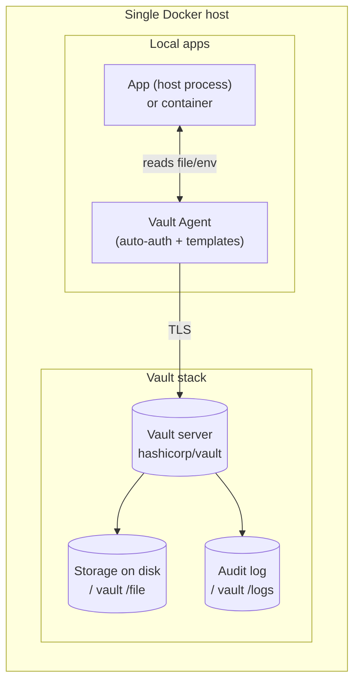

# Running Vault on a Single Docker Host for Local Application Secrets

## Executive summary

Vault (the secrets-management product from entity["company","HashiCorp","infrastructure software vendor"]) can be run as a **single-node, self-managed** deployment in Docker using the **official `hashicorp/vault` image**, including persistent storage and audit logging, and this is supported in the free **Vault Community Edition**. citeturn6view0turn23view0turn8view1

For a single Docker host where **applications on the same host** need secrets, the two practical, no-external-dependency storage choices are: **Integrated Storage (Raft)** (recommended by HashiCorp for most use cases, and gives first-class snapshot backup/restore) or the simpler **filesystem (“file”) backend** (durable single-server, but no HA semantics and backups are filesystem-level). citeturn8view2turn8view0turn8view1turn24view1turn24view2

Without an external KMS/HSM, **manual Shamir unseal** is the default and most realistic unseal strategy on a single box; “auto-unseal” exists, but every auto-unseal option requires an **external trusted service/device** (cloud KMS, HSM, or a separate “transit” Vault). citeturn11view2turn11view3turn12search0turn12search1turn12search2turn12search3turn1search4

For local apps, the most robust pattern is **Vault Agent + auto-auth** (commonly via AppRole) to keep tokens out of application code and render secrets to files/env at runtime; this aligns with Vault Agent’s design goal of reducing app integration complexity and supports templating and renewal/caching behaviours. citeturn17view2turn17view3turn17view1turn25view0

A single-host deployment has fundamental security limits: HashiCorp’s baseline hardening guidance prefers **single tenancy** (Vault being the only user process on a machine) and even prefers bare metal over VMs over containers; additionally, the Vault security model explicitly does **not** try to protect against memory inspection of a running Vault or arbitrary control of the storage backend—both are realistic risks when Vault and apps share one host. citeturn22view0turn22view1

## Scope and assumptions

This report covers a **single Docker host** running a Vault server container to provide secrets to **applications on the same host** (either host processes or other containers). It assumes **no Kubernetes** unless explicitly introduced later. citeturn22view0turn17view2

It focuses on features available in **Vault Community Edition** (free, self-managed) and calls out where **Vault Enterprise** is required (for example, seal wrap and HSM auto-unseal). citeturn23view0turn11view3turn5search2

Because Vault’s licensing changed in 2023 to the Business Source License (BSL) for newer releases, “OSS” in practice often means “free/community and source-available” for modern Vault Community Edition. citeturn5search3turn23view1turn23view0

## Deployment architecture and Docker deployment guide

A single-host “local secrets” design usually has three moving parts: Vault server, one or more local clients (apps), and optionally Vault Agent to broker authentication and render secrets.



Vault’s official Docker image supports both **dev mode** (default if you run the container with no args) and **server mode** with explicit configuration, including mounting `/vault/file` for persistent data and `/vault/logs` for persistent audit logs, and supplying configuration via `/vault/config` or `VAULT_LOCAL_CONFIG`. citeturn6view0turn16view0

### Step-by-step: production-like single-node Vault with Docker Compose (Integrated Storage: Raft)

This path uses Integrated Storage (Raft) so you get built-in snapshot backup/restore workflows, and it avoids needing any external database or Consul. HashiCorp recommends integrated storage for most use cases. citeturn8view2turn24view0turn8view0

#### Create directories on the host

Example layout (adjust to your conventions):

- `./vault/config/` → Vault server config (HCL)
- `./vault/file/` → persistent storage (raft data on disk)
- `./vault/logs/` → audit logs
- `./vault/tls/` → TLS materials (CA + server cert/key)

The official container exposes `/vault/file` and `/vault/logs` as optional volumes, intended for persistent storage and persistent audit logs respectively. citeturn6view0

#### Generate TLS certificates (self-signed CA option)

HashiCorp’s hardening guidance is to **use end-to-end TLS in production**; Vault assumes TLS by default and you must explicitly disable it if you choose insecure transport. citeturn22view0turn28view1turn9search1

A self-signed CA is often acceptable for a single-host deployment if all clients can be configured to trust the CA. HashiCorp’s integrated-storage deployment guidance notes that install tooling may generate self-signed certs for experimentation, but strongly recommends replacing them with CA-signed certs that match your environment. citeturn19search12turn22view0

Example OpenSSL commands (create a local CA, then a server cert for `localhost` and `127.0.0.1`):

```bash
mkdir -p vault/tls

# CA key + cert
openssl genrsa -out vault/tls/ca.key 4096
openssl req -x509 -new -nodes -key vault/tls/ca.key \
  -sha256 -days 825 -subj "/CN=vault-local-ca" \
  -out vault/tls/ca.crt

# Server key + CSR
openssl genrsa -out vault/tls/vault.key 4096
openssl req -new -key vault/tls/vault.key \
  -subj "/CN=localhost" \
  -out vault/tls/vault.csr

# SANs (important for modern TLS clients)
cat > vault/tls/vault.ext <<'EOF'
subjectAltName = DNS:localhost,IP:127.0.0.1
extendedKeyUsage = serverAuth
EOF

# Sign server cert with your CA
openssl x509 -req -in vault/tls/vault.csr \
  -CA vault/tls/ca.crt -CAkey vault/tls/ca.key -CAcreateserial \
  -out vault/tls/vault.crt -days 825 -sha256 -extfile vault/tls/vault.ext

# Tighten permissions (you will likely need to align ownership so the container's 'vault' user can read vault.key)
chmod 644 vault/tls/ca.crt vault/tls/vault.crt
chmod 600 vault/tls/vault.key
```

To avoid making the private key world-readable, you typically align ownership to the container’s `vault` user. The official day-one guidance for TLS file permissions (outside containers) shows patterns like root-owned certs and group-readable keys for the Vault service account; you can apply the same idea by mapping to the container’s `vault` UID/GID. citeturn19search12turn22view0turn16view0

To identify the UID/GID inside the image:

```bash
docker run --rm hashicorp/vault:1.21 sh -c 'id vault'
```

#### Write the Vault server configuration (Integrated Storage / Raft)

Key points from HashiCorp’s docs that matter in single-node Docker:

- `storage "raft"` persists data to a filesystem path; `node_id` identifies the raft node. citeturn8view0turn24view0  
- Integrated storage requires `cluster_addr`, and the cluster port defaults to `8201`. citeturn8view0turn24view0turn28view0  
- `disable_mlock` is **required to be explicitly set** when using integrated storage and is strongly recommended to be `true` because `mlock` interacts poorly with BoltDB memory-mapped files (raft state), potentially forcing the dataset into resident memory and causing OOM issues; if you disable `mlock`, you should disable swap to reduce the risk of sensitive data being paged to disk. citeturn10view0turn8view0turn22view0  
- Vault listeners default to TLS 1.2/1.3 and TLS is assumed unless explicitly disabled. citeturn28view0turn28view1turn9search1

Example `./vault/config/vault.hcl`:

```hcl
ui = true

# Addresses Vault advertises to clients and (if you ever expand) to other nodes
api_addr     = "https://127.0.0.1:8200"
cluster_addr = "https://127.0.0.1:8201"

# Required explicitly with integrated storage, and recommended true for raft due to mmap/BoltDB behaviour
disable_mlock = true

# Integrated storage (Raft)
storage "raft" {
  path    = "/vault/file/raft"
  node_id = "vault-1"
}

# TCP listener (API + cluster)
listener "tcp" {
  address         = "0.0.0.0:8200"
  cluster_address = "0.0.0.0:8201"

  tls_cert_file = "/vault/tls/vault.crt"
  tls_key_file  = "/vault/tls/vault.key"
}

# Optional: set global lease defaults (must keep default <= max)
default_lease_ttl = "24h"
max_lease_ttl     = "168h"
```

The meaning and constraints of `default_lease_ttl` and `max_lease_ttl` are defined in the configuration reference (including that default cannot exceed max). citeturn10view0

#### Docker Compose: Vault server container

Vault’s official container exposes `/vault/file` and `/vault/logs` for persistence, and recommends `--cap-add=IPC_LOCK` if you intend to use memory locking; however integrated storage generally uses `disable_mlock=true` per HashiCorp’s guidance, so `IPC_LOCK` is not strictly necessary in this specific raft configuration (it is more relevant if you run with `disable_mlock=false`). citeturn6view0turn10view0turn8view0

Example `docker-compose.yml` (bind API only to localhost on the host; don’t publish the cluster port):

```yaml
services:
  vault:
    image: hashicorp/vault:1.21
    container_name: vault
    restart: unless-stopped

    command: ["vault", "server", "-config=/vault/config/vault.hcl"]

    # Publish only to localhost on the Docker host
    ports:
      - "127.0.0.1:8200:8200"

    volumes:
      - ./vault/config:/vault/config:ro
      - ./vault/file:/vault/file
      - ./vault/logs:/vault/logs
      - ./vault/tls:/vault/tls:ro

    environment:
      VAULT_LOG_LEVEL: "info"

    # Optional hardening: these reduce accidental writes, but test carefully in your environment.
    # read_only: true
    # tmpfs:
    #   - /tmp
```

The container’s entrypoint supports loading config files from `/vault/config` and also supports `VAULT_LOCAL_CONFIG` as an alternative; in server mode, you should generally prefer explicit config files you can manage as code. citeturn6view0turn16view0turn22view0

Bring it up:

```bash
docker compose up -d
```

### Alternative: `docker run` (explicit server mode)

The Docker Hub docs include a “server mode” example using `VAULT_LOCAL_CONFIG` and publishing port 8200; for production-like use, you typically mount config/TLS and run `vault server` with `-config`. citeturn6view0turn10view0

Example pattern:

```bash
docker run -d --name vault \
  -p 127.0.0.1:8200:8200 \
  -v "$PWD/vault/config:/vault/config:ro" \
  -v "$PWD/vault/file:/vault/file" \
  -v "$PWD/vault/logs:/vault/logs" \
  -v "$PWD/vault/tls:/vault/tls:ro" \
  hashicorp/vault:1.21 \
  vault server -config=/vault/config/vault.hcl
```

## Storage backends for single-node deployments

HashiCorp’s guidance is that integrated storage is recommended for most use cases because it’s operationally simpler (one less system to run) and is part of Vault itself, while still supporting snapshots and HA semantics when you add nodes. citeturn8view2turn24view0turn8view0

The filesystem backend is explicitly described as usable for “durable single server situations,” but it provides no HA semantics. citeturn8view1

### Storage backend comparison table

| Backend | External dependency | Single-node suitability | Backup/restore story | Key limitations / risks | Secure config notes |
|---|---:|---:|---|---|---|
| Integrated storage (Raft) | None | Strong | Built-in `vault operator raft snapshot save/restore` workflows | Still single point of failure on one host; requires correct `cluster_addr`; needs careful `disable_mlock` + swap handling | Must explicitly set `disable_mlock` and should consider disabling swap; requires `cluster_addr` citeturn10view0turn22view0turn8view0turn24view1turn24view2 |
| Filesystem (`storage "file"`) | None | OK (simple) | Filesystem-level backups (stop/consistent snapshot) | No HA; fewer first-class operational workflows than raft | “Durable single server situations”; secure filesystem access is still required even though data is encrypted at rest citeturn8view1turn22view0 |
| SQLite | N/A | Not supported as a built-in storage backend | N/A | You cannot configure `storage "sqlite"` in official Vault docs; use supported backends instead | Prefer `raft` or `file` for no-external-dependency single-node setups citeturn8view2turn8view0turn8view1 |
| External DB (e.g., PostgreSQL/MySQL) | Yes | Usually unnecessary for “single-box” | DB-native backup/restore + Vault recovery | Adds operational dependency and network path; varies by backend support level | PostgreSQL backend supports HA; MySQL backend is community supported citeturn13search1turn13search2turn22view0turn8view2 |

### Secure configuration examples

**Integrated storage (Raft)** config essentials are shown earlier; the official raft backend configuration requires a `path` and recommends providing `cluster_addr`. citeturn8view0turn24view0

**Filesystem backend** minimal HCL (if you choose it for simplicity):

```hcl
ui = true
api_addr = "https://127.0.0.1:8200"

# Not using integrated storage, so HashiCorp does not recommend disabling mlock.
# You must decide based on container capability and swap handling.
disable_mlock = false

storage "file" {
  path = "/vault/file"
}

listener "tcp" {
  address = "0.0.0.0:8200"
  tls_cert_file = "/vault/tls/vault.crt"
  tls_key_file  = "/vault/tls/vault.key"
}
```

HashiCorp’s configuration reference explicitly states that disabling `mlock` is not recommended for deployments **not** using integrated storage and explains the security and memory trade-offs (swap risk vs OOM risk). citeturn10view0turn22view0turn6view0

## Initialisation and unsealing for a single-box scenario

### What init/unseal does in Vault terms

`vault operator init` initialises the storage backend, generates the root key material, and (by default) uses Shamir’s Secret Sharing to split it into “unseal keys” (key shares) requiring a threshold to reconstruct; it also outputs an initial root token. citeturn11view0turn11view2

Vault starts **sealed** and cannot serve secrets until unsealed. `vault operator unseal` is stateful and supports entering shares from different clients; supplying an unseal key on the command line is explicitly discouraged because it lands in shell history. citeturn11view1turn11view2turn22view0

A Vault node remains unsealed until you reseal it, restart it, or the storage layer hits an unrecoverable error. citeturn11view2

```mermaid
flowchart TD
  Start[Start Vault server] --> Sealed[Vault is sealed]
  Sealed -->|vault operator init| Init[Initialised: root key + root token created]
  Init -->|vault operator unseal (threshold shares)| Unsealed[Vault is unsealed]
  Unsealed --> Ops[Serve secrets + auth + audit]
  Ops -->|restart / explicit seal| Sealed
```

### Unseal options comparison table

| Option | Works on Vault Community Edition | Requires external service/device | Operational behaviour | Keys produced at init | Notes |
|---|---:|---:|---|---|---|
| Shamir manual unseal | Yes | No | Manual entry of `key-threshold` shares after every restart | Unseal keys (shares) | Default approach; can PGP-encrypt keys during init; operational overhead is key-holder availability citeturn11view0turn11view1turn11view3 |
| Cloud KMS auto-unseal | Yes (cloud KMS supported) | Yes (cloud KMS) | Vault contacts KMS at startup to decrypt the root key; reduces manual unseal operations | Recovery keys (not unseal keys) | Supported providers include major clouds; trust and credentials/identity for cloud access are major design considerations citeturn11view2turn11view3turn12search1turn12search2turn12search3turn0search10 |
| Transit auto-unseal | Yes (feature exists) | Yes (another Vault cluster providing Transit) | Uses a “trusted” Vault’s Transit secrets engine as the autoseal mechanism | Recovery keys | Suitable only if you can run/secure a separate Vault specifically for unsealing citeturn12search0turn11view2turn12search20 |
| HSM auto-unseal (PKCS#11) | Enterprise | Yes (HSM) | Root key stored/retrieved via HSM; strong control but operational overhead | Recovery keys | Explicitly positioned as an Enterprise capability in HashiCorp’s guidance citeturn11view3turn23view0turn5search2 |
| Seal wrap (extra encryption layer) | Enterprise | Typically yes (HSM/KMS) | Not an unseal method: adds a second encryption layer for certain data using the seal | N/A | Seal wrap is Enterprise-only; it’s an additional protection mechanism rather than an unseal strategy citeturn5search2turn2search7turn23view0 |

### Recommended single-box unseal approach

If you truly assume **no external services**, you are effectively choosing **Shamir manual unseal**. HashiCorp’s seal best-practices document frames the decision as balancing operator overhead vs trust in cloud providers vs availability of an HSM, and notes you can use `operator init` flags to PGP-encrypt unseal keys and the root token. citeturn11view3turn11view0

For a single-box scenario, common practical patterns are:

- **1 share, threshold 1 (1-of-1)**: simplest operations (one key unseals), but removes the multi-person control property of Shamir. `operator init` defaults are 5 shares / threshold 3 unless you override. citeturn11view0turn11view3  
- **3 shares, threshold 2 (2-of-3)**: still operable for a small team but retains separation-of-duties intent if you store shares separately. citeturn11view0turn11view3turn11view2  

Example init (2-of-3), output as JSON for machine parsing:

```bash
export VAULT_ADDR='https://127.0.0.1:8200'
export VAULT_CACERT='./vault/tls/ca.crt'

vault operator init -key-shares=3 -key-threshold=2 -format=json
```

`vault operator unseal` should be run without passing the key as an argument, so it prompts and hides input. citeturn11view1

## Secure secret storage and access patterns for local applications

### Principles that matter on a single host

Vault Agent exists specifically to simplify application integration by handling authentication, token management, caching, and templating (rendering secrets to files or environment variables) without requiring your app to call Vault directly. citeturn17view2turn17view3

Even on one host, it is usually safer to avoid embedding long-lived tokens into app configs because Vault tokens are the core auth primitive and grant whatever policies they carry. citeturn27view1turn4search2turn7search2

If you do write tokens to disk, HashiCorp’s file sink docs recommend writing to a ramdisk (ideally encrypted), using appropriate permissions, and removing the file promptly once consumed. citeturn25view0

### Auth method comparison table (for “local apps on one host”)

| Auth method | External dependency | Best fit | Strengths | Key risks / trade-offs |
|---|---:|---|---|---|
| Token auth (static token) | None | Simple scripts, break-glass, very small demos | Built-in at `/auth/token`, always available | Token sprawl; if a token leaks, attacker gets its policy scope citeturn7search2turn27view1turn22view0 |
| AppRole | None | Machine-to-machine auth including servers, services | Designed for automated workflows; flexible constraints; supports CLI and API login | You must protect RoleID and SecretID; HashiCorp recommends batch tokens, but batch tokens are not renewable (may force re-auth patterns) citeturn17view0turn27view1turn27view1turn31view0 |
| TLS cert auth (`auth/cert`) | Needs PKI materials (can be local) | Strong local identity via client certs | Supports CA-signed or self-signed client certs | Certificate lifecycle management; if running behind proxies you must be careful with forwarded client cert headers citeturn19search1turn28view1turn22view0 |
| Vault Agent auto-auth + templating | None beyond chosen auth | Default recommendation for “local secret delivery” | Renders secrets to file/env; auto-auth and renewal/caching capabilities | Agent becomes a local high-value process; must secure sink/template outputs citeturn17view2turn17view3turn25view0 |

### Step-by-step: set up KV v2 + policy + AppRole + Vault Agent

#### Enable audit logging early

HashiCorp’s production-hardening baseline recommends enabling audit device logs to provide a detailed history of operations; audit logging is part of the accountability goals in Vault’s security model, and Vault supports multiple audit backends including the file audit device. citeturn22view0turn22view1turn7search7turn7search3

Example (write to the mounted `/vault/logs`):

```bash
export VAULT_ADDR='https://127.0.0.1:8200'
export VAULT_CACERT='./vault/tls/ca.crt'

# Use initial root token only for bootstrap work
vault login

vault audit enable file \
  file_path=/vault/logs/audit.log \
  hmac_accessor=false \
  elide_list_responses=true
```

The file audit device simply appends to a file and does not manage log rotation; HashiCorp recommends using external log rotation tooling and notes that `SIGHUP` causes file audit devices to reopen their file handles. citeturn7search3turn7search7

#### Enable KV v2 and store a test secret

KV v2 stores and versions arbitrary static secrets in Vault’s physical storage and provides soft deletes and version history. citeturn7search0turn7search12

Enable KV v2 at a mount path (example uses `secret/`):

```bash
vault secrets enable -path=secret -version=2 kv
vault kv put secret/myapp/config db_user="appuser" db_pass="correct-horse-battery-staple"
```

KV v2 enablement options (`-version=2` or `kv-v2`) are documented in the KV v2 setup guide. citeturn7search12turn7search0

#### Create a minimal read policy for the app

Vault policies are deny-by-default and grant capabilities (read/list/create/update/delete/etc) on specific paths. citeturn4search3turn4search7

For KV v2, your app usually needs:

- `read` on `secret/data/...`
- optionally `list` on `secret/metadata/...` (for discovery/use cases)

Example policy `myapp-read.hcl`:

```hcl
# Read secret data
path "secret/data/myapp/*" {
  capabilities = ["read"]
}

# Allow listing metadata if needed
path "secret/metadata/myapp/*" {
  capabilities = ["list"]
}
```

Write it:

```bash
vault policy write myapp-read myapp-read.hcl
```

#### Enable AppRole and create a role

AppRole is designed for machines/services and is enabled as an auth method; the docs recommend batch tokens for AppRole, and show common role parameters such as SecretID TTL and token TTL limits. citeturn17view0turn31view0turn27view1

Enable auth:

```bash
vault auth enable approle
```

Create role (example uses short-lived SecretIDs and tokens; adjust to your operational reality):

```bash
vault write auth/approle/role/myapp \
  token_policies="myapp-read" \
  secret_id_ttl="24h" \
  secret_id_num_uses=1 \
  token_ttl="30m" \
  token_max_ttl="2h"
```

These parameters map to documented AppRole API fields such as `secret_id_ttl`, `secret_id_num_uses`, `token_ttl`, and `token_max_ttl`. citeturn31view0turn17view0

Fetch RoleID and generate a SecretID:

```bash
vault read -field=role_id auth/approle/role/myapp/role-id > roleid
vault write -force -field=secret_id auth/approle/role/myapp/secret-id > secretid
chmod 600 roleid secretid
```

#### Configure Vault Agent (AppRole auto-auth + templates)

Vault Agent supports **auto-auth**, **templating**, and (optionally) caching; auto-auth retrieves a token using a configured method and can keep unwrapped tokens renewed until renewal is denied. citeturn17view2turn17view3turn26search4turn25view1

AppRole auto-auth config example is documented, including role_id/secret_id file paths. citeturn17view1

A file sink can write tokens (optionally wrapped/encrypted) to disk; HashiCorp recommends ramdisk and appropriate permissions. citeturn25view0turn25view1

Example `vault-agent.hcl` (renders an env-style file for a legacy app):

```hcl
pid_file = "/tmp/vault-agent.pid"

vault {
  address = "https://127.0.0.1:8200"
}

auto_auth {
  method {
    type = "approle"
    config = {
      role_id_file_path   = "/etc/vault-agent/roleid"
      secret_id_file_path = "/etc/vault-agent/secretid"
    }
  }

  # Optional: write the token to a file, but prefer templates-only if possible.
  sink "file" {
    config = {
      path = "/run/vault-agent/token"
      mode = 0400
    }
  }
}

template {
  destination = "/run/vault-agent/myapp.env"
  perms       = 0400
  contents = <<EOF
DB_USER={{ with secret "secret/data/myapp/config" }}{{ .Data.data.db_user }}{{ end }}
DB_PASS={{ with secret "secret/data/myapp/config" }}{{ .Data.data.db_pass }}{{ end }}
EOF
}
```

Vault Agent templating uses Consul Template markup and the `secret` function to fetch secrets, then renders them locally; it retries with backoff on auth failure and refreshes rendered content based on renewal behaviour. citeturn17view3turn17view2

#### Run Vault Agent as a container sidecar (Docker Compose example)

For containerised apps on the same host, a common pattern is: Vault Agent runs as a companion container, writes rendered secrets into a shared in-memory or on-disk volume, and the app reads that file.

```yaml
services:
  vault-agent:
    image: hashicorp/vault:1.21
    container_name: vault-agent
    restart: unless-stopped
    command: ["vault", "agent", "-config=/etc/vault-agent/vault-agent.hcl"]

    volumes:
      - ./vault-agent:/etc/vault-agent:ro
      - vault-agent-run:/run/vault-agent

    # If you use a self-signed CA for Vault, mount it and set VAULT_CACERT for the agent process.
    environment:
      VAULT_ADDR: "https://127.0.0.1:8200"
      VAULT_CACERT: "/etc/vault-agent/ca.crt"

  myapp:
    image: your-app-image:latest
    depends_on:
      - vault-agent
    volumes:
      - vault-agent-run:/run/vault-agent:ro
    environment:
      # Your app can read /run/vault-agent/myapp.env at startup (or periodically reload)
      MYAPP_SECRETS_FILE: "/run/vault-agent/myapp.env"

volumes:
  vault-agent-run:
```

One important operational pitfall: Vault Agent warns that `VAULT_ADDR` environment variables can override config and can create accidental self-referential loops if the agent points at itself rather than the Vault server; ensure the agent’s address resolves to the **Vault server**, not the agent listener. citeturn17view2

### Minimal client access examples (CLI and HTTP API)

#### CLI read from KV v2

```bash
export VAULT_ADDR='https://127.0.0.1:8200'
export VAULT_CACERT='./vault/tls/ca.crt'
export VAULT_TOKEN="$(cat /run/vault-agent/token)"  # if using the sink pattern

vault kv get -field=db_pass secret/myapp/config
```

KV v2 is explicitly versioned and documented; CLI operations map down to HTTP API paths under the hood. citeturn7search0turn7search4turn20view0

#### HTTP API read (curl)

KV v2 API uses `/v1/<mount>/data/<path>` for reads; the KV v2 API reference documents these endpoints. citeturn7search4turn7search0

```bash
export VAULT_ADDR='https://127.0.0.1:8200'
export VAULT_TOKEN="$(cat /run/vault-agent/token)"
export CURL_CA_BUNDLE='./vault/tls/ca.crt'

curl -sS \
  --header "X-Vault-Token: $VAULT_TOKEN" \
  "$VAULT_ADDR/v1/secret/data/myapp/config" | jq -r '.data.data.db_pass'
```

### Token type guidance (service vs batch vs periodic) in this context

HashiCorp recommends batch tokens for AppRole in general. citeturn17view0  
However, Vault’s token documentation states batch tokens **cannot be renewable** and lack several features of service tokens. citeturn27view1turn27view0

On a single host, practical guidance is:

- If you need **continuous renewal** semantics (especially for long-lived agents and dynamic secrets workflows), prefer **service tokens** or **periodic tokens** where appropriate; periodic tokens are documented as a way for a token to have an unlimited lifetime as long as it is actively renewed. citeturn27view0turn17view2turn26search4  
- If you choose **batch tokens**, design for **reauth on expiry** (Vault Agent can reauthenticate when renewal is denied, and templating will continue to retry). citeturn26search4turn17view3turn27view1  

AppRole’s API response model includes a `period` field (token periodicity) and documents explicit TTL/max TTL fields, which are the controls you tune for token lifetime behaviour. citeturn31view0turn27view0

## TLS, hardening, backups, rotation, and the single-host threat model

### TLS setup guidance

HashiCorp’s baseline recommendation is **end-to-end TLS** for all Vault connections (clients, proxies/load balancers, and any external storage connections) and notes that disabling TLS can degrade some UI functionality; Vault defaults to TLS 1.2/1.3 on TCP listeners. citeturn22view0turn28view0turn28view1

For **clients**, the Vault CLI supports `VAULT_CACERT` / `-ca-cert` (and `VAULT_CAPATH` / `-ca-path`) to trust a CA, and explicitly warns not to use `VAULT_SKIP_VERIFY` in production because it violates the Vault security model. citeturn21view0turn20view0turn22view1

Self-signed vs CA-signed practical rule for a single host:

- **Self-signed CA**: acceptable if you can distribute the CA cert (`ca.crt`) to every local application/runtime that needs to call Vault and you can manage rotation. citeturn21view0turn19search12  
- **Organisational/internal CA**: preferred where available; HashiCorp explicitly recommends replacing self-signed defaults with certificates signed by an appropriate CA. citeturn19search12turn22view0  

### Network and filesystem permissions

HashiCorp’s baseline hardening guidance includes: do not run Vault as root, grant minimal write privileges (only storage and audit paths writable), firewall traffic, disable swap, disable core dumps, and avoid root tokens beyond initial bootstrap. citeturn22view0turn10view0turn27view1

On a single Docker host, a pragmatic interpretation is:

- Bind the Vault API port to `127.0.0.1` (or don’t publish it at all and use a Docker network for container-only access), and firewall inbound/outbound traffic so Vault only talks to what it needs. citeturn22view0turn6view0  
- Ensure the only writable persistent mounts are the storage directory and audit log directory; the filesystem backend docs explicitly remind you to secure filesystem access even though Vault data is encrypted at rest. citeturn22view0turn8view1  
- Disable swap on the host if possible; HashiCorp calls this out as even more critical for integrated storage. citeturn22view0turn10view0turn8view0  
- Prefer Vault Agent templating over sprinkling tokens into many app configs; if you must write tokens, follow the file sink best practices (ramdisk, strict perms). citeturn17view2turn25view0  

Note: the official container entrypoint explicitly disables core dumps (`ulimit -c 0`) and runs Vault under an unprivileged `vault` user (via `su-exec`), which aligns with the “do not run as root” guidance at least within the container boundary. citeturn16view0turn22view0turn6view0

### Secret rotation on a single host

Vault’s KV v2 engine stores **versioned** static secrets (soft deletes, version history). A rotation workflow for static secrets is typically “write a new version and redeploy/reload consumers,” plus managing version retention. citeturn7search0turn7search8

For true automated rotation, Vault’s strength is dynamic secrets engines with leases; Vault Agent is designed to manage renewals of tokens and leased secrets generated off those tokens. citeturn17view2turn27view0turn22view1

In single-node deployments, rotation decisions should be paired with audit logging so you can trace use and identify stale clients. citeturn7search7turn22view1turn22view0

### Backup/restore and disaster recovery for single-node

Integrated storage provides first-class snapshot workflows:

- Save a snapshot with `vault operator raft snapshot save backup.snap`. citeturn24view1turn1search8  
- Restore requires `vault operator raft snapshot restore -force <path>` and includes operational steps like bringing the cluster online, reinitialising with new storage, and then unsealing after restore; HashiCorp also cautions to test restores in an isolated environment to avoid revoking live third-party credentials. citeturn24view2turn11view2turn22view0  

For a single-box deployment, “DR” effectively means: keep **snapshots off-host** and separately protect **unseal keys/recovery keys** so you can rebuild the host and restore state. The snapshot docs explicitly recommend saving snapshots in a secure location away from the Vault cluster infrastructure. citeturn24view1turn24view2turn11view3

If you use the filesystem backend, backups are filesystem-level (copying the data directory) and you must handle consistency (typically by stopping Vault or using a filesystem snapshot mechanism). The filesystem backend is documented as durable for single server, but it does not provide the richer raft snapshot workflows. citeturn8view1turn24view0turn22view0

### Security limitations and threat model for single-host Vault

Vault’s security model threat model includes eavesdropping, tampering, unauthorised access, and accountability via audit logs, but it explicitly does **not** include protection against:

- **Memory analysis of a running Vault** (if an attacker can inspect Vault process memory, confidentiality may be compromised). citeturn22view1turn22view0  
- **Arbitrary control of the storage backend** (an attacker who can arbitrarily read/write/delete the storage backend can undermine Vault in ways Vault cannot practically defend against). citeturn22view1turn8view1turn24view0  

HashiCorp’s production hardening baseline also explicitly recommends “single tenancy” (Vault should be the sole user process on a machine) and prefers running on bare metal over VMs and VMs over containers. Running Vault and applications on the same host therefore increases your exposure: a compromise of a colocated app may become a stepping stone to Vault tokens, rendered secret files, or even the Vault process/storage depending on the host compromise level. citeturn22view0turn22view1turn25view0

In practical terms, a single-host Vault can still provide value (centralised access control, templated delivery, audit logging, and standardised secret handling), but its **security boundary is the host**. The closer an attacker can get to root on the host, the less Vault can do to protect secrets. citeturn22view1turn22view0turn10view0