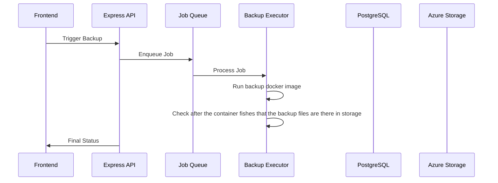
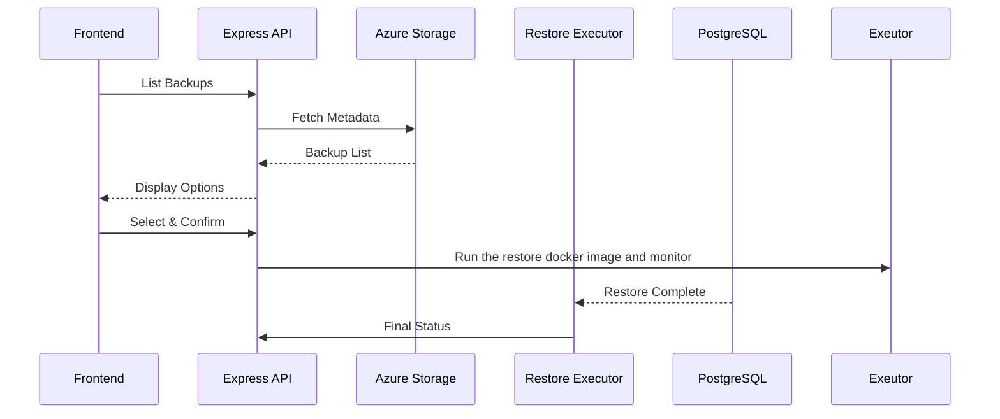

# PostgreSQL Database Management - Technical Architecture

## 1. Feature Breakdown

### Core Components

#### 1.1 Database Configuration Service
- Connection string management with encryption
- Multi-instance and multi-database support
- Connection validation and health checks
- Credential rotation support

#### 1.2 Backup Orchestration Engine
- Scheduling service with cron expression support
- Manual backup triggers
- Backup queue management
- Concurrent backup execution control

#### 1.3 Restore Management Service
- Azure Storage backup discovery
- Point-in-time restore capabilities
- Restore validation and verification
- Rollback mechanisms

#### 1.4 Azure Storage Integration Layer
- Blob storage operations
- Retention policy enforcement
- Storage tier management
- Backup metadata indexing

#### 1.5 Progress Monitoring System
- Real-time operation tracking
- Historical operation logs
- Performance metrics collection
- Alert and notification framework

#### 1.6 Frontend Management Interface
- Database CRUD operations UI
- Backup scheduling dashboard
- Restore browser with filtering
- Real-time progress indicators

## 2. Implementation Considerations

### 2.1 Software Design

#### Database Configuration Service
```typescript
// Core interfaces
interface PostgresDatabase {
  id: string;
  name: string;
  connectionString: string; // Encrypted
  host: string;
  port: number;
  database: string;
  username: string;
  sslMode: 'require' | 'disable' | 'prefer';
  tags: string[];
  createdAt: Date;
  updatedAt: Date;
  lastHealthCheck: Date;
  healthStatus: 'healthy' | 'unhealthy' | 'unknown';
}

interface BackupConfiguration {
  id: string;
  databaseId: string;
  schedule?: string; // Cron expression
  azureContainerName: string;
  azurePathPrefix: string;
  retentionDays: number;
  backupFormat: 'custom' | 'plain' | 'tar';
  compressionLevel: number;
  isEnabled: boolean;
  lastBackupAt?: Date;
  nextScheduledAt?: Date;
}

interface BackupOperation {
  id: string;
  databaseId: string;
  operationType: 'manual' | 'scheduled';
  status: 'pending' | 'running' | 'completed' | 'failed';
  startedAt: Date;
  completedAt?: Date;
  sizeBytes?: number;
  azureBlobUrl?: string;
  errorMessage?: string;
  progress: number; // 0-100
}
```

#### Service Layer Architecture
- **DatabaseConfigService**: Handles CRUD operations for database configurations
- **BackupSchedulerService**: Manages cron jobs and scheduling logic
- **BackupExecutorService**: Executes backup operations by running a specially configured docker image
- **RestoreExecutorService**: Handles restore operations by running a specially configured docker image
- **ProgressTrackerService**: Tracks and broadcasts operation progress

#### API Endpoint Structure
```
/api/postgres/
  /databases
    GET    - List all configured databases
    POST   - Add new database configuration
    PUT    /:id - Update database configuration
    DELETE /:id - Remove database configuration
    POST   /:id/test - Test database connection
    
  /backup-configs
    GET    /:databaseId - Get backup configuration
    POST   - Create/update backup configuration
    DELETE /:id - Remove backup configuration
    
  /backups
    GET    /:databaseId - List backups for database
    POST   /:databaseId/manual - Trigger manual backup
    GET    /:backupId/status - Get backup operation status
    DELETE /:backupId - Delete backup from Azure
    
  /restore
    POST   /:databaseId - Initiate restore operation
    GET    /:operationId/status - Get restore operation status
```

### 2.2 Software Libraries

#### Required NPM Packages
```json
{
  "dependencies": {
    // Existing dependencies plus:
    "pg": "^8.13.0",              // PostgreSQL client for connection testing
    "node-cron": "^3.0.3",         // Cron job scheduling
    "bull": "^4.16.3",             // Job queue for backup operations
    "ioredis": "^5.4.1",           // Redis client for Bull queue (optional)
    "crypto-js": "^4.2.0",         // Encryption for connection strings
    "stream": "^0.0.3",            // Stream processing for large backups
    "ws": "^8.18.0"                // WebSocket for real-time progress
  }
}
```

### 2.3 External Dependencies

#### Docker Considerations
- Allow in the system setting the definition of a particular container image for Postgres Backus and Restores.
- Once the backup is done we can validate that the backfiles exist post job.
- Feedback from the restore is critical as well.

### 2.4 Important Flows

#### Backup Flow


#### Restore Flow


### 2.5 Database Changes

#### Prisma Schema Additions
```prisma
model PostgresDatabase {
  id               String   @id @default(cuid())
  name             String
  connectionString String   // Encrypted
  host             String
  port             Int
  database         String
  username         String
  sslMode          String   @default("prefer")
  tags             String   // JSON array
  createdAt        DateTime @default(now())
  updatedAt        DateTime @updatedAt
  lastHealthCheck  DateTime?
  healthStatus     String   @default("unknown")
  userId           String
  user             User     @relation(fields: [userId], references: [id])
  
  backupConfig     BackupConfiguration?
  backupOperations BackupOperation[]
  restoreOperations RestoreOperation[]
  
  @@unique([userId, name])
  @@index([userId])
}

model BackupConfiguration {
  id                String   @id @default(cuid())
  databaseId        String   @unique
  database          PostgresDatabase @relation(fields: [databaseId], references: [id], onDelete: Cascade)
  schedule          String?  // Cron expression
  azureContainerName String
  azurePathPrefix   String
  retentionDays     Int      @default(30)
  backupFormat      String   @default("custom")
  compressionLevel  Int      @default(6)
  isEnabled         Boolean  @default(true)
  lastBackupAt      DateTime?
  nextScheduledAt   DateTime?
  createdAt         DateTime @default(now())
  updatedAt         DateTime @updatedAt
  
  @@index([databaseId])
}

model BackupOperation {
  id              String   @id @default(cuid())
  databaseId      String
  database        PostgresDatabase @relation(fields: [databaseId], references: [id], onDelete: Cascade)
  operationType   String   // manual, scheduled
  status          String   // pending, running, completed, failed
  startedAt       DateTime @default(now())
  completedAt     DateTime?
  sizeBytes       BigInt?
  azureBlobUrl    String?
  errorMessage    String?
  progress        Int      @default(0)
  metadata        String?  // JSON for additional data
  
  @@index([databaseId, status])
  @@index([startedAt])
}

model RestoreOperation {
  id              String   @id @default(cuid())
  databaseId      String
  database        PostgresDatabase @relation(fields: [databaseId], references: [id], onDelete: Cascade)
  backupUrl       String
  status          String   // pending, running, completed, failed
  startedAt       DateTime @default(now())
  completedAt     DateTime?
  errorMessage    String?
  progress        Int      @default(0)
  
  @@index([databaseId, status])
}
```

### 2.6 New System Dependencies

#### Queue Management Options
1. **In-Memory Queue** (Development)
   - Simple array-based queue for single-instance deployment
   - No additional infrastructure required

2. **Bull Queue with Redis** (Production)
   - Persistent job queue with retry mechanisms
   - Optional Redis deployment for queue persistence
   - Better for handling failures and restarts

#### Process Management
- Run a configured docker inmage with 

### 2.7 Scalability and Performance

### 2.8 Security Considerations

#### Network Security
- **SSL/TLS Enforcement**: Require encrypted PostgreSQL connections
- **IP Whitelisting**: Optional IP restrictions for database access
- **Private Endpoints**: Support for Azure Private Endpoints
- **VPN/Tunnel Support**: Compatible with Cloudflare tunnels

#### Data Protection
- **Backup Encryption**: Optional encryption of backup files
- **Secure Deletion**: Proper cleanup of temporary files
- **Access Control**: User-based access to database configurations
- **Sensitive Data Masking**: Hide passwords in UI and logs

### 2.9 Testing Strategy

#### Unit Testing
```typescript
// Example test structure
describe('DatabaseConfigService', () => {
  test('should encrypt connection string on save');
  test('should validate PostgreSQL connection');
  test('should handle connection failures gracefully');
});

describe('BackupExecutorService', () => {
  test('should execute pg_dump with correct parameters');
  test('should stream output to Azure Storage');
  test('should update progress during backup');
  test('should handle backup failures and cleanup');
});
```

### 2.11 System Integration

#### Docker Integration
- **Container Discovery**: Detect PostgreSQL containers automatically
- **Network Access**: Handle Docker network configurations
- **Volume Mapping**: Access to backup tools in containers

#### Traefik Integration
- **Service Discovery**: Route to PostgreSQL instances via Traefik
- **Load Balancing**: Support for read replicas
- **Health Endpoints**: Expose database health via Traefik

#### Cloudflare Tunnel Support
- **Secure Connections**: Database access through tunnels
- **Zero Trust Access**: Integration with Cloudflare Access policies

#### Existing Settings Framework
- **Leverage Existing Patterns**: Use established settings management
- **Configuration Service Factory**: Extend for PostgreSQL settings
- **Connectivity Monitoring**: Add to background scheduler

## 3. Technical Design and Architecture Summary

The PostgreSQL Database Management feature provides a comprehensive solution for managing database backups and restores within the Mini Infra ecosystem. The architecture leverages existing infrastructure components while introducing specialized services for database operations.

### Key Architectural Decisions

1. **Service-Oriented Design**: Separate services for configuration, scheduling, execution, and monitoring ensure modularity and maintainability.

2. **Queue-Based Processing**: Backup operations are queued to prevent system overload and provide reliable execution with retry capabilities.

3. **Streaming Architecture**: Direct streaming between PostgreSQL and Azure Storage minimizes local storage requirements and improves performance.

4. **Security-First Approach**: Connection strings are encrypted at rest, with comprehensive audit logging and least-privilege access patterns.

5. **Progressive Enhancement**: The system starts with basic functionality and can scale to support advanced features like incremental backups and point-in-time recovery.

### Integration Points

- **Frontend**: React hooks following established patterns (use-postgres-databases, use-backup-configs)
- **Backend**: Express routes with Zod validation and Pino logging
- **Database**: Prisma models extending existing schema
- **Azure**: Leverages existing Azure Storage integration
- **Authentication**: Uses established OAuth and session management

### Success Metrics

- Backup success rate > 99%
- Restore reliability > 99.9%
- Operation visibility with < 1 second latency
- Support for databases up to 1TB
- Concurrent operation support (3+ simultaneous backups)

### Future Enhancements

- WAL-based incremental backups
- Point-in-time recovery
- Cross-region backup replication
- Automated backup testing
- Database migration tools
- Performance analytics dashboard

This architecture provides a robust foundation for PostgreSQL database management while maintaining consistency with the existing Mini Infra design patterns and technology stack.